# Capítulo V: Product Implementation, Validation & Deployment

## Software Configuration Management

### Software Development Environment Configuration

**Figma**

{width=150px}

Producto SaaS utilizado para la elaboración de la propuesta de diseño de interfaces (UX/UI), incluyendo la creación de Wireframes, Mock-ups y Prototipos interactivos para el Landing Page y las aplicaciones web. Permite la colaboración en tiempo real del equipo de diseño.

* **Ruta de referencia:** [https://www.figma.com/](https://www.figma.com/)

**HTML5 & CSS3**

{width=150px}

Lenguajes estándar de marcado y hojas de estilo utilizados para definir la estructura semántica y el diseño visual estático de los templates en el Landing Page y los componentes de las Frontend Web Applications.

* **Documentación de referencia:** [https://developer.mozilla.org/](https://developer.mozilla.org/)

**Angular Framework**

{width=150px}

Framework de desarrollo principal para la construcción de las Frontend Web Applications en formato SPA (Single Page Application). Se encarga de la lógica de presentación en el lado del cliente, el enrutamiento y el consumo de la API RESTful utilizando TypeScript como lenguaje de programación.

* **Ruta de descarga:** [https://angular.io/cli](https://angular.io/cli)

**Miro**

{width=150px}

Plataforma de pizarra virtual (SaaS) empleada para las sesiones colaborativas de análisis de dominio y la elaboración de los diagramas de Big Picture EventStorming y Design-Level EventStorming.

* **Ruta de referencia:** [https://miro.com/](https://miro.com/)

**Structurizr**

{width=150px}

Herramienta de modelado utilizada para el diseño y la documentación de la arquitectura de software de la solución, aplicando estrictamente el C4 Model (Context, Container y Component diagrams).

* **Ruta de referencia:** [https://structurizr.com/](https://structurizr.com/)

**Microsoft SQL Server**

{width=150px}

Sistema de Gestión de Bases de Datos Relacionales (RDBMS) utilizado para el diseño y almacenamiento persistente de los datos transaccionales de los Bounded Contexts del sistema. Soporta la integridad referencial y las consultas estructuradas necesarias para la lógica del backend.

* **Ruta de descarga:** [https://www.microsoft.com/sql-server/sql-server-downloads](https://www.microsoft.com/sql-server/sql-server-downloads)

**Spring Boot (Java)**

{width=150px}

Framework backend basado en Java utilizado para la construcción, configuración y despliegue de los RESTful Web Services. Gestiona la lógica de negocio, la seguridad, las transacciones y la exposición de los endpoints que serán consumidos por las aplicaciones web.

* **Ruta de descarga:** [https://spring.io/projects/spring-boot](https://spring.io/projects/spring-boot)

### Source Code Management

El proyecto utiliza **GitHub** como sistema de control de versiones mediante un repositorio público. Se adoptó una estrategia basada en **GitFlow**:
* La rama `main` contiene versiones estables del sistema.
* La rama `develop` funciona como entorno de integración.
* Las nuevas funcionalidades se desarrollan en ramas `feature/*`.

La integración de cambios se realiza mediante **Pull Requests** hacia la rama `develop`, asegurando un control previo antes de incorporar modificaciones. Se emplea una convención de commits semánticos (`feat`, `fix`).

### Source Code Style Guide & Conventions

Para garantizar la claridad y cohesión del código fuente en el desarrollo de la plataforma, el equipo ha adoptado rigurosas convenciones de codificación y una nomenclatura estrictamente en idioma inglés, aplicándose esto a todas las tecnologías de la solución. 

En relación al **frontend**, la estructura semántica y los estilos se rigen por la *Google HTML/CSS Style Guide*, priorizando el uso exclusivo de minúsculas y la separación de palabras mediante guiones (**kebab-case**) para identificadores y clases, tal como se evidencia en selectores estructurales tipo `machine-status-badge` o `asset-detail-card` (Google, s.f.). Asimismo, la lógica de la interfaz y la arquitectura siguen los lineamientos de la *Google TypeScript Style Guide* (Google, s.f.) y la *Angular Coding Style Guide* (Angular, s.f.), aplicando **lowerCamelCase** para la declaración de variables y funciones (por ejemplo, `reportMachineIssue()`) y estandarizando la denominación de archivos por responsabilidades separadas por puntos (ej., `equipment-list.component.ts`). 

Por otro lado, en la **arquitectura del lado del servidor**, el código se alinea con la *Google Java Style Guide* y las directrices de *Spring Boot Features* (Google, s.f.), estableciendo el uso innegociable de **UpperCamelCase (PascalCase)** para la definición de entidades y controladores (ej., `MaintenanceTicketController`), además de seguir patrones arquitectónicos definidos por el framework para la inyección de dependencias. 

Finalmente, para asegurar una trazabilidad transparente entre los requerimientos del gimnasio y las pruebas automatizadas, el equipo utiliza las *Gherkin Conventions for Readable Specifications*, modelando historias de usuario bajo la sintaxis declarativa de comportamiento (**Given, When, Then**), lo que unifica el entendimiento funcional entre desarrolladores y stakeholders (Cucumber, s.f.).

### Software Deployment Configuration

Para el despliegue de la **Landing Page** de SpotTrack, se seleccionó **GitHub Pages** como servicio de hosting estático, aprovechando su integración nativa con el repositorio del equipo. La automatización del proceso se realizó mediante **GitHub Actions**, definiendo un pipeline CI/CD en el archivo `.github/workflows/deploy.yml`. Este workflow se activa automáticamente ante cada `push` a la rama `main`, ejecuta el proceso de build y publica el sitio en la URL pública del repositorio, garantizando que cada cambio integrado quede inmediatamente reflejado en producción sin intervención manual.

La siguiente figura muestra la configuración del archivo de workflow de GitHub Actions utilizado para el despliegue continuo de la Landing Page:

Deployed landing page:

https://upc-pre-202610-1asi0730-11881-spottrack.github.io/spottrack-website/

## Landing Page, Services & Applications Implementation

### Sprint 1
#### Sprint Planning 1  

El presente apartado detalla los acuerdos y objetivos definidos durante el Sprint Planning Meeting de nuestra primera iteración. Para este Sprint inicial de SpotTrack, nuestro esfuerzo se centró en sentar las bases estratégicas y técnicas del proyecto. Esto abarcó desde la elaboración de los artefactos fundacionales de Lean UX y la especificación de requerimientos, hasta el modelado de la arquitectura usando Domain-Driven Design (DDD) y el diseño lógico de la base de datos. Asimismo, priorizamos el prototipado de interfaces en Figma y el despliegue de nuestra Landing Page comercial para asegurar una presencia web temprana orientada a gimnasios y centros deportivos.

| Aspect | Details |
| :--- | :--- |
| **Sprint #** | Sprint 1 |
| **Date** | 2026-04-23 |
| **Time** | 10:00 AM |
| **Location** | Reunión Virtual (Discord / Microsoft Teams) |
| **Prepared By** | Azama Fukuda, Juan Pablo |
| **Attendees (to planning meeting)** | Atoche Gonzales, Nicolas Fernando / Azama Fukuda, Juan Pablo / Cataño Zarate, Jesus Miguel / Espinoza Orrego, Valentino Andre / Fernández Linares, Alvaro Sebastian |
| **Sprint Goal** | Nuestro enfoque es que los administradores de gimnasios y centros deportivos puedan descubrir y evaluar SpotTrack como solución de monitoreo IoT a través de una Landing Page publicada en producción. Creemos que esto les entrega una primera impresión clara del valor del producto y los motiva a solicitar acceso o información adicional sobre la plataforma. Esto se confirmará cuando la Landing Page esté desplegada y accesible públicamente, y los prototipos de experiencia de usuario estén validados por representantes de los segmentos objetivo. |
| **Sprint 1 Velocity** | 45 Story Points |
| **Sum of Story Points** | 45 |

#### Aspect Leaders and Collaborators

Durante este sprint, la dinámica de trabajo exigió una división estratégica de los integrantes. Para optimizar el flujo de desarrollo, conformamos subequipos especializados que pudieran concentrarse íntegramente en el ecosistema frontend, la investigación de usuarios y la estructuración de la Landing Page de SpotTrack. Esta organización nos permitió mantener un avance continuo y evitar la fragmentación en microtareas, lo cual habría ocasionado que perdiéramos la perspectiva general de la solución IoT orientada a gimnasios.

| Team Member (Last Name, First Name) | GitHub Username | Aspect Name 1 Leader (L) / Collaborator (C) | Aspect Name 2 Leader (L) / Collaborator (C) | Aspect Name 3 Leader (L) / Collaborator (C) | Aspect Name 4 Leader (L) / Collaborator (C) |
| :--- | :--- | :--- | :--- | :--- | :--- |
| Azama Fukuda, Juan Pablo | llummo | Landing Page Elaboration (L) | Bounded Context Development (C) | Prototyping (L) | Scrum Master Role (L) |
| Atoche Gonzales, Nicolas Fernando | THECOMAX | Landing Page Elaboration (C) | Bounded Context Development (C) | Prototyping (C) | UX Research (L) |
| Cataño Zarate, Jesus Miguel | jcuz1510 | Landing Page Elaboration (C) | Bounded Context Development (L) | Database & Class Diagram (L) | UX Research (C) |
| Espinoza Orrego, Valentino Andre | valentinoespinoza13 | Landing Page Elaboration (C) | Bounded Context Development (C) | Database & Class Diagram (C) | UX Research (C) |
| Fernández Linares, Alvaro Sebastian | ORION-tech-c | Landing Page Elaboration (C) | Bounded Context Development (C) | Prototyping (C) | UX Research (C) |

### Sprint Backlog

| Id | Title | Task Id | Task Title | Description | Estimation (Hours) | Assigned To | Status |
| :--- | :--- | :--- | :--- | :--- | :--- | :--- | :--- |
| | | T01 | UX Research & Entrevistas | Realizar entrevistas a administradores de gimnasios y clientes frecuentes; crear User Personas y Empathy Maps orientados al dominio IoT de SpotTrack. | 6 hrs | Atoche / Espinoza / Azama / Fernández | Done |
| | | T02 | Diseño UX/UI de Landing Page | Diseñar Wireframes, Mockups y User Flows para la presentación comercial web de SpotTrack dirigida a gimnasios B2B. | 5 hrs | Cataño / Azama / Espinoza | Done |
| | | T03 | Domain-Driven Design Artifacts | Elaborar EventStorming, Bounded Contexts y Context Mapping para la lógica de telemetría IoT y gestión de activos. | 5 hrs | Fernández / Atoche | Done |
| | | T04 | Database & Class Diagram | Diseñar el Diagrama de Clases (UML) y el Diagrama Entidad-Relación (ERD) del sistema SpotTrack. | 5 hrs | Fernández / Atoche | Done |
| | | T05 | Software Development Environment | Configurar el entorno de desarrollo y dependencias locales para el framework Angular (frontend) y ASP.NET Core (backend). | 4 hrs | Azama | Done |
| | | T06 | Source Code Management & Styles | Definir el Style Guide del código, convenciones de commits y la arquitectura de información base bajo GitFlow. | 4 hrs | Cataño | Done |
| | | T07 | Segmento objetivo & Lean UX Process | Definir segmentos objetivo (administradores de gimnasios y clientes frecuentes), Lean UX Canvas y la matriz de tareas del usuario. | 4 hrs | Cataño | Done |
| | | T08 | Software Deployment Configuration | Configurar el servicio de hosting cloud estático para la Landing Page de SpotTrack (Vercel/Netlify/GitHub Pages). | 4 hrs | Azama | Done |
| | | T09 | Sprint 1 Planning & Backlog | Redactar el Sprint Planning, Aspect Leaders y el Backlog en el documento académico del proyecto. | 4 hrs | Espinoza | Done |
| | | T10 | Development & Execution Evidence | Recolectar capturas de commits y evidencia gráfica de la ejecución de la Landing Page de SpotTrack. | 4 hrs | Cataño | Done |
| | | T11 | Deployment & Services Evidence | Documentar los enlaces de producción desplegados y las métricas de colaboración del equipo en GitHub. | 4 hrs | Fernández | Done |
| US-01 | Descripción principal en el Hero Section | T12 | Desarrollo: Hero Section | Maquetar en HTML/CSS/JS la cabecera principal con el mensaje sobre optimización IoT de gimnasios y los CTAs de acceso al portal. | 4 hrs | Azama | Done |
| US-03 | Visualización de Soluciones y Características | T13 | Desarrollo: Módulos del Sistema | Programar la sección responsiva que detalla los seis módulos del sistema: telemetría, mapa de calor, analíticas, mantenimiento predictivo, reservas y reportes. | 4 hrs | Cataño | Done |
| US-04 | Selección de planes de suscripción SaaS | T14 | Desarrollo: Pricing Table | Maquetar la tabla de precios interactiva para los planes SaaS (Basic, Mid, Platinum) dirigidos a centros deportivos. | 4 hrs | Espinoza | Done |
| US-05 | Envío de formulario de Contacto | T15 | Desarrollo: Formulario & Validaciones | Codificar el formulario de contacto para leads comerciales con validaciones en JavaScript. | 4 hrs | Atoche | Done |
| US-06 | Acceso al portal desde la navegación | T16 | Desarrollo: Navbar & Footer | Implementar la barra de navegación superior con botones de Login y Demo visibles, y el footer con enlaces institucionales. | 4 hrs | Fernández | Done |

#### Development Evidence for Sprint Review

| Repository | Branch | Commit Id | Commit Message | Commit Message Body | Committed on (Date) |
| :--- | :--- | :--- | :--- | :--- | :--- |
| SpotTrack-1ASI0729-2610-11881/SpotTrack-Landing-Page | feature/hero-section | e480ef9 | feat(hero-section): add background animations | - | 2026-04-19 |
| SpotTrack-1ASI0729-2610-11881/SpotTrack-Landing-Page | feature/header | ed84ec5 | feat: add header | - | 2026-04-19 |
| SpotTrack-1ASI0729-2610-11881/SpotTrack-Landing-Page | develop | 6a2919f | chore: project-setup | - | 2026-04-18 |
| SpotTrack-1ASI0729-2610-11881/SpotTrack-Landing-Page | main | 3871093 | Initial commit | - | 2026-04-18 |

#### Execution Evidence for Sprint Review

A lo largo de esta primera iteración del proyecto SpotTrack, logramos consolidar el diseño estratégico del sistema apoyándonos en la elaboración de artefactos de Domain-Driven Design orientados al dominio de telemetría IoT para gimnasios, así como en el modelado estructural de la base de datos. Esta arquitectura, diseñada para integrarse con sensores Edge que capturan el estado de ocupación de las máquinas en tiempo real, se complementó con una exhaustiva investigación de Experiencia de Usuario (UX/UI) enfocada en los dolores reales de administradores de centros deportivos y clientes frecuentes de gimnasio.

Execution evidence video: https://upcedupe-my.sharepoint.com/:v:/g/personal/u202411310_upc_edu_pe/IQD5046UeDkRSo745jyy-GSkAca4D6UTxvBVjrCKFTVHF58?nav=eyJyZWZlcnJhbEluZm8iOnsicmVmZXJyYWxBcHAiOiJPbmVEcml2ZUZvckJ1c2luZXNzIiwicmVmZXJyYWxBcHBQbGF0Zm9ybSI6IldlYiIsInJlZmVycmFsTW9kZSI6InZpZXciLCJyZWZlcnJhbFZpZXciOiJNeUZpbGVzTGlua0NvcHkifX0&e=tmSM0d

#### Team Collaboration Insights during Sprint

### Sprint 2

#### Sprint Planning 2

El presente apartado detalla los acuerdos y objetivos definidos durante el Sprint Planning Meeting de nuestra segunda iteración. Para este Sprint, el equipo se enfocó en dos frentes de trabajo simultáneos: (1) la corrección y completitud de todos los artefactos pendientes del Sprint 1, incluyendo el despliegue completo de la Landing Page; y (2) el inicio del desarrollo frontend de la Web Application principal (Angular), empleando una Fake API (JSON Server) como capa de datos simulada para desacoplar el desarrollo frontend del backend real, cuya implementación se reserva para el Sprint 3.

| Aspect | Details |
| :--- | :--- |
| **Sprint #** | Sprint 2 |
| **Date** | 2026-05-08 |
| **Time** | 10:00 AM |
| **Location** | Reunión Virtual (Discord / Microsoft Teams) |
| **Prepared By** | Azama Fukuda, Juan Pablo |
| **Attendees (to planning meeting)** | Atoche Gonzales, Nicolas Fernando / Azama Fukuda, Juan Pablo / Cataño Zarate, Jesus Miguel / Espinoza Orrego, Valentino Andre / Fernández Linares, Alvaro Sebastian |
| **Sprint 1 Review Summary** | Sprint 1 entregó los artefactos fundacionales de Lean UX, DDD, diseño UX/UI en Figma y el inicio de la Landing Page (Hero Section y Header). Sin embargo, quedaron pendientes el despliegue, las secciones de módulos, precios y contacto de la Landing Page, así como diversas secciones de documentación del informe. |
| **Sprint 1 Retrospective Summary** | El equipo identificó que la carga de trabajo de documentación y diseño subestimó el tiempo necesario. Para este Sprint 2 se priorizará paralelizar la corrección de Sprint 1 con el inicio del desarrollo de la Web App, asignando responsables claros por cada frente. |
| **Sprint Goal** | Nuestro enfoque es que los administradores de gimnasios y los clientes frecuentes puedan explorar las funcionalidades principales de SpotTrack —como el mapa de calor de máquinas, la gestión de activos y las sugerencias de rutinas— navegando la aplicación web de la plataforma. Creemos que esto les entrega una experiencia tangible del flujo real del producto, permitiendo validar si la propuesta de valor responde a sus necesidades antes de conectar los servicios reales. Esto se confirmará cuando la aplicación web esté desplegada y ambos segmentos puedan completar los flujos principales sin bloqueos críticos. |
| **Sprint 2 Velocity** | 58 Story Points |
| **Sum of Story Points** | 58 |

#### Aspect Leaders and Collaborators

Para este Sprint 2, el equipo adoptó una estructura dual de trabajo: un subequipo dedicado a las correcciones del Sprint 1 (documentación + Landing Page) y otro enfocado en el desarrollo frontend de la Web Application. Esta división permite avanzar en paralelo sin bloqueos entre tareas de distinta naturaleza.

| Team Member (Last Name, First Name) | GitHub Username | Aspect 1: Sprint 1 Corrections Leader (L) / Collaborator (C) | Aspect 2: Angular App Setup & Auth Leader (L) / Collaborator (C) | Aspect 3: Client App Frontend (Heatmap & Routines) Leader (L) / Collaborator (C) | Aspect 4: Admin Dashboard Frontend Leader (L) / Collaborator (C) |
| :--- | :--- | :--- | :--- | :--- | :--- |
| Azama Fukuda, Juan Pablo | llummo | Corrections (C) | Angular App Setup (L) | Client App (C) | Admin Dashboard (C) |
| Atoche Gonzales, Nicolas Fernando | THECOMAX | Corrections (C) | Fake API Config (L) | Client App (C) | Admin Dashboard (C) |
| Cataño Zarate, Jesus Miguel | jcuz1510 | Landing Page Completion (L) | Angular App Setup (C) | Client App (C) | Admin Dashboard (C) |
| Espinoza Orrego, Valentino Andre | valentinoespinoza13 | Corrections (C) | Angular App Setup (C) | Client App (C) | Admin Dashboard (L) |
| Fernández Linares, Alvaro Sebastian | ORION-tech-c | Corrections (L) | Angular App Setup (C) | Client App (L) | Admin Dashboard (C) |

#### Sprint Backlog

> **Nota:** Las filas con prefijo `CORR-` y `SETUP-` son **storyless** — no corresponden a ninguna User Story y no tienen Story Points asignados, pero son obligatorias para subsanar deficiencias del Sprint anterior y preparar el entorno de desarrollo.

| Id | Title | Task Id | Task Title | Description | Estimation (Hours) | Assigned To | Status |
| :--- | :--- | :--- | :--- | :--- | :--- | :--- | :--- |
| - | Corrección Sprint 1 | CORR-01 | Completar sección "The Solution" en Landing Page | Maquetar las seis tarjetas de soluciones del sistema (US-03 pendiente) con HTML/CSS responsivo. | 4 hrs | Cataño | Done |
| - | Corrección Sprint 1 | CORR-02 | Completar Pricing Table en Landing Page | Implementar la tabla comparativa de planes SaaS Basic/Mid/Platinum con CTAs (US-04 pendiente). | 4 hrs | Cataño | Done |
| - | Corrección Sprint 1 | CORR-03 | Completar formulario de Contacto en Landing Page | Codificar el formulario de contacto con validaciones JavaScript (US-05 pendiente). | 4 hrs | Espinoza | Done |
| - | Corrección Sprint 1 | CORR-04 | Completar Navbar y Footer de Landing Page | Implementar la barra de navegación sticky con anchor links y el footer con enlaces institucionales (US-06 pendiente). | 4 hrs | Fernández | Done |
| - | Corrección Sprint 1 | CORR-05 | Despliegue de Landing Page en producción | Configurar y publicar la Landing Page en GitHub Pages (T08 pendiente). Documentar el enlace de producción. | 4 hrs | Azama | Done |
| - | Corrección Sprint 1 | CORR-06 | Completar Diagrama ERD y Diagrama de Clases | Finalizar y subir el ERD y el Diagrama de Clases UML al repositorio (T04 pendiente). Actualizar referencias en el informe. | 4 hrs | Atoche / Cataño | Done |
| - | Corrección Sprint 1 | CORR-07 | Completar evidencias del Sprint 1 en el informe | Añadir capturas de pantalla de la Landing Page, commits reales y métricas de GitHub Insights en Development Evidence, Execution Evidence y Team Collaboration Insights. | 4 hrs | Espinoza / Fernández | Done |
| - | Corrección Sprint 1 | CORR-08 | Completar Big Picture Event Storming (Capítulo II) | Elaborar y añadir el Big Picture Event Storming al Capítulo II (sección actualmente vacía). | 4 hrs | Atoche | Done |
| - | Corrección Sprint 1 | CORR-09 | Completar sección Software Deployment Configuration (Capítulo V) | Redactar la descripción del entorno de despliegue, pipelines CI/CD y hosting utilizados. | 4 hrs | Azama | Done |
| - | Corrección Sprint 1 | CORR-10 | Completar Project Report Collaboration Insights (Capítulo 0) | Añadir la descripción de la colaboración del equipo en el desarrollo del informe con evidencia de GitHub. | 4 hrs | Espinoza | Done |
| - | Corrección Sprint 1 | CORR-11 | Agregar Student Outcome de Cataño Zárate (Capítulo 0) | Añadir las entradas de "Comunica oralmente" y "Comunica por escrito" para Jesús Miguel Cataño Zárate, actualmente ausentes de la tabla. | 4 hrs | Cataño | Done |
| - | Corrección Sprint 1 | CORR-12 | Estandarizar análisis de entrevistas 4 y 5 | Añadir el campo "Resumen" completo a las entrevistas de Joan Steffano Quispe (Entrevistado 4) y Fabián Suárez (Entrevistado 5), siguiendo el mismo formato de las entrevistas 1–3. | 4 hrs | Fernández | Done |
| - | Corrección Sprint 1 | CORR-13 | Subir fotos faltantes de integrantes del equipo | Agregar al repositorio las imágenes `foto-valentino.jpeg`, `foto-nicolas.png` y `foto-jesus-c.png`, referenciadas en el Capítulo I pero ausentes en la carpeta assets. | 4 hrs | Azama / Cataño | Done |
| - | Corrección Sprint 1 | CORR-14 | Corregir inconsistencia de tech stack (ASP.NET vs Spring Boot) | En el Sprint 1 Backlog, la tarea T05 menciona "ASP.NET Core" como backend, pero el tech stack oficial declara Spring Boot. Corregir la descripción de T05 en el informe. | 4 hrs | Azama | Done |
| - | Corrección Sprint 1 | CORR-15 | Corregir nombre de marca en análisis competitivo | La tabla de análisis competitivo usa "SpotTrack" (nombre antiguo) en lugar de "SpotTrack". Actualizar todas las instancias en el Capítulo II. | 4 hrs | Espinoza | Done |
| - | Setup Web App | SETUP-01 | Crear proyecto Angular con estructura por Bounded Contexts | Inicializar el proyecto Angular (ng new spottrack-app), configurar la estructura de carpetas por bounded context: `auth/`, `heatmap/`, `admin/`, `maintenance/`, `equipment/`, `routines/`, `shared/`, `analytics/`. | 4 hrs | Azama | Done |
| - | Setup Web App | SETUP-02 | Configurar JSON Server como Fake API | Instalar y configurar `json-server` con un `db.json` que contenga datos seed para: `users`, `equipments`, `IoT`, `alerts`, `tickets`, `reservations`, `routines/alternatives`, `analytics`. Exponer en `localhost:3000`. | 4 hrs | Atoche | Done |
| - | Setup Web App | SETUP-03 | Documentar Sprint 2 Planning, Backlog y evidencias en el informe | Redactar las secciones de Sprint Planning 2, Aspect Leaders y Sprint Backlog en el Capítulo V. Al finalizar el sprint, completar Development Evidence, Execution Evidence y Team Collaboration Insights. | 4 hrs | Espinoza | Done |
| US25 | Gestión de activos físicos y altas | T01 | Implement equipment registration form | Build the UI form to register new equipment linked to an IoT sensor | 6 | Juan Pablo | Done |
| US25 | Gestión de activos físicos y altas | T02 | Implement equipment decommission flow | Add decommission action and confirmation dialog | 4 | Juan Pablo | Done |
| US20 | Monitoreo de estado de hardware Edge IoT | T03 | Build IoT node health dashboard view | Display connected/disconnected status per sensor node | 5 | Juan Pablo | Done |
| US20 | Monitoreo de estado de hardware Edge IoT | T04 | Implement reconnection status sync | Handle state sync when a node reconnects | 4 | Juan Pablo | Done |
| TS12 | Registrar evento de telemetría IoT API | T05 | Implement POST /api/v1/telemetry endpoint | Receive and process IoT sensor state events | 5 | Juan Pablo | Done |
| TS12 | Registrar evento de telemetría IoT API | T06 | Validate telemetry payload and auth | Return 400 on malformed or unauthorized payloads | 4 | Juan Pablo | Done |
| TS13 | Listar historial de uso general API | T07 | Implement GET /api/v1/telemetry endpoint | Return usage history array filtered by date range | 4 | Juan Pablo | Done |
| US08 | Gestión de preferencias y perfil | T08 | Build profile edit view | Allow user to update personal data and language preference | 4 | Jesús | Done |
| US08 | Gestión de preferencias y perfil | T09 | Implement language toggle i18n | Wire language selector to i18n service | 4 | Jesús | Done |
| US12 | Notificaciones push de disponibilidad | T10 | Build availability bell subscription UI | Allow client to subscribe to machine availability alert | 4 | Jesús | Done |
| US12 | Notificaciones push de disponibilidad | T11 | Display push notification on machine release | Show notification when subscribed machine becomes free | 4 | Jesús | Done |
| US23 | Notificación de restablecimiento a usuarios | T12 | Show restoration notification to clients | Notify clients when a repaired machine is back online | 4 | Nicolas | Done |
| US09 | Visualización del mapa de calor en vivo | T13 | Build interactive heatmap component | Render machine availability map with green/red indicators | 8 | Juan Pablo | Done |
| US09 | Visualización del mapa de calor en vivo | T14 | Implement real-time status update via polling | Auto-update machine icons without page reload | 6 | Juan Pablo | Done |
| US10 | Filtrado del inventario por tipo de máquina | T15 | Implement filter tags component | Add Fuerza/Cardio filter tags to heatmap | 4 | Juan Pablo | Done |
| US10 | Filtrado del inventario por tipo de máquina | T16 | Implement clear filters action | Restore full inventory on filter clear | 4 | Juan Pablo | Done |
| US11 | Cambio de sucursal para revisión de aforo | T17 | Implement branch selector component | Allow user to switch branches and reload heatmap | 4 | Juan Pablo | Done |
| US11 | Cambio de sucursal para revisión de aforo | T18 | Block premium branch for basic plan users | Show upgrade suggestion when branch access is denied | 4 | Juan Pablo | Done |
| US13 | Motor de sugerencia de rutinas alternativas | T19 | Build alternative routine suggestion view | Show alternative exercises when selected machine is occupied | 6 | Álvaro | Done |
| US13 | Motor de sugerencia de rutinas alternativas | T20 | Handle no-alternatives scenario | Suggest bodyweight exercises when gym is at full capacity | 4 | Álvaro | Done |
| US14 | Filtrado de alternativas por grupo muscular | T21 | Filter suggestions by target muscle group | Discard exercises from other muscle groups in suggestions | 4 | Álvaro | Done |
| US14 | Filtrado de alternativas por grupo muscular | T22 | Exclude machines with open tickets from suggestions | Filter out equipment in maintenance from suggestions | 4 | Álvaro | Done |
| US15 | Sistema de reserva exprés en horas pico | T23 | Build express reservation button and timer UI | Show yellow status and countdown on reservation | 5 | Álvaro | Done |
| US15 | Sistema de reserva exprés en horas pico | T24 | Implement reservation expiry release flow | Return machine to free state when timer runs out | 4 | Álvaro | Done |
| US24 | Calendario inteligente de bloqueos | T25 | Build smart schedule view with peak-hour warnings | Show warning when client selects high-demand slot | 5 | Álvaro | Done |
| US24 | Calendario inteligente de bloqueos | T26 | Implement valley-hour suggestion on conflict | Suggest off-peak alternative when peak slot is selected | 4 | Álvaro | Done |
| TS16 | Crear reserva exprés API | T27 | Implement POST /api/v1/reservations endpoint | Execute logical machine block during high demand | 5 | Nicolas | Done |
| TS17 | Cancelar reserva exprés API | T28 | Implement PUT /api/v1/reservations/{id}/cancel endpoint | Release machine block on timer expiry or user abort | 4 | Nicolas | Done |
| TS18 | Obtener sugerencias de rutinas API | T29 | Implement GET /api/v1/routines/alternatives endpoint | Run replacement algorithm by muscle group and availability | 5 | Nicolas | Done |
| TS18 | Obtener sugerencias de rutinas API | T30 | Handle bodyweight fallback in suggestions | Return bodyweight alternatives when no machines are free | 4 | Nicolas | Done |
| TS14 | Obtener picos de afluencia por día API | T31 | Implement GET /api/v1/analytics/peak-hours endpoint | Identify hourly blocks exceeding 90% capacity | 5 | Nicolas | Done |
| TS15 | Exportar reporte gerencial API | T32 | Implement GET /api/v1/analytics/export/pdf endpoint | Generate binary PDF stream of monthly usage report | 5 | Nicolas | Done |
| TS19 | Crear ticket de mantenimiento API | T33 | Implement POST /api/v1/tickets endpoint | Register incident and set machine to In Maintenance | 4 | Nicolas | Done |
| TS20 | Listar tickets activos/históricos API | T34 | Implement GET /api/v1/tickets endpoint | Return filtered ticket backlog by branch or status | 4 | Nicolas | Done |
| TS21 | Resolver ticket técnico API | T35 | Implement PUT /api/v1/tickets/{id}/resolve endpoint | Close ticket and return machine to free status | 4 | Nicolas | Done |
| TS22 | Generar alerta predictiva API | T36 | Implement POST /api/v1/alerts endpoint | Auto-generate alert when usage exceeds safe threshold | 5 | Nicolas | Done |
| TS23 | Programar bloqueo de mantenimiento API | T37 | Implement POST /api/v1/maintenance-blocks endpoint | Validate maintenance schedule against peak-hour conflicts | 5 | Nicolas | Done |
| TS24 | Calcular impacto financiero API | T38 | Implement GET /api/v1/analytics/financial-impact endpoint | Convert downtime hours to monetary loss estimate | 5 | Nicolas | Done |
| TS25 | Simular ROI API | T39 | Implement POST /api/v1/analytics/roi-projection endpoint | Run ROI simulation based on stress telemetry | 5 | Nicolas | Done |
| TS05 | Crear nueva máquina API | T40 | Implement POST /api/v1/machines endpoint | Register new equipment linked to IoT sensor | 4 | Nicolas | Done |
| TS06 | Listar máquinas por sede API | T41 | Implement GET /api/v1/machines endpoint | Return full inventory filtered by branchId | 4 | Nicolas | Done |
| TS07 | Mostrar máquina por Id API | T42 | Implement GET /api/v1/machines/{id} endpoint | Return detailed physical and logical machine data | 4 | Nicolas | Done |
| TS08 | Actualizar/Reubicar máquina API | T43 | Implement PUT /api/v1/machines/{id} endpoint | Allow branch reassignment or attribute update | 4 | Nicolas | Done |
| TS09 | Dar de baja máquina API | T44 | Implement DELETE /api/v1/machines/{id} endpoint | Apply soft-delete and unlink IoT sensor | 4 | Nicolas | Done |
| TS10 | Registrar repuesto en inventario API | T45 | Implement POST /api/v1/inventory endpoint | Add new spare part to maintenance stock | 4 | Nicolas | Done |
| TS11 | Actualizar stock de repuesto API | T46 | Implement PUT /api/v1/inventory/{id}/stock endpoint | Discount materials when a ticket is resolved | 4 | Nicolas | Done |
| US16 | Acumulación automática de horas de uso | T47 | Build equipment usage hours chart | Display cumulative usage minutes per machine | 5 | Valentino | Done |
| US16 | Acumulación automática de horas de uso | T48 | Implement date range filter on usage chart | Recalculate totals based on selected period | 4 | Valentino | Done |
| US17 | Identificación de equipos subutilizados | T49 | Build underutilized equipment table | Highlight machines below usage threshold | 4 | Valentino | Done |
| US17 | Identificación de equipos subutilizados | T50 | Implement CSV export for underutilized list | Download underutilized equipment data as CSV | 4 | Valentino | Done |
| US18 | Visualización de picos de estrés del local | T51 | Build peak stress hours chart | Mark red hourly blocks exceeding 90% capacity | 5 | Valentino | Done |
| US18 | Visualización de picos de estrés del local | T52 | Implement intersemanal comparison overlay | Superimpose two trend lines for weekly comparison | 4 | Valentino | Done |
| US19 | Exportación de analíticas de uso | T53 | Build PDF export button on dashboard | Trigger formatted PDF download from analytics view | 4 | Valentino | Done |
| US19 | Exportación de analíticas de uso | T54 | Handle export delay with email fallback notice | Show deferred notice when server is under load | 4 | Valentino | Done |
| US21 | Alerta predictiva de mantenimiento | T55 | Build maintenance alert banner component | Display predictive alert when threshold is exceeded | 5 | Nicolas | Done |
| US21 | Alerta predictiva de mantenimiento | T56 | Implement manual threshold configuration UI | Allow manager to set safe hours limit per machine | 4 | Nicolas | Done |
| US22 | Despacho automatizado de tickets técnicos | T57 | Build assign-to-support action on alert | Convert alert to ticket and notify technician | 4 | Nicolas | Done |
| US22 | Despacho automatizado de tickets técnicos | T58 | Update machine status to In Maintenance on ticket creation | Reflect maintenance state on public heatmap | 4 | Nicolas | Done |
| US26 | Estadísticas de reubicación multisede | T59 | Build cross-branch utilization stats view | Show demand comparison between branches | 6 | Valentino | Done |
| US26 | Estadísticas de reubicación multisede | T60 | Display relocation recommendation card | Show transfer suggestion when demand imbalance is detected | 4 | Valentino | Done |
| US27 | Gestión automatizada de stock de repuestos | T61 | Build spare parts inventory table | Show current stock per part with restock alert indicator | 4 | Nicolas | Done |
| US27 | Gestión automatizada de stock de repuestos | T62 | Implement restock alert notification display | Show alert when part reaches minimum stock level | 4 | Nicolas | Done |
| US28 | Calculadora de impacto financiero | T63 | Build financial impact module view | Display estimated monetary loss per machine downtime | 5 | Valentino | Done |
| US28 | Calculadora de impacto financiero | T64 | Show monthly inefficiency cost chart | Render total hidden cost from equipment inactivity | 4 | Valentino | Done |
| US29 | Analítica predictiva de compras e inversión | T65 | Build ROI projection simulation view | Allow manager to input acquisition cost and see ROI estimate | 5 | Valentino | Done |
| US29 | Analítica predictiva de compras e inversión | T66 | Display purchase recommendation on saturation | Show buy suggestion when machine consistently exceeds max capacity | 4 | Valentino | Done |

Trello board: https://trello.com/invite/b/69fc21c2d05be44be499c75d/ATTI944e7a75fa88bba093494745abbec4eb6F6DB156/spottrack-tb1

Si bien es cierto se solicitó el desarrollo de un Trello board, nuestro equipo principalmente decidió utilizar la plataforma de Jira para la asignación de tareas.

#### Development Evidence for Sprint Review

Frontend Web Applications Commits:

| Repository | Branch | Commit Id | Commit Message | Commit Message Body | Committed on (Date) |
| :--- | :--- | :--- | :--- | :--- | :--- |
| SpotTrack-1ASI0729-2610-11881/SpotTrack-Frontend-Web-Applications | develop | d3a30e2 | Merge pull request #40 from SpotTrack-1ASI0729-2610-11881/fix/mantainance | fix: fix base infrastructure not being used | 2026-05-10 |
| SpotTrack-1ASI0729-2610-11881/SpotTrack-Frontend-Web-Applications | fix/mantainance | 94bb1f9 | fix: fix base infrastructure not being used | - | 2026-05-10 |
| SpotTrack-1ASI0729-2610-11881/SpotTrack-Frontend-Web-Applications | develop | 424a52d | Merge pull request #39 from SpotTrack-1ASI0729-2610-11881/feature/client-booking | added booking section | 2026-05-10 |
| SpotTrack-1ASI0729-2610-11881/SpotTrack-Frontend-Web-Applications | feature/client-booking | 3a88e65 | added booking section | - | 2026-05-10 |
| SpotTrack-1ASI0729-2610-11881/SpotTrack-Frontend-Web-Applications | develop | d16b42b | Merge pull request #38 from SpotTrack-1ASI0729-2610-11881/feature/analytics | chore: analytics context structured | 2026-05-10 |
| SpotTrack-1ASI0729-2610-11881/SpotTrack-Frontend-Web-Applications | feature/analytics | 0f0df28 | chore: analytics context structured | - | 2026-05-10 |
| SpotTrack-1ASI0729-2610-11881/SpotTrack-Frontend-Web-Applications | develop | 9e5e94a | Merge pull request #37 from SpotTrack-1ASI0729-2610-11881/feature/client-map | add map view | 2026-05-10 |
| SpotTrack-1ASI0729-2610-11881/SpotTrack-Frontend-Web-Applications | feature/client-map | 4f093fa | add map view | - | 2026-05-10 |
| SpotTrack-1ASI0729-2610-11881/SpotTrack-Frontend-Web-Applications | develop | e02b3e6 | Merge pull request #36 from SpotTrack-1ASI0729-2610-11881/feature/analytics | feat(analytics): add analytics section | 2026-05-09 |
| SpotTrack-1ASI0729-2610-11881/SpotTrack-Frontend-Web-Applications | feature/analytics | d224048 | feat(analytics): add analytics section | - | 2026-05-09 |
| SpotTrack-1ASI0729-2610-11881/SpotTrack-Frontend-Web-Applications | develop | 139bca7 | Merge pull request #35 from SpotTrack-1ASI0729-2610-11881/feature/client-map | separe bottombar from layout | 2026-05-09 |
| SpotTrack-1ASI0729-2610-11881/SpotTrack-Frontend-Web-Applications | feature/client-map | 9ac8232 | separe bottombar from layout | - | 2026-05-09 |
| SpotTrack-1ASI0729-2610-11881/SpotTrack-Frontend-Web-Applications | develop | 660ba4f | Merge pull request #34 from SpotTrack-1ASI0729-2610-11881/feature/mantainance | feat(mantainance): add mantainace section | 2026-05-09 |
| SpotTrack-1ASI0729-2610-11881/SpotTrack-Frontend-Web-Applications | feature/mantainance | c9a42db | feat(mantainance): add mantainace section | - | 2026-05-09 |
| SpotTrack-1ASI0729-2610-11881/SpotTrack-Frontend-Web-Applications | develop | 50ad787 | Merge pull request #33 from SpotTrack-1ASI0729-2610-11881/fast-hotfix | fixerrors | 2026-05-09 |
| SpotTrack-1ASI0729-2610-11881/SpotTrack-Frontend-Web-Applications | fast-hotfix | dd10791 | fixerrors | - | 2026-05-09 |
| SpotTrack-1ASI0729-2610-11881/SpotTrack-Frontend-Web-Applications | develop | 8bbb3e4 | Merge pull request #32 from SpotTrack-1ASI0729-2610-11881/feature/client-app | Feature/client app | 2026-05-09 |
| SpotTrack-1ASI0729-2610-11881/SpotTrack-Frontend-Web-Applications | feature/client-app | 448b08e | Merge branch 'develop' into feature/client-app | - | 2026-05-09 |
| SpotTrack-1ASI0729-2610-11881/SpotTrack-Frontend-Web-Applications | feature/client-app | 9f45f61 | add new properties client&admin | - | 2026-05-09 |
| SpotTrack-1ASI0729-2610-11881/SpotTrack-Frontend-Web-Applications | feature/client-app | f3e9dc1 | Views adjusted also added proper preview components | - | 2026-05-09 |
| SpotTrack-1ASI0729-2610-11881/SpotTrack-Frontend-Web-Applications | feature/client-app | 87e85ff | added-switch-button-between-client&admin | - | 2026-05-09 |
| SpotTrack-1ASI0729-2610-11881/SpotTrack-Frontend-Web-Applications | develop | 4522b29 | Merge pull request #31 from SpotTrack-1ASI0729-2610-11881/feature/login | fix: build fix | 2026-05-09 |
| SpotTrack-1ASI0729-2610-11881/SpotTrack-Frontend-Web-Applications | feature/login | 0053e96 | fix: build fix | - | 2026-05-09 |
| SpotTrack-1ASI0729-2610-11881/SpotTrack-Frontend-Web-Applications | develop | 7b32797 | Merge pull request #30 from SpotTrack-1ASI0729-2610-11881/feature/login | feat: add login screen | 2026-05-09 |
| SpotTrack-1ASI0729-2610-11881/SpotTrack-Frontend-Web-Applications | feature/login | 68cc54e | feat: add login screen | - | 2026-05-09 |
| SpotTrack-1ASI0729-2610-11881/SpotTrack-Frontend-Web-Applications | develop | 183bc13 | Merge pull request #29 from SpotTrack-1ASI0729-2610-11881/feature/iot-monitoring | fix: translation in iot monitoring section didnt work | 2026-05-09 |
| SpotTrack-1ASI0729-2610-11881/SpotTrack-Frontend-Web-Applications | feature/iot-monitoring | 10c6cd0 | fix: translation in iot monitoring section didnt work | - | 2026-05-09 |
| SpotTrack-1ASI0729-2610-11881/SpotTrack-Frontend-Web-Applications | develop | ae98bd6 | Merge pull request #28 from SpotTrack-1ASI0729-2610-11881/feature/iot-monitoring-2 | feat: IoT monitoring latest version | 2026-05-09 |
| SpotTrack-1ASI0729-2610-11881/SpotTrack-Frontend-Web-Applications | feature/iot-monitoring-2 | 96a0b95 | feat: IoT monitoring latest version | - | 2026-05-09 |
| SpotTrack-1ASI0729-2610-11881/SpotTrack-Frontend-Web-Applications | develop | 76b164c | Merge pull request #27 from SpotTrack-1ASI0729-2610-11881/feature/configuration | Add configuration section | 2026-05-09 |
| SpotTrack-1ASI0729-2610-11881/SpotTrack-Frontend-Web-Applications | feature/configuration | 414aa67 | Add configuration section | - | 2026-05-09 |
| SpotTrack-1ASI0729-2610-11881/SpotTrack-Frontend-Web-Applications | main | 2c1aa9b | Revert "Merge pull request #18 from SpotTrack-1ASI0729-2610-11881/US-24" | - | 2026-05-09 |
| SpotTrack-1ASI0729-2610-11881/SpotTrack-Frontend-Web-Applications | develop | 1c35ac9 | Merge pull request #25 from SpotTrack-1ASI0729-2610-11881/fix/endpoint-equipment | fix: equipents endopoint hardcoded | 2026-05-08 |
| SpotTrack-1ASI0729-2610-11881/SpotTrack-Frontend-Web-Applications | fix/endpoint-equipment | f2e5559 | fix: equipents endopoint hardcoded | - | 2026-05-08 |
| SpotTrack-1ASI0729-2610-11881/SpotTrack-Frontend-Web-Applications | develop | 2695fe5 | Merge pull request #24 from SpotTrack-1ASI0729-2610-11881/fix/endpoints | fix: register new equipment route renamed | 2026-05-08 |
| SpotTrack-1ASI0729-2610-11881/SpotTrack-Frontend-Web-Applications | fix/endpoints | 9e5b897 | fix: register new equipment route renamed | - | 2026-05-08 |
| SpotTrack-1ASI0729-2610-11881/SpotTrack-Frontend-Web-Applications | develop | cb357fc | Merge pull request #23 from SpotTrack-1ASI0729-2610-11881/fix/endpoints | fix: equipents route fixed | 2026-05-08 |
| SpotTrack-1ASI0729-2610-11881/SpotTrack-Frontend-Web-Applications | fix/endpoints | 6172264 | fix: equipents route fixed | - | 2026-05-08 |
| SpotTrack-1ASI0729-2610-11881/SpotTrack-Frontend-Web-Applications | develop | cc80283 | Merge pull request #22 from SpotTrack-1ASI0729-2610-11881/fix/endpoints | fix: rename equipent routes | 2026-05-08 |
| SpotTrack-1ASI0729-2610-11881/SpotTrack-Frontend-Web-Applications | fix/endpoints | ed95636 | fix: rename equipent routes | - | 2026-05-08 |
| SpotTrack-1ASI0729-2610-11881/SpotTrack-Frontend-Web-Applications | develop | 050fb54 | ci: add Azure Static Web Apps workflow file | - | 2026-05-08 |
| SpotTrack-1ASI0729-2610-11881/SpotTrack-Frontend-Web-Applications | develop | 83e0b66 | Merge pull request #21 from SpotTrack-1ASI0729-2610-11881/chore/production | chore: add production api | 2026-05-08 |
| SpotTrack-1ASI0729-2610-11881/SpotTrack-Frontend-Web-Applications | chore/production | 4f820da | chore: add production api | - | 2026-05-08 |
| SpotTrack-1ASI0729-2610-11881/SpotTrack-Frontend-Web-Applications | develop | 760fe04 | Merge pull request #20 from SpotTrack-1ASI0729-2610-11881/chore/production | chore: add dist folder | 2026-05-08 |
| SpotTrack-1ASI0729-2610-11881/SpotTrack-Frontend-Web-Applications | chore/production | b852edf | chore: add dist folder | - | 2026-05-08 |
| SpotTrack-1ASI0729-2610-11881/SpotTrack-Frontend-Web-Applications | develop | 65c1a21 | Merge pull request #19 from SpotTrack-1ASI0729-2610-11881/chore/dist | chore: configure rewrite rule for SPA | 2026-05-08 |
| SpotTrack-1ASI0729-2610-11881/SpotTrack-Frontend-Web-Applications | chore/dist | 75b24fd | chore: configure rewrite rule for SPA | - | 2026-05-08 |
| SpotTrack-1ASI0729-2610-11881/SpotTrack-Frontend-Web-Applications | develop | dbd63df | Merge pull request #18 from SpotTrack-1ASI0729-2610-11881/US-24 | Add initial configurations components | 2026-05-08 |
| SpotTrack-1ASI0729-2610-11881/SpotTrack-Frontend-Web-Applications | US-24 | 82b1833 | Add initial configurations components | - | 2026-05-08 |
| SpotTrack-1ASI0729-2610-11881/SpotTrack-Frontend-Web-Applications | develop | 1ed2967 | Merge pull request #17 from SpotTrack-1ASI0729-2610-11881/feature/iot-monitoring | feat: add monitoring section initial version | 2026-05-05 |
| SpotTrack-1ASI0729-2610-11881/SpotTrack-Frontend-Web-Applications | feature/iot-monitoring | a23eba3 | feat: add monitoring section initial version | - | 2026-05-05 |
| SpotTrack-1ASI0729-2610-11881/SpotTrack-Frontend-Web-Applications | develop | b8a8cf5 | Merge pull request #16 from SpotTrack-1ASI0729-2610-11881/fix/equipment | Fix/equipment | 2026-05-05 |
| SpotTrack-1ASI0729-2610-11881/SpotTrack-Frontend-Web-Applications | fix/equipment | 1dd31ba | fix: fix equipment.entity structure | - | 2026-05-05 |
| SpotTrack-1ASI0729-2610-11881/SpotTrack-Frontend-Web-Applications | fix/equipment | 91555b7 | feat: add IoT entity | - | 2026-05-05 |
| SpotTrack-1ASI0729-2610-11881/SpotTrack-Frontend-Web-Applications | develop | 985f74c | Merge pull request #15 from SpotTrack-1ASI0729-2610-11881/feature/sidebar | feat: add configuration to sidebar | 2026-05-05 |
| SpotTrack-1ASI0729-2610-11881/SpotTrack-Frontend-Web-Applications | feature/sidebar | 456b712 | feat: add configuration to sidebar | - | 2026-05-05 |
| SpotTrack-1ASI0729-2610-11881/SpotTrack-Frontend-Web-Applications | develop | 84d2e87 | Merge pull request #14 from SpotTrack-1ASI0729-2610-11881/feature/sidebar | feat: add dashboard to the sidebar | 2026-05-05 |
| SpotTrack-1ASI0729-2610-11881/SpotTrack-Frontend-Web-Applications | feature/sidebar | bc619c3 | feat: add dashboard to the sidebar | - | 2026-05-05 |
| SpotTrack-1ASI0729-2610-11881/SpotTrack-Frontend-Web-Applications | develop | c9f20a0 | Merge pull request #13 from SpotTrack-1ASI0729-2610-11881/feature/sidebar | feat(sidebar): add sidebar | 2026-05-05 |
| SpotTrack-1ASI0729-2610-11881/SpotTrack-Frontend-Web-Applications | feature/sidebar | a3d59a5 | feat(sidebar): add sidebar | - | 2026-05-05 |
| SpotTrack-1ASI0729-2610-11881/SpotTrack-Frontend-Web-Applications | develop | cd26e26 | Merge pull request #12 from SpotTrack-1ASI0729-2610-11881/feature/equipment | feat(equipment): add register equipment and equipment section | 2026-05-05 |
| SpotTrack-1ASI0729-2610-11881/SpotTrack-Frontend-Web-Applications | feature/equipment | 95f0342 | feat(equipment): add register equipment and equipment section | - | 2026-05-05 |
| SpotTrack-1ASI0729-2610-11881/SpotTrack-Frontend-Web-Applications | develop | d43d059 | Merge pull request #11 from SpotTrack-1ASI0729-2610-11881/feature/equipment | Feature/equipment | 2026-05-05 |
| SpotTrack-1ASI0729-2610-11881/SpotTrack-Frontend-Web-Applications | feature/equipment | ac98a93 | feat: working json server methods for equipment feature | - | 2026-05-05 |
| SpotTrack-1ASI0729-2610-11881/SpotTrack-Frontend-Web-Applications | feature/equipment | 6f70b17 | feat: add equipment store | - | 2026-05-04 |
| SpotTrack-1ASI0729-2610-11881/SpotTrack-Frontend-Web-Applications | develop | e1c2a86 | Merge pull request #10 from SpotTrack-1ASI0729-2610-11881/feature/equipment | feat: add partially working us-26 with json server set up | 2026-05-04 |
| SpotTrack-1ASI0729-2610-11881/SpotTrack-Frontend-Web-Applications | feature/equipment | eabed49 | feat: add partially working us-26 with json server set up | - | 2026-05-04 |
| SpotTrack-1ASI0729-2610-11881/SpotTrack-Frontend-Web-Applications | develop | 9fefd90 | Merge pull request #9 from SpotTrack-1ASI0729-2610-11881/feature/equipment | Feature/equipment | 2026-05-04 |
| SpotTrack-1ASI0729-2610-11881/SpotTrack-Frontend-Web-Applications | feature/equipment | 8ace1b1 | feat: add presentation layer for equipment related user stories | - | 2026-05-04 |
| SpotTrack-1ASI0729-2610-11881/SpotTrack-Frontend-Web-Applications | feature/equipment | c9fe227 | feat: finished equipment APIs, assemblers and reponses | - | 2026-05-04 |
| SpotTrack-1ASI0729-2610-11881/SpotTrack-Frontend-Web-Applications | feature/equipment | f5e6b9e | feat: add equipment infrastructure | - | 2026-05-04 |
| SpotTrack-1ASI0729-2610-11881/SpotTrack-Frontend-Web-Applications | develop | cd8c1a0 | Merge pull request #8 from SpotTrack-1ASI0729-2610-11881/chore/json-local-server | feat: structure equipment infrastructure | 2026-05-04 |
| SpotTrack-1ASI0729-2610-11881/SpotTrack-Frontend-Web-Applications | chore/json-local-server | bcd9596 | feat: structure equipment infrastructure | - | 2026-05-04 |
| SpotTrack-1ASI0729-2610-11881/SpotTrack-Frontend-Web-Applications | develop | cbda4b1 | Merge pull request #7 from SpotTrack-1ASI0729-2610-11881/chore/json-local-server | chore: setup db.json | 2026-05-04 |
| SpotTrack-1ASI0729-2610-11881/SpotTrack-Frontend-Web-Applications | chore/json-local-server | 6164e8c | chore: setup db.json | - | 2026-05-04 |
| SpotTrack-1ASI0729-2610-11881/SpotTrack-Frontend-Web-Applications | develop | 4caee1e | Merge pull request #6 from SpotTrack-1ASI0729-2610-11881/feature/generic-infrastructure | chore: add routing | 2026-05-04 |
| SpotTrack-1ASI0729-2610-11881/SpotTrack-Frontend-Web-Applications | feature/generic-infrastructure | d2fdd81 | chore: add routing | - | 2026-05-04 |
| SpotTrack-1ASI0729-2610-11881/SpotTrack-Frontend-Web-Applications | feature/generic-infrastructure | 13dc0d4 | chore: add routing | - | 2026-05-04 |
| SpotTrack-1ASI0729-2610-11881/SpotTrack-Frontend-Web-Applications | develop | df621bc | Merge pull request #5 from SpotTrack-1ASI0729-2610-11881/feature/generic-infrastructure | Feature/generic infrastructure | 2026-05-04 |
| SpotTrack-1ASI0729-2610-11881/SpotTrack-Frontend-Web-Applications | feature/generic-infrastructure | ec0489d | feat: add equipment bounded context presentation and i18n | - | 2026-05-04 |
| SpotTrack-1ASI0729-2610-11881/SpotTrack-Frontend-Web-Applications | feature/generic-infrastructure | b1d97c7 | docs: add class diagrams frontend | - | 2026-05-04 |
| SpotTrack-1ASI0729-2610-11881/SpotTrack-Frontend-Web-Applications | develop | 67fc548 | Merge pull request #4 from SpotTrack-1ASI0729-2610-11881/feature/generic-infrastructure | feat: add base apis, responses, entities and assembler | 2026-05-04 |
| SpotTrack-1ASI0729-2610-11881/SpotTrack-Frontend-Web-Applications | feature/generic-infrastructure | 03697f5 | feat: add base apis, responses, entities and assembler | - | 2026-05-04 |
| SpotTrack-1ASI0729-2610-11881/SpotTrack-Frontend-Web-Applications | develop | f385091 | Merge pull request #3 from SpotTrack-1ASI0729-2610-11881/feature/generic-infrastructure | feat: setup shared bounded context | 2026-05-04 |
| SpotTrack-1ASI0729-2610-11881/SpotTrack-Frontend-Web-Applications | feature/generic-infrastructure | c6345ac | feat: setup shared bounded context | - | 2026-05-04 |
| SpotTrack-1ASI0729-2610-11881/SpotTrack-Frontend-Web-Applications | develop | 7c2c65d | Merge pull request #2 from SpotTrack-1ASI0729-2610-11881/feature/US-26 | chore: add equipment bounded context | 2026-05-04 |
| SpotTrack-1ASI0729-2610-11881/SpotTrack-Frontend-Web-Applications | feature/US-26 | 8102bfa | chore: add equipment bounded context | - | 2026-05-04 |
| SpotTrack-1ASI0729-2610-11881/SpotTrack-Frontend-Web-Applications | develop | 29dcac5 | Merge pull request #1 from SpotTrack-1ASI0729-2610-11881/feature/class-diagrams | docs: add class diagrams | 2026-04-24 |
| SpotTrack-1ASI0729-2610-11881/SpotTrack-Frontend-Web-Applications | feature/class-diagrams | 1308f7a | docs: add class diagrams | - | 2026-04-24 |
| SpotTrack-1ASI0729-2610-11881/SpotTrack-Frontend-Web-Applications | feature/init-testing | 66d1157 | feat: add initial angular testing program | - | 2026-04-15 |
| SpotTrack-1ASI0729-2610-11881/SpotTrack-Frontend-Web-Applications | main | 5fd40ea | chore: initial commit | - | 2026-04-14 |
| SpotTrack-1ASI0729-2610-11881/SpotTrack-Frontend-Web-Applications | main | 39f083c | chore:second commit | - | 2026-04-06 |
| SpotTrack-1ASI0729-2610-11881/SpotTrack-Frontend-Web-Applications | main | ec1c353 | chore:initial commit | - | 2026-04-06 |
| SpotTrack-1ASI0729-2610-11881/SpotTrack-Frontend-Web-Applications | main | fd32baf | Initial commit | - | 2026-04-06 |

Landing Page Commits

| Repository | Branch | Commit Id | Commit Message | Commit Message Body | Committed on (Date) |
| :--- | :--- | :--- | :--- | :--- | :--- |
| SpotTrack-1ASI0729-2610-11881/SpotTrack-Landing-Page | develop | f6eba3a | Merge pull request #17 from SpotTrack-1ASI0729-2610-11881/feature/contact-email | feat:add-email-sender | 2026-05-09 |
| SpotTrack-1ASI0729-2610-11881/SpotTrack-Landing-Page | feature/contact-email | df0057d | feat:add-email-sender | - | 2026-05-09 |
| SpotTrack-1ASI0729-2610-11881/SpotTrack-Landing-Page | develop | ba302d6 | Merge pull request #16 from SpotTrack-1ASI0729-2610-11881/fix/contact-section-i18n | fixed:i18n contanct and footer | 2026-05-09 |
| SpotTrack-1ASI0729-2610-11881/SpotTrack-Landing-Page | fix/contact-section-i18n | cdb34bc | fixed:i18n contanct and footer | - | 2026-05-09 |
| SpotTrack-1ASI0729-2610-11881/SpotTrack-Landing-Page | develop | 62a2b97 | Merge pull request #15 from SpotTrack-1ASI0729-2610-11881/fix/contact-section | fixed: add-angular-materials | 2026-05-07 |
| SpotTrack-1ASI0729-2610-11881/SpotTrack-Landing-Page | develop | 9380f51 | Merge pull request #13 from SpotTrack-1ASI0729-2610-11881/landing/hotfix-features | landing-fix | 2026-05-07 |
| SpotTrack-1ASI0729-2610-11881/SpotTrack-Landing-Page | landing/hotfix-features | 7564abb | landing-fix | - | 2026-05-07 |
| SpotTrack-1ASI0729-2610-11881/SpotTrack-Landing-Page | feature/contact-section | a95b603 | Merge branch 'develop' into feature/contact-section | - | 2026-05-07 |
| SpotTrack-1ASI0729-2610-11881/SpotTrack-Landing-Page | feature/contact-section | 248395f | fixed: add-angular-materials | - | 2026-05-07 |
| SpotTrack-1ASI0729-2610-11881/SpotTrack-Landing-Page | develop | 009da6e | Merge pull request #11 from SpotTrack-1ASI0729-2610-11881/feature/footer-section | feat:add-footer-section | 2026-05-07 |
| SpotTrack-1ASI0729-2610-11881/SpotTrack-Landing-Page | feature/footer-section | 914917c | Merge branch 'develop' into feature/footer-section | - | 2026-05-07 |
| SpotTrack-1ASI0729-2610-11881/SpotTrack-Landing-Page | feature/footer-section | 04fb8c8 | feat:add-footer-section | - | 2026-05-07 |
| SpotTrack-1ASI0729-2610-11881/SpotTrack-Landing-Page | develop | db87823 | Merge pull request #10 from SpotTrack-1ASI0729-2610-11881/landing/features-section | Landing/features section | 2026-05-07 |
| SpotTrack-1ASI0729-2610-11881/SpotTrack-Landing-Page | landing/features-section | ae25905 | landing-feature-implementation-v2 | - | 2026-05-07 |
| SpotTrack-1ASI0729-2610-11881/SpotTrack-Landing-Page | landing/features-section | de4178a | landing-feature-implementation | - | 2026-05-07 |
| SpotTrack-1ASI0729-2610-11881/SpotTrack-Landing-Page | develop | d98b24a | Merge pull request #9 from SpotTrack-1ASI0729-2610-11881/feature/contact-section | Feature/contact section | 2026-05-05 |
| SpotTrack-1ASI0729-2610-11881/SpotTrack-Landing-Page | feature/contact-section | 212b557 | feat:source correction | - | 2026-05-05 |
| SpotTrack-1ASI0729-2610-11881/SpotTrack-Landing-Page | feature/contact-section | f083ae0 | Merge branch 'feature/contact-section' into feature/contact-section | - | 2026-05-05 |
| SpotTrack-1ASI0729-2610-11881/SpotTrack-Landing-Page | feature/contact-section | c5e629f | feat:add-contact | - | 2026-05-05 |
| SpotTrack-1ASI0729-2610-11881/SpotTrack-Landing-Page | develop | 11cb386 | Merge pull request #8 from SpotTrack-1ASI0729-2610-11881/chore/github-pages | fix: github pages only showed readme.md | 2026-05-05 |
| SpotTrack-1ASI0729-2610-11881/SpotTrack-Landing-Page | chore/github-pages | 742612a | fix: github pages only showed readme.md | - | 2026-05-05 |
| SpotTrack-1ASI0729-2610-11881/SpotTrack-Landing-Page | develop | 8c34fe6 | Merge pull request #7 from SpotTrack-1ASI0729-2610-11881/chore/github-pages | Chore/GitHub pages | 2026-05-05 |
| SpotTrack-1ASI0729-2610-11881/SpotTrack-Landing-Page | chore/github-pages | 1fb2b77 | fix: switch deployment branch | - | 2026-05-05 |
| SpotTrack-1ASI0729-2610-11881/SpotTrack-Landing-Page | chore/github-pages | 1831ca2 | chore: add github pages | - | 2026-05-05 |
| SpotTrack-1ASI0729-2610-11881/SpotTrack-Landing-Page | develop | b414365 | Merge pull request #6 from SpotTrack-1ASI0729-2610-11881/fix/stripe | fix: add environments and services | 2026-05-05 |
| SpotTrack-1ASI0729-2610-11881/SpotTrack-Landing-Page | fix/stripe | 7c2a041 | fix: add environments and services | - | 2026-05-05 |
| SpotTrack-1ASI0729-2610-11881/SpotTrack-Landing-Page | develop | cf91d30 | Merge pull request #5 from SpotTrack-1ASI0729-2610-11881/feature/hero-header | fix: fix login button height | 2026-05-03 |
| SpotTrack-1ASI0729-2610-11881/SpotTrack-Landing-Page | feature/hero-header | f3804cb | fix: fix login button height | - | 2026-05-03 |
| SpotTrack-1ASI0729-2610-11881/SpotTrack-Landing-Page | feature/hero-header | d3b9348 | fix: fix login button height | - | 2026-05-03 |
| SpotTrack-1ASI0729-2610-11881/SpotTrack-Landing-Page | develop | 6357640 | Merge pull request #4 from SpotTrack-1ASI0729-2610-11881/feature/hero-header | fix: hero section completed | 2026-05-03 |
| SpotTrack-1ASI0729-2610-11881/SpotTrack-Landing-Page | feature/hero-header | cb21759 | fix: hero section completed | - | 2026-05-03 |
| SpotTrack-1ASI0729-2610-11881/SpotTrack-Landing-Page | develop | ae2957c | Merge pull request #3 from SpotTrack-1ASI0729-2610-11881/feature/niubiz | feat(stripe): add stripe payments | 2026-05-03 |
| SpotTrack-1ASI0729-2610-11881/SpotTrack-Landing-Page | feature/niubiz | 1aa12f4 | feat(stripe): add stripe payments | - | 2026-05-03 |
| SpotTrack-1ASI0729-2610-11881/SpotTrack-Landing-Page | develop | db9a16c | Merge pull request #2 from SpotTrack-1ASI0729-2610-11881/feature/pricing | fix: fix pricing cards organization | 2026-05-03 |
| SpotTrack-1ASI0729-2610-11881/SpotTrack-Landing-Page | feature/pricing | b996a8a | fix: fix pricing cards organization | - | 2026-05-03 |
| SpotTrack-1ASI0729-2610-11881/SpotTrack-Landing-Page | develop | 8b00971 | Merge pull request #1 from SpotTrack-1ASI0729-2610-11881/feature/pricing | Feature/pricing | 2026-05-03 |
| SpotTrack-1ASI0729-2610-11881/SpotTrack-Landing-Page | feature/pricing | d732028 | feat(pricing): add pricing section | - | 2026-05-03 |
| SpotTrack-1ASI0729-2610-11881/SpotTrack-Landing-Page | feature/pricing | 76e113d | feat(en-es): add diciontarios for en and es | - | 2026-05-03 |
| SpotTrack-1ASI0729-2610-11881/SpotTrack-Landing-Page | feature/pricing | 0138b31 | feat(i18n): add language switcher component | - | 2026-05-03 |
| SpotTrack-1ASI0729-2610-11881/SpotTrack-Landing-Page | feature/pricing | 68b1da4 | chore: add translate service | - | 2026-05-03 |
| SpotTrack-1ASI0729-2610-11881/SpotTrack-Landing-Page | develop | e480ef9 | feat(hero-section): add background animations | - | 2026-04-19 |
| SpotTrack-1ASI0729-2610-11881/SpotTrack-Landing-Page | develop | ed84ec5 | feat: add header | - | 2026-04-19 |
| SpotTrack-1ASI0729-2610-11881/SpotTrack-Landing-Page | develop | 6a2919f | chore: project-setup | - | 2026-04-18 |
| SpotTrack-1ASI0729-2610-11881/SpotTrack-Landing-Page | main | 3871093 | Initial commit | - | 2026-04-18 |

#### Execution Evidence for Sprint Review

Se logró desplegar una primera versión de la aplicación web, se realizaron correcciones en los diagramas C4, diagramas de clase, diagramas de base de datos, calidad de imágenes de figma. Finalmente, se desplegó el landing page completamente funcional con call-to-action.

Execution evidence video: https://upcedupe-my.sharepoint.com/:v:/g/personal/u202411310_upc_edu_pe/IQAyZJfDltN7RJ8xrkWcS9TAAd0yi2YQX-Dd3K_c-9unRaM?e=LvnaDZ&nav=eyJyZWZlcnJhbEluZm8iOnsicmVmZXJyYWxBcHAiOiJTdHJlYW1XZWJBcHAiLCJyZWZlcnJhbFZpZXciOiJTaGFyZURpYWxvZy1MaW5rIiwicmVmZXJyYWxBcHBQbGF0Zm9ybSI6IldlYiIsInJlZmVycmFsTW9kZSI6InZpZXcifX0%3D

#### Services Documentation Evidence for Sprint Review

Para este Sprint, se ha implementado y desplegado con éxito un Mock API utilizando JSON-Server, alojado en Azure App Service. Este servicio proporciona un backend funcional para el proyecto SpotTrack, permitiendo la persistencia de datos y la integración con el frontend. Se configuró un flujo de CI/CD mediante GitHub Actions, integrando el perfil de publicación de Azure como un secreto de organización. La API está configurada con un prefijo /api/v1 y soporta operaciones CRUD completas, facilitando el desarrollo paralelo de las funcionalidades de monitoreo de equipos y gestión de dispositivos IoT.

##### Relación de Endpoints Documentados

| Endpoint | Acción | Verbo HTTP | Sintaxis de Llamada      | Ejemplo de Response | Explicación |
|---|---|---|--------------------------|---|---|
| `/gyms` | Listar / Crear | `GET`, `POST` | `/api/v1/gyms`           | `{ "id": 1, "name": "FitNode Central", "subscription_tier": "Premium", "created_at": "2026-05-01T10:00:00Z" }` | Gestión de la entidad principal del gimnasio. |
| `/branches` | Listar / Crear | `GET`, `POST` | `/api/v1/branches`              | `{ "id": 1, "gym_id": 1, "name": "Main Branch", "address": "123 Main Street", "city": "Lima" }` | Información de sedes físicas. |
| `/zones` | Listar / Crear | `GET`, `POST` | `/api/v1/zones`                 | `{ "id": 1, "branch_id": 1, "name": "Cardio Zone", "capacity_limit": 20 }` | Áreas específicas dentro de una sede (ej. Cardio). |
| `/users` | Listar / Crear | `GET`, `POST` | `/api/v1/users`                 | `{ "id": 1, "gym_id": 1, "name": "Admin User", "email": "admin@fitnode.com", "role": "ADMIN" }` | Gestión de acceso y perfiles de usuario. |
| `/equipments` | Listar / Crear | `GET`, `POST` | `/api/v1/equipments`            | `{ "id": 1, "zone_id": 1, "name": "Treadmill", "brand": "Life Fitness", "model": "T5 Track", "status": "OPERATIONAL" }` | Inventario de máquinas de entrenamiento. |
| `/iot_devices` | Listar / Crear | `GET`, `POST` | `/api/v1/iot_devices`           | `{ "id": 1, "equipment_id": 1, "mac_address": "AA:BB:CC:DD:01", "status": "ACTIVE" }` | Dispositivos de monitoreo vinculados a equipos. |
| `/sensor_data` | Listar / Crear | `GET`, `POST` | `/api/v1/sensor_data`           | `{ "id": 1, "device_id": 1, "timestamp": "2026-05-04T09:00:00Z", "occupancy_detected": true, "vibration_index": 0.75 }` | Captura de telemetría y detección de ocupación. |
| `/usage_sessions` | Listar / Crear | `GET`, `POST` | `/api/v1/usage_sessions`        | `{ "id": 1, "equipment_id": 1, "start_time": "2026-05-04T08:00:00Z", "end_time": "2026-05-04T08:30:00Z", "calories_burned_est": 250.5 }` | Historial de uso de máquinas por sesión. |
| `/equipment_usage_stats` | Listar / Crear | `GET`, `POST` | `/api/v1/equipment_usage_stats` | `{ "id": 1, "equipment_id": 1, "total_usage_hours": 120.5, "usage_count_daily": 8, "estimated_wear_level": 0.35 }` | Estadísticas acumuladas y nivel de desgaste. |
| `/maintenance_tickets` | Listar / Crear | `GET`, `POST` | `/api/v1/maintenance_tickets`   | `{ "id": 1, "equipment_id": 2, "status": "OPEN", "priority": "HIGH", "type": "CORRECTIVE" }` | Registro de fallos y tickets de reparación. |
| `/maintenance_logs` | Listar / Crear | `GET`, `POST` | `/api/v1/maintenance_logs`      | `{ "id": 1, "ticket_id": 1, "action_description": "Replaced internal belt", "cost": 150.0 }` | Bitácora de acciones realizadas en mantenimientos. |
| `/maintenance_schedules` | Listar / Crear | `GET`, `POST` | `/api/v1/maintenance_schedules` | `{ "id": 1, "equipment_id": 1, "scheduled_date": "2026-06-01", "task_type": "LUBRICATION" }` | Planificación de mantenimientos preventivos. |
| `/spare_parts` | Listar / Crear | `GET`, `POST` | `/api/v1/spare_parts`           | `{ "id": 1, "gym_id": 1, "part_name": "Treadmill Belt", "stock_quantity": 5, "unit_cost": 80.0 }` | Inventario de repuestos para equipos. |
| `/alerts` | Listar / Crear | `GET`, `POST` | `/alerts`                | `{ "id": 1, "equipment_id": 4, "severity": "CRITICAL", "message": "Equipment out of order", "is_resolved": false }` | Notificaciones de estado crítico de equipos. |
| `/notifications` | Listar / Crear | `GET`, `POST` | `/api/v1/notifications`         | `{ "id": 1, "user_id": 1, "title": "Critical Alert", "content": "Lat Pulldown Machine is out of order", "is_read": false }` | Mensajes enviados a usuarios finales. |

##### Evidencias de Interacción con la Documentación

###### Disponibilidad del Servicio
Validación del endpoint /api/v1/health que confirma el estado "ok" del servidor en Azure.

###### Interacción con Recurso Equipments
Visualización de los datos de equipos obtenidos directamente desde el App Service de Azure.

##### Repositorio y Trazabilidad de Documentación

Para asegurar la transparencia y el seguimiento de los cambios, se detallan los enlaces a los repositorios de la organización.

URL Repositorio Mock API: https://github.com/SpotTrack-1ASI0729-2610-11881/SpotTrack-Mock-Api

URL Repositorio Frontend: https://github.com/SpotTrack-1ASI0729-2610-11881/SpotTrack-Frontend-Web-Applications

URL Repositorio Landing Page: https://github.com/SpotTrack-1ASI0729-2610-11881/SpotTrack-Landing-Page.git

#### Software Deployment Evidence for Sprint Review

Como parte de la tarea **CORR-05**, la Landing Page de SpotTrack fue desplegada exitosamente en **GitHub Pages** durante este Sprint 2. El proceso se automatizó mediante el workflow de GitHub Actions definido en `.github/workflows/deploy.yml`, el cual se activa con cada `push` a la rama `main` del repositorio `SpotTrack-Landing-Page`, asegurando despliegues continuos sin fricción.

| Producto | Entorno | URL de Producción |
| :--- | :--- | :--- |
| SpotTrack Landing Page | GitHub Pages (producción) | https://upc-pre-202610-1asi0729-11881-spottrack.github.io/spottrack-website/|

La siguiente figura muestra la Landing Page de SpotTrack correctamente desplegada y funcional en el entorno de producción de GitHub Pages:

Por parte de la aplicación web, se utilizó un static web app de Azure para realizar el despliegue. Para ello, simplemente se configura la organización, repositorio y rama deseada en donde se va desplegar la aplicación, esto se vincula a un Github Actions. La activación de este último sucede en cada push a develop.

Webapp URL: https://kind-desert-06c07fc10.7.azurestaticapps.net/

#### Team Collaboration Insights during Sprint

### Sprint 3

#### Sprint Planning 3

El presente apartado detalla los acuerdos y objetivos definidos durante el Sprint Planning Meeting de nuestra tercera iteración. Para este Sprint, el equipo se enfocó en dos frentes de trabajo simultáneos: (1) la corrección y completitud de todos los artefactos pendientes del Sprint 2, incluyendo el despliegue completo de la Web Application frontend; y (2) el inicio del desarrollo backend de la aplicación principal, conectando los servicios reales a las vistas ya implementadas en el Sprint anterior, con el objetivo de lograr una plataforma web completamente integrada para administradores y clientes de gimnasio.

| Aspect | Details |
| :--- | :--- |
| **Sprint #** | Sprint 3 |
| **Date** | 2026-05-18 |
| **Time** | 22:18 PM |
| **Location** | Reunión Virtual (Discord) |
| **Prepared By** | Azama Fukuda, Juan Pablo |
| **Attendees (to planning meeting)** | Atoche Gonzales, Nicolas Fernando / Azama Fukuda, Juan Pablo / Cataño Zarate, Jesus Miguel / Espinoza Orrego, Valentino Andre / Fernández Linares, Alvaro Sebastian |
| **Sprint 2 Review Summary** | Sprint 2 entregó una primera versión del frontend de la aplicación web desplegada correctamente. Asimismo, se desplegó una versión de la Landing Page culminada en un 90%. Sin embargo, solo se aplicó el 60% de las correcciones indicadas en el Sprint 1, quedando pendiente completar las correcciones restantes. |
| **Sprint 2 Retrospective Summary** | El equipo identificó la ausencia de un proceso de QA formal como principal área de mejora, originada porque no todo estuvo terminado a tiempo. Se resaltó la necesidad de establecer deadlines claros, rastrear el progreso por capítulo y realizar releases oportunos. Se reconoció una mejora en el equilibrio de la carga de trabajo respecto al Sprint 1, aunque persistieron errores arrastrados del sprint anterior. También se señaló la falta de comunicación en la delegación de tareas y la importancia de que todos los integrantes se mantengan al tanto del avance general del equipo para facilitar un mejor QA colectivo. Como aciertos, se destacaron el cumplimiento de entregas por miembro en su mayoría, la mejora en el uso de GitFlow y el despliegue correcto del frontend con progreso decente. |
| **Sprint Goal** | Nuestro enfoque es habilitar a los administradores de gimnasios para gestionar sus operaciones y a los clientes de gimnasio para registrar su actividad física a través de una plataforma web completamente conectada. Creemos que esto entrega una experiencia integral y sin fricciones —desde la gestión de cuentas hasta el seguimiento de sesiones— a administradores y clientes de gimnasio. Esto se confirmará cuando los participantes de las entrevistas de validación de ambos segmentos puedan completar exitosamente sus tareas principales en la aplicación desplegada sin bloqueos críticos. |
| **Sprint 3 Velocity** | 45 Story Points |
| **Sum of Story Points** | 45 |

#### Aspect Leaders and Collaborators

Para este Sprint 3, el equipo concentró sus esfuerzos en el desarrollo del backend con Spring Boot. La división de trabajo se organizó por Bounded Contexts del dominio, permitiendo que cada integrante tomara ownership completo sobre uno o varios contextos delimitados.

| Team Member (Last Name, First Name) | GitHub Username | Aspect 1: Backend Gym & Equipment BC Leader (L) / Collaborator (C) | Aspect 2: Backend IAM & Profiles BC Leader (L) / Collaborator (C) | Aspect 3: Validation Interviews Leader (L) / Collaborator (C) | Aspect 4: Sprint 2 Corrections Leader (L) / Collaborator (C) |
| :--- | :--- | :--- | :--- | :--- | :--- |
| Azama Fukuda, Juan Pablo | llummo | Gym / Equipment / Maintenance / Reservation BC (L) | IAM BC (C) | Segment 1 (C) | Corrections (C) |
| Fernández Linares, Alvaro Sebastian | ORION-tech-c | Profiles BC / Routines BC (L) | IAM BC (L) | Segment 2 (L) | C4 Diagram Revision (C) |
| Atoche Gonzales, Nicolas Fernando | THECOMAX | Analytics BC (L) | (C) | (C) | Ubiquitous Language Update (L) |
| Cataño Zarate, Jesus Miguel | jcuz1510 | Database Design & Creation (L) | (C) | (C) | Figma Documentation (C) |
| Espinoza Orrego, Valentino Andre | valentinoespinoza13 | Analytics BC (C) | (C) | Segment 1 (L) | Figma Documentation (L) |

#### Sprint Backlog 3

| Id | Title | Task Id | Task Title | Description | Estimation (Hours) | Assigned To | Status |
| :--- | :--- | :--- | :--- | :--- | :--- | :--- | :--- |
| TAS-167 | Eventstorming review | TAS-168 | EVENT STORMING GROUP MEETING (MANDATORY ATTENDANCE) | Reunión grupal obligatoria para revisión del Event Storming del dominio antes de comenzar el backend. | 2 hrs | Sin asignar | Done |
| TAS-166 | Validation Interviews | TAS-180 | Create interview questions segment 2 | Elaborar guía de preguntas para entrevistas de validación con administradores de gimnasio. | 2 hrs | Fernández | Done |
| TAS-166 | Validation Interviews | TAS-179 | Create interview questions segment 1 | Elaborar guía de preguntas para entrevistas de validación con clientes frecuentes. | 2 hrs | Espinoza | Done |
| TAS-166 | Validation Interviews | TAS-170 | Segment 2 interviews | Realizar y registrar entrevistas de validación con representantes del segmento administradores. | 4 hrs | Fernández | Done |
| TAS-166 | Validation Interviews | TAS-169 | Segment 1 interviews | Realizar y registrar entrevistas de validación con representantes del segmento clientes frecuentes. | 4 hrs | Espinoza | Done |
| TAS-165 | Web Services Programming | TAS-177 | Create Data Base | Desplegar e inicializar el esquema de base de datos SQL para todos los Bounded Contexts del backend. | 4 hrs | Espinoza | Done |
| TAS-165 | Web Services Programming | TAS-176 | Solidify Data Base Design (meeting) | Reunión de validación y cierre del diseño de base de datos con el equipo antes de la implementación. | 3 hrs | Fernández | Done |
| TS01 | Registrar usuario API | T01 | IAM domain layer (User aggregate, commands, value objects) | Definir el agregado User, comandos SignUp/SignIn/SignOut/ResetPassword/Deactivate y value objects del Bounded Context IAM. | 4 hrs | Fernández | Done |
| TS01 | Registrar usuario API | T02 | IAM application layer (UserCommandService & UserQueryService) | Implementar UserCommandService y UserQueryService con todos los métodos handle para cada comando/query IAM. | 4 hrs | Fernández | Done |
| TS01 | Registrar usuario API | T03 | IAM infrastructure layer (JWT provider, Spring Security config) | Configurar el proveedor de tokens JWT, el filtro de seguridad y la cadena de filtros de Spring Security. | 4 hrs | Fernández | Done |
| TS01 | Registrar usuario API | T04 | Implement POST /api/v1/authentication/sign-up | Endpoint REST para registro de nuevos usuarios con asignación de rol y creación de perfil. | 3 hrs | Fernández | Done |
| TS02 | Autenticar usuario API | T05 | Implement POST /api/v1/authentication/sign-in | Endpoint REST para validar credenciales y retornar token JWT firmado. | 3 hrs | Fernández | Done |
| TS29 | Cerrar sesión API | T06 | Implement POST /api/v1/authentication/sign-out | Endpoint REST para invalidar la sesión activa del usuario autenticado. | 2 hrs | Fernández | Done |
| TS30 | Restablecer contraseña API | T07 | Implement POST /api/v1/authentication/reset-password | Endpoint REST para que el usuario actualice su contraseña de forma segura. | 2 hrs | Fernández | Done |
| TS31 | Desactivar cuenta API | T08 | Implement POST /api/v1/authentication/deactivate | Endpoint REST para deshabilitar una cuenta de usuario sin eliminarla del sistema. | 2 hrs | Fernández | Done |
| TS03 | Obtener usuario por ID API | T09 | Implement GET /api/v1/users/{id} | Endpoint REST para recuperar datos del usuario por identificador único. | 2 hrs | Fernández | Done |
| TS32 | Listar todos los usuarios API | T10 | Implement GET /api/v1/users | Endpoint REST para retornar el listado completo de usuarios registrados en el sistema. | 2 hrs | Fernández | Done |
| TS33 | Crear perfil de administrador API | T11 | Profiles BC domain layer (Admin & Client aggregates, commands, value objects) | Definir los agregados Admin y Client, comandos CreateAdmin/UpdateAdmin/CreateClient/UpdateClient y value objects. | 4 hrs | Fernández | Done |
| TS33 | Crear perfil de administrador API | T12 | Implement POST /api/v1/profiles/admins | Endpoint REST para crear el perfil de un administrador vinculado a su cuenta IAM. | 3 hrs | Fernández | Done |
| TS34 | Obtener perfil de administrador API | T13 | Implement GET /api/v1/profiles/admins/{id} | Endpoint REST para recuperar el perfil de un administrador por identificador único. | 2 hrs | Fernández | Done |
| TS35 | Actualizar perfil de administrador API | T14 | Implement PUT /api/v1/profiles/admins/{id} | Endpoint REST para actualizar datos personales de un perfil de administrador. | 3 hrs | Fernández | Done |
| TS36 | Crear perfil de cliente API | T15 | Implement POST /api/v1/profiles/clients | Endpoint REST para crear el perfil de un cliente vinculado a su cuenta IAM. | 3 hrs | Fernández | Done |
| TS37 | Obtener perfil de cliente API | T16 | Implement GET /api/v1/profiles/clients/{id} | Endpoint REST para recuperar el perfil de un cliente por identificador único. | 2 hrs | Fernández | Done |
| TS38 | Actualizar perfil de cliente API | T17 | Implement PUT /api/v1/profiles/clients/{id} | Endpoint REST para actualizar datos personales de un perfil de cliente. | 2 hrs | Fernández | Done |
| TS39 | Crear gimnasio API | T18 | Gym BC domain layer (Gym aggregate, Branch & Zone entities, commands) | Definir el agregado Gym, entidades Branch y Zone, y los comandos CreateGym/AddBranch/AddZone. | 4 hrs | Azama | Done |
| TS39 | Crear gimnasio API | T19 | Implement POST /api/v1/gyms | Endpoint REST para registrar un nuevo gimnasio como entidad raíz del sistema. | 3 hrs | Azama | Done |
| TS40 | Agregar sede a gimnasio API | T20 | Implement POST /api/v1/gyms/{gymId}/branches | Endpoint REST para añadir una sede física a un gimnasio existente. | 3 hrs | Azama | Done |
| TS41 | Agregar zona a sede API | T21 | Implement POST /api/v1/gyms/{gymId}/branches/{branchId}/zones | Endpoint REST para crear una zona dentro de una sede (ej. Zona Cardio, Zona de Pesas). | 3 hrs | Azama | Done |
| TS05 | Registrar equipo API | T22 | Equipment BC domain layer (Equipment aggregate, commands, value objects) | Definir el agregado Equipment, comandos RegisterEquipment/MarkOutOfService/Relocate/Decommission y value objects de estado. | 4 hrs | Azama | Done |
| TS05 | Registrar equipo API | T23 | Implement POST /api/v1/equipments | Endpoint REST para registrar un nuevo equipo físico vinculado a una zona. | 3 hrs | Azama | Done |
| TS07 | Obtener equipo por ID API | T24 | Implement GET /api/v1/equipments/{id} | Endpoint REST para recuperar el detalle físico y lógico de un equipo. | 2 hrs | Azama | Done |
| TS42 | Actualizar estado de equipo API | T25 | Implement PATCH /api/v1/equipments/{id}/status | Endpoint REST para cambiar el estado operativo de un equipo directamente. | 2 hrs | Azama | Done |
| TS43 | Marcar equipo fuera de servicio API | T26 | Implement PATCH /api/v1/equipments/{id}/out-of-service | Endpoint REST para señalar que un equipo no está disponible y publicar EquipmentStatusUpdatedEvent. | 2 hrs | Azama | Done |
| TS08 | Reubicar equipo API | T27 | Implement PATCH /api/v1/equipments/{id}/relocate | Endpoint REST para reasignar un equipo a una zona distinta. | 2 hrs | Azama | Done |
| TS09 | Dar de baja equipo API | T28 | Implement PATCH /api/v1/equipments/{id}/decomission | Endpoint REST para retirar definitivamente un equipo del inventario activo. | 2 hrs | Azama | Done |
| TS44 | Definir umbral de mantenimiento API | T29 | Implement PATCH /api/v1/equipments/{id}/maintenance-threshold | Endpoint REST para configurar las horas de uso seguro antes de disparar una alerta de mantenimiento. | 2 hrs | Azama | Done |
| TS45 | Solicitar mantenimiento API | T30 | Maintenance BC domain layer (Maintenance, TechnicalTicket, MaintenanceJob, MaintenanceLog aggregates) | Definir los agregados y comandos del Bounded Context Maintenance, incluyendo políticas de integración con Gym BC. | 5 hrs | Azama | Done |
| TS45 | Solicitar mantenimiento API | T31 | Implement POST /api/v1/maintenance/requests | Endpoint REST para iniciar una solicitud de mantenimiento que marca el equipo fuera de servicio. | 3 hrs | Azama | Done |
| TS19 | Crear ticket técnico API | T32 | Implement POST /api/v1/maintenance/tickets | Endpoint REST para registrar una incidencia técnica formal con prioridad y descripción. | 3 hrs | Azama | Done |
| TS46 | Asignar ticket a técnico API | T33 | Implement PATCH /api/v1/maintenance/tickets/{id}/assign/{technicianId} | Endpoint REST para vincular un técnico responsable a un ticket técnico. | 2 hrs | Azama | Done |
| TS47 | Aceptar trabajo de mantenimiento API | T34 | Implement PATCH /api/v1/maintenance/jobs/{jobId}/accept/{technicianId} | Endpoint REST para que el técnico acepte y active un trabajo de mantenimiento. | 2 hrs | Azama | Done |
| TS21 | Completar ticket técnico API | T35 | Implement PATCH /api/v1/maintenance/tickets/{id}/complete | Endpoint REST para cerrar el ticket y disparar el evento TicketResolvedEvent que restaura el equipo. | 3 hrs | Azama | Done |
| TS48 | Modificar estado de ticket API | T36 | Implement PATCH /api/v1/maintenance/tickets/{id}/status | Endpoint REST para actualizar el estado de un ticket técnico a cualquier estado válido. | 2 hrs | Azama | Done |
| TS49 | Registrar bitácora de mantenimiento API | T37 | Implement POST /api/v1/maintenance/tickets/{id}/completion-log | Endpoint REST para registrar las acciones, materiales y costos de una intervención técnica. | 3 hrs | Azama | Done |
| TS50 | Recomendar transferencia de equipo API | T38 | Implement POST /api/v1/maintenance/equipment/{id}/transfer-recommendation | Endpoint REST para generar una recomendación de reubicación de equipo desde mantenimiento. | 2 hrs | Azama | Done |
| TS16 | Iniciar reserva exprés API | T39 | Reservation BC domain layer (Reservation & ReservationRequest aggregates, timer logic) | Definir los agregados Reservation y ReservationRequest, comandos, temporizador y políticas de integración con Gym BC. | 5 hrs | Azama | Done |
| TS16 | Iniciar reserva exprés API | T40 | Implement POST /api/v1/reservations/reserve | Endpoint REST para iniciar una reserva exprés y bloquear lógicamente el equipo. | 3 hrs | Azama | Done |
| TS51 | Iniciar temporizador de reserva API | T41 | Implement PATCH /api/v1/reservations/{id}/timer | Endpoint REST para activar el countdown de una reserva activa con duración configurable. | 2 hrs | Azama | Done |
| TS52 | Finalizar reserva API | T42 | Implement PATCH /api/v1/reservations/{id}/end | Endpoint REST para que el cliente termine explícitamente su reserva y dispare la liberación del equipo. | 2 hrs | Azama | Done |
| TS17 | Cancelar reserva API | T43 | Implement DELETE /api/v1/reservations/{id} | Endpoint REST para cancelar una reserva activa y liberar el equipo bloqueado. | 2 hrs | Azama | Done |
| TS53 | Enviar solicitud de ocupación API | T44 | Implement POST /api/v1/reservation-requests | Endpoint REST para registrar la intención de un cliente de ocupar un equipo específico. | 3 hrs | Azama | Done |
| TS54 | Solicitar equipo alternativo API | T45 | Implement PATCH /api/v1/reservation-requests/{id}/alternative | Endpoint REST para cambiar la solicitud a un equipo alternativo disponible. | 2 hrs | Azama | Done |
| TS55 | Liberar equipo de reserva API | T46 | Implement PATCH /api/v1/reservation-requests/{id}/release | Endpoint REST para señalar que el equipo debe volver a estado disponible al concluir o cancelar la reserva. | 2 hrs | Azama | Done |
| TS56 | Crear rutina API | T47 | Routine BC domain layer (Routine aggregate, ExerciseBlock entity, RoutineSession aggregate) | Definir el agregado Routine, la entidad ExerciseBlock, el agregado RoutineSession y los comandos correspondientes. | 4 hrs | Fernández | Done |
| TS56 | Crear rutina API | T48 | Implement POST /api/v1/routines | Endpoint REST para crear una nueva rutina de entrenamiento asociada a un cliente. | 3 hrs | Fernández | Done |
| TS57 | Obtener rutina por ID API | T49 | Implement GET /api/v1/routines/{id} | Endpoint REST para recuperar el detalle de una rutina con sus bloques de ejercicio. | 2 hrs | Fernández | Done |
| TS58 | Listar rutinas por cliente API | T50 | Implement GET /api/v1/routines?clientId={id} | Endpoint REST para listar todas las rutinas de un cliente específico. | 2 hrs | Fernández | Done |
| TS59 | Agregar bloque de ejercicio API | T51 | Implement POST /api/v1/routines/{id}/exercise-blocks | Endpoint REST para añadir un bloque de ejercicio con nombre, tipo y orden a una rutina existente. | 3 hrs | Fernández | Done |
| TAS-164 | Sprint 2 corrections | TAS-175 | Ubiquitous language update | Actualizar el glosario de lenguaje ubicuo en el Capítulo II para reflejar la terminología implementada en el backend. | 3 hrs | Atoche | Done |
| TAS-164 | Sprint 2 corrections | TAS-174 | Remove hardcoded part in the main flow of the app | Conectar el frontend Angular a las URLs reales del backend, reemplazando valores hardcodeados por el environment de producción. | 3 hrs | Fernández | Done |
| TAS-164 | Sprint 2 corrections | TAS-173 | Support in C4 diagram revision | Revisar y validar los diagramas C4 Component para asegurar que reflejan la arquitectura real del backend Spring Boot. | 3 hrs | Azama | Done |
| TAS-164 | Sprint 2 corrections | TAS-172 | Diagrams Revision C4 Backend | Actualizar y corregir los diagramas C4 para representar con precisión la arquitectura por Bounded Contexts del backend. | 4 hrs | Atoche | Done |
| TAS-164 | Sprint 2 corrections | TAS-171 | Figma documentation correction and completion | Corregir y completar la documentación de prototipos Figma en el informe del proyecto. | 3 hrs | Espinoza | Done |

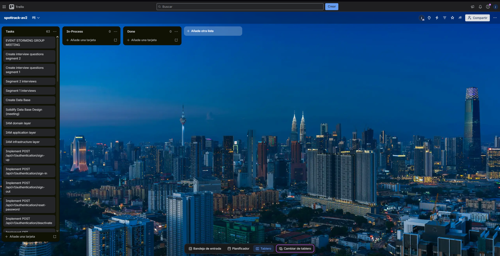
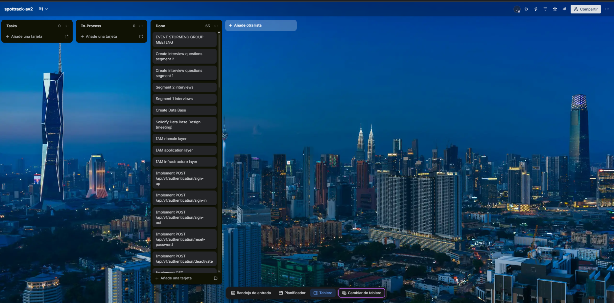

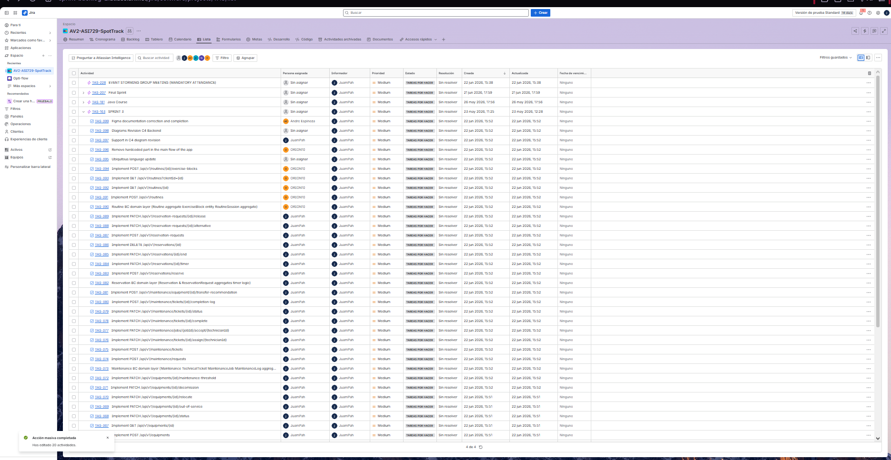
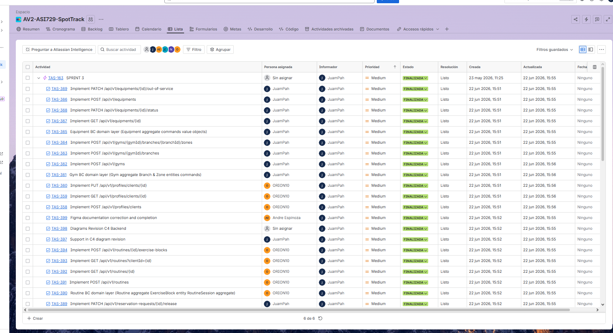

#### Development Evidence for Sprint Review

El principal trabajo del Sprint 3 se concentró en el repositorio `spottrack-platform`, correspondiente al backend desarrollado con Spring Boot. A continuación se presentan los commits más representativos, agrupados por Bounded Context.

Backend Web Services Commits (spottrack-platform):

| Repository | Branch | Commit Id | Commit Message | Commit Message Body | Committed on (Date) |
| :--- | :--- | :--- | :--- | :--- | :--- |
| upc-pre-202610-1asi0729-11881-spottrack/spottrack-platform | main | 1325eaf | Initial commit | - | 2026-05-19 |
| upc-pre-202610-1asi0729-11881-spottrack/spottrack-platform | develop | 86e7199 | chore: initial project setup | - | 2026-05-29 |
| upc-pre-202610-1asi0729-11881-spottrack/spottrack-platform | feat/shared-bounded-context | e58c5dc | feat: add shared bounded context | - | 2026-05-29 |
| upc-pre-202610-1asi0729-11881-spottrack/spottrack-platform | feat/equipment | b3baf4c | feat: add equipment bounded context and aggregate | - | 2026-05-29 |
| upc-pre-202610-1asi0729-11881-spottrack/spottrack-platform | feat/equipment | 81032b1 | add RegisterEquipmentCommand and MarkEquipmentOutOfService command | - | 2026-06-02 |
| upc-pre-202610-1asi0729-11881-spottrack/spottrack-platform | feat/equipment | 20eb775 | fix: add currency pattern validation for money value object | - | 2026-06-02 |
| upc-pre-202610-1asi0729-11881-spottrack/spottrack-platform | feat/equipment | 5d3f36c | feat: add equipment commandService implementation | - | 2026-06-02 |
| upc-pre-202610-1asi0729-11881-spottrack/spottrack-platform | feat/reservation | 52aabc7 | feat: add Reservation bounded context | - | 2026-06-03 |
| upc-pre-202610-1asi0729-11881-spottrack/spottrack-platform | feat/maintenance | 85aaa7c | feat: add maintenance bounded context | - | 2026-06-03 |
| upc-pre-202610-1asi0729-11881-spottrack/spottrack-platform | feature/routines-bounded | fe293a1 | domain layer implemented | - | 2026-06-08 |
| upc-pre-202610-1asi0729-11881-spottrack/spottrack-platform | feature/profiles-bounded | fe4e01e | domain layer added | - | 2026-06-10 |
| upc-pre-202610-1asi0729-11881-spottrack/spottrack-platform | feature/profiles-bounded | 57db4ce | add interfaces layer | - | 2026-06-10 |
| upc-pre-202610-1asi0729-11881-spottrack/spottrack-platform | feature/routines-bounded | 81bd12d | RoutineSession aggregate implemented | - | 2026-06-11 |
| upc-pre-202610-1asi0729-11881-spottrack/spottrack-platform | feat/register-equipment | a995d66 | feat(equipments): consolidated equipments bounded context | - | 2026-06-12 |
| upc-pre-202610-1asi0729-11881-spottrack/spottrack-platform | feat/equipment-markout | 70c410e | feat(equipments): finish mark equipment out of service | - | 2026-06-13 |
| upc-pre-202610-1asi0729-11881-spottrack/spottrack-platform | feat/equipment-reworkTo-gym | 956991d | feat(gym): add createGym controller | - | 2026-06-13 |
| upc-pre-202610-1asi0729-11881-spottrack/spottrack-platform | feat/add-branch | cb5b898 | feat(gym): add addbranch command impl | - | 2026-06-13 |
| upc-pre-202610-1asi0729-11881-spottrack/spottrack-platform | feat/add-zone | 935ba34 | feat(gym): complete add zone feature | - | 2026-06-14 |
| upc-pre-202610-1asi0729-11881-spottrack/spottrack-platform | feat/define-threshold | dfa9941 | feat(gym): add DefineMaintenanceThresholdCommand | - | 2026-06-14 |
| upc-pre-202610-1asi0729-11881-spottrack/spottrack-platform | fix/persistence-entities | a07eb89 | feat(reservation): finished initiate express reservation command working with persistence entity | - | 2026-06-15 |
| upc-pre-202610-1asi0729-11881-spottrack/spottrack-platform | feature/iam-dependencies | 6b02423 | chore: add Spring Security and JWT dependencies | - | 2026-06-16 |
| upc-pre-202610-1asi0729-11881-spottrack/spottrack-platform | feature/iam-register-user | fedf4b3 | feat(iam): add UsersController | - | 2026-06-16 |
| upc-pre-202610-1asi0729-11881-spottrack/spottrack-platform | feature/iam-login-user | 5a24c22 | feat(iam): add AuthenticationController | - | 2026-06-16 |
| upc-pre-202610-1asi0729-11881-spottrack/spottrack-platform | feature/iam-security | 81c77cd | feat(iam): add WebSecurityConfiguration | - | 2026-06-16 |
| upc-pre-202610-1asi0729-11881-spottrack/spottrack-platform | feature/profiles-update-profile-endpoint | 0fa8256 | feat(profiles): add PUT update profile endpoint | - | 2026-06-16 |
| upc-pre-202610-1asi0729-11881-spottrack/spottrack-platform | feat/reservation-timer | 9c92017 | feat(reservation): add methods required for creating the timer and enabled scheduling | - | 2026-06-17 |
| upc-pre-202610-1asi0729-11881-spottrack/spottrack-platform | feat/maintenance | fbddba4 | feat(maintenance): add EquipmentId value object | - | 2026-06-18 |
| upc-pre-202610-1asi0729-11881-spottrack/spottrack-platform | feat/ticket-created-policy | 0ea580e | feat(maintenance): implement ticket created policy to mark equipment out of service | - | 2026-06-19 |
| upc-pre-202610-1asi0729-11881-spottrack/spottrack-platform | feat/ticket-resolved-policy | 7e3d5f1 | feat(maintenance): implement ticket resolved policy to request equipment status update to available | - | 2026-06-19 |
| upc-pre-202610-1asi0729-11881-spottrack/spottrack-platform | develop | 080acf5 | Merge pull request #81 fix/maintenance-repository-save-update | - | 2026-06-19 |

#### Execution Evidence for Sprint Review

Durante el Sprint 3, el equipo concretó la transición de una arquitectura basada en Fake API (JSON Server) a un backend real implementado con Spring Boot. La plataforma `spottrack-platform` fue construida siguiendo los principios de Domain-Driven Design, con Bounded Contexts claramente delimitados: **Gym** (gestión de sedes, zonas y umbral de mantenimiento), **Equipment** (registro, actualización de estado, retiro y reubicación de activos), **Maintenance** (tickets técnicos, trabajos de mantenimiento y bitácora), **Reservation** (reservas exprés con temporizador), **Profiles** (perfiles de administrador y cliente), **IAM** (autenticación JWT, registro, login y desactivación de cuenta) y **Routines** (sesiones de rutina).

Los Bounded Contexts se comunicaron mediante eventos de integración, implementando el patrón de ACL (Anti-Corruption Layer): el evento `TicketCreatedEvent` disparó la política que marcó el equipo como fuera de servicio en el Gym BC, y el evento `TicketResolvedEvent` disparó la política que actualizó el estado del equipo a disponible al completar el mantenimiento.

La integración frontend-backend se logró sin modificaciones a los componentes Angular del Sprint 2, al respetar el contrato de API documentado desde la etapa de Fake API. Únicamente fue necesario actualizar la URL base en `environment.ts`.

Link del video: https://upcedupe-my.sharepoint.com/:v:/g/personal/u202411310_upc_edu_pe/IQAmkUSHJN8lS4mvzoEyBucuAUqh5hJe9wrQA8COdFcSUaQ?nav=eyJyZWZlcnJhbEluZm8iOnsicmVmZXJyYWxBcHAiOiJPbmVEcml2ZUZvckJ1c2luZXNzIiwicmVmZXJyYWxBcHBQbGF0Zm9ybSI6IldlYiIsInJlZmVycmFsTW9kZSI6InZpZXciLCJyZWZlcnJhbFZpZXciOiJNeUZpbGVzTGlua0NvcHkifX0&e=GWuXN8

#### Services Documentation for Sprint Review

El backend fue construido con Spring Boot y expone una API RESTful protegida con JWT. A continuación se detallan los principales endpoints implementados por Bounded Context.

##### Bounded Context: IAM (Identity & Access Management)

| Endpoint | Acción | Verbo HTTP | Sintaxis de Llamada | Ejemplo de Response | Explicación |
| :--- | :--- | :--- | :--- | :--- | :--- |
| `/api/v1/auth/sign-up` | Registrar usuario | `POST` | `/api/v1/auth/sign-up` | `{ "id": 1, "username": "admin@gym.com", "roles": ["ROLE_ADMIN"] }` | Crea un nuevo usuario con rol asignado y dispara la creación del perfil correspondiente. |
| `/api/v1/auth/sign-in` | Autenticar usuario | `POST` | `/api/v1/auth/sign-in` | `{ "id": 1, "username": "admin@gym.com", "token": "eyJ..." }` | Valida credenciales y retorna un Bearer Token JWT para autenticación posterior. |
| `/api/v1/auth/sign-out` | Cerrar sesión | `POST` | `/api/v1/auth/sign-out` | `{ "message": "Signed out successfully" }` | Invalida la sesión activa del usuario. |
| `/api/v1/auth/reset-password` | Restablecer contraseña | `POST` | `/api/v1/auth/reset-password` | `{ "message": "Password reset successfully" }` | Permite al usuario actualizar su contraseña. |

##### Bounded Context: Gym (Gestión de Instalaciones)

| Endpoint | Acción | Verbo HTTP | Sintaxis de Llamada | Ejemplo de Response | Explicación |
| :--- | :--- | :--- | :--- | :--- | :--- |
| `/api/v1/gyms` | Crear gimnasio | `POST` | `/api/v1/gyms` | `{ "id": "uuid", "name": "FitNode Central" }` | Registra un nuevo gimnasio en el sistema. |
| `/api/v1/gyms/{gymId}/branches` | Agregar sede | `POST` | `/api/v1/gyms/{gymId}/branches` | `{ "id": "uuid", "name": "Main Branch", "address": "..." }` | Añade una sede física al gimnasio indicado. |
| `/api/v1/gyms/{gymId}/branches/{branchId}/zones` | Agregar zona | `POST` | `/api/v1/gyms/{gymId}/branches/{branchId}/zones` | `{ "id": "uuid", "name": "Cardio Zone" }` | Crea una zona dentro de una sede. |
| `/api/v1/gyms/{gymId}/maintenance-threshold` | Definir umbral | `PATCH` | `/api/v1/gyms/{gymId}/maintenance-threshold` | `{ "thresholdHours": 200 }` | Configura las horas de uso máximo antes de alertar mantenimiento predictivo. |

##### Bounded Context: Equipment (Gestión de Activos)

| Endpoint | Acción | Verbo HTTP | Sintaxis de Llamada | Ejemplo de Response | Explicación |
| :--- | :--- | :--- | :--- | :--- | :--- |
| `/api/v1/equipments` | Registrar equipo | `POST` | `/api/v1/equipments` | `{ "id": "uuid", "name": "Treadmill", "status": "OPERATIONAL" }` | Registra un equipo físico vinculado a un sensor IoT. |
| `/api/v1/equipments/{id}` | Consultar equipo | `GET` | `/api/v1/equipments/{id}` | `{ "id": "uuid", "name": "Treadmill", "status": "OPERATIONAL" }` | Retorna el detalle completo de un equipo. |
| `/api/v1/equipments/{id}/status` | Actualizar estado | `PATCH` | `/api/v1/equipments/{id}/status` | `{ "status": "OUT_OF_SERVICE" }` | Cambia el estado operativo del equipo. |
| `/api/v1/equipments/{id}/decommission` | Dar de baja | `PATCH` | `/api/v1/equipments/{id}/decommission` | `{ "status": "DECOMMISSIONED" }` | Retira definitivamente el equipo del inventario activo. |
| `/api/v1/equipments/{id}/relocate` | Reubicar equipo | `PATCH` | `/api/v1/equipments/{id}/relocate` | `{ "zoneId": "uuid" }` | Transfiere el equipo a otra zona o sede. |

##### Bounded Context: Maintenance (Mantenimiento)

| Endpoint | Acción | Verbo HTTP | Sintaxis de Llamada | Ejemplo de Response | Explicación |
| :--- | :--- | :--- | :--- | :--- | :--- |
| `/api/v1/maintenance/request` | Solicitar mantenimiento | `POST` | `/api/v1/maintenance/request` | `{ "id": "uuid", "status": "PENDING" }` | Inicia una solicitud de mantenimiento; dispara el evento que marca el equipo fuera de servicio. |
| `/api/v1/maintenance/tickets` | Crear ticket técnico | `POST` | `/api/v1/maintenance/tickets` | `{ "id": "uuid", "priority": "HIGH", "status": "OPEN" }` | Registra un ticket técnico asociado a la solicitud de mantenimiento. |
| `/api/v1/maintenance/tickets/{id}/accept` | Aceptar ticket | `PATCH` | `/api/v1/maintenance/tickets/{id}/accept` | `{ "status": "IN_PROGRESS", "technicianId": 5 }` | Asigna un técnico y activa el trabajo de mantenimiento. |
| `/api/v1/maintenance/tickets/{id}/resolve` | Resolver ticket | `PATCH` | `/api/v1/maintenance/tickets/{id}/resolve` | `{ "status": "RESOLVED" }` | Cierra el ticket y dispara el evento que devuelve el equipo a estado disponible. |

##### Bounded Context: Reservation (Reservas Exprés)

| Endpoint | Acción | Verbo HTTP | Sintaxis de Llamada | Ejemplo de Response | Explicación |
| :--- | :--- | :--- | :--- | :--- | :--- |
| `/api/v1/reservations/initiate-express` | Iniciar reserva exprés | `POST` | `/api/v1/reservations/initiate-express` | `{ "id": "uuid", "status": "ACTIVE", "timerExpiry": "..." }` | Bloquea lógicamente el equipo durante el período reservado; activa el temporizador. |
| `/api/v1/reservations/request-occupy` | Solicitar ocupación | `POST` | `/api/v1/reservations/request-occupy` | `{ "id": "uuid", "status": "PENDING" }` | Registra la intención del cliente de ocupar un equipo en horas pico. |
| `/api/v1/reservations/{id}/end` | Finalizar reserva | `PUT` | `/api/v1/reservations/{id}/end` | `{ "status": "ENDED" }` | Termina la reserva y dispara el evento para liberar el equipo. |

#### Software Deployment Evidence for Sprint Review

Durante el Sprint 3, se completó el despliegue en producción de los tres productos que conforman la solución SpotTrack. El backend fue publicado como un servicio en Azure App Service, conectado a una instancia de Azure MySQL Flexible Database, y expone su documentación interactiva mediante Swagger UI. La aplicación web fue desplegada en Azure Static Web Apps, permitiendo a los usuarios finales acceder a la plataforma desde cualquier navegador. La landing page permanece publicada en GitHub Pages y fue actualizada para reflejar las funcionalidades incorporadas en este sprint. Todos los entornos se encuentran activos y accesibles públicamente a través de los enlaces indicados en la siguiente tabla.

| Producto | Entorno | Tecnología | Enlace |
| :--- | :--- | :--- | :-- |
| SpotTrack Backend API | Docker + Azure MySQL Flexible Database (producción) | Spring Boot + Java | https://spottrack-platform-os.azurewebsites.net/swagger-ui/index.html |
| SpotTrack Web Application | Azure Static Web Apps (producción) | Angular |https://ashy-meadow-0d9e60a10.7.azurestaticapps.net|
| SpotTrack Landing Page | GitHub Pages (producción) | Angular | https://upc-pre-202610-1asi0729-11881-spottrack.github.io/spottrack-website |

Este despliegue garantiza que la lógica de negocio, las bases de datos y los servicios del backend estén completamente disponibles en la nube para ser consumidos de manera estable y segura.

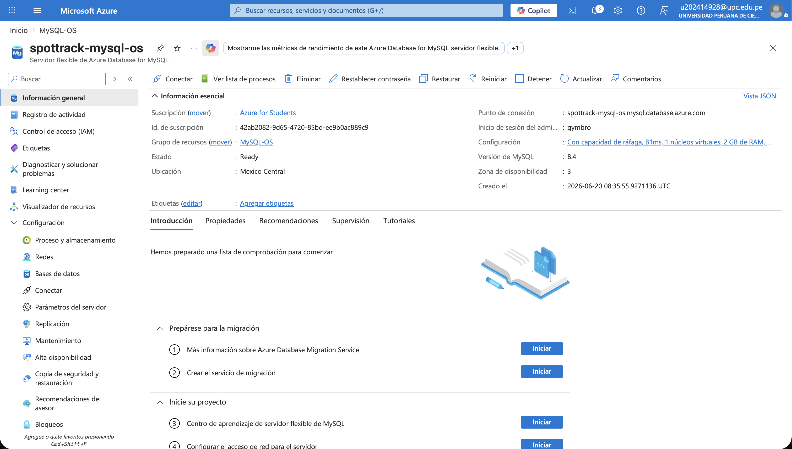
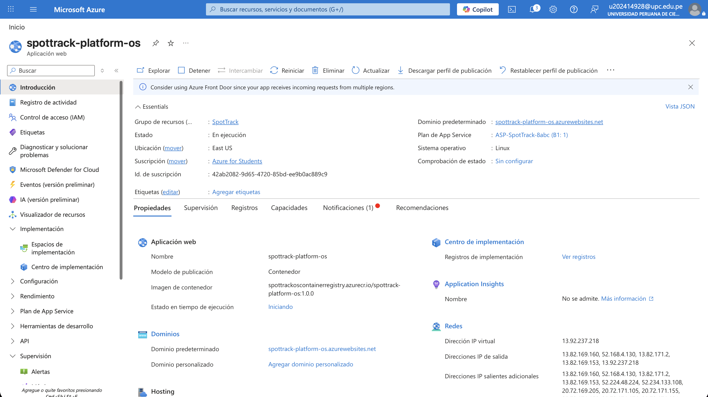

#### Team Collaboration Insights for Sprint Review

Durante el Sprint 3, la colaboración del equipo se concentró principalmente en el repositorio `spottrack-platform`. El historial de commits refleja una distribución activa del trabajo: **llummo** (Juan Pablo Azama) fue el principal contribuidor en los Bounded Contexts de Gym, Equipment, Maintenance y Reservation; mientras que **ORION-tech-c** (Álvaro Fernández) lideró los Bounded Contexts de IAM, Profiles y Routines. El repositorio acumuló más de 80 Pull Requests fusionados a la rama `develop` durante el período del sprint (2026-05-18 al 2026-06-19), evidenciando una metodología GitFlow disciplinada con ramas por feature y revisión de código mediante PRs.

#### Platform
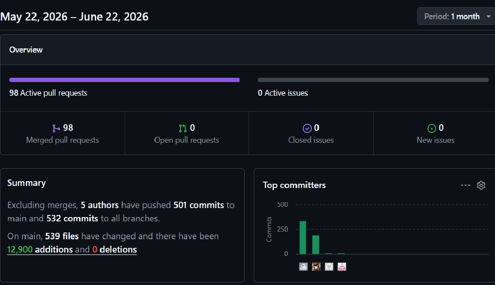

#### Report
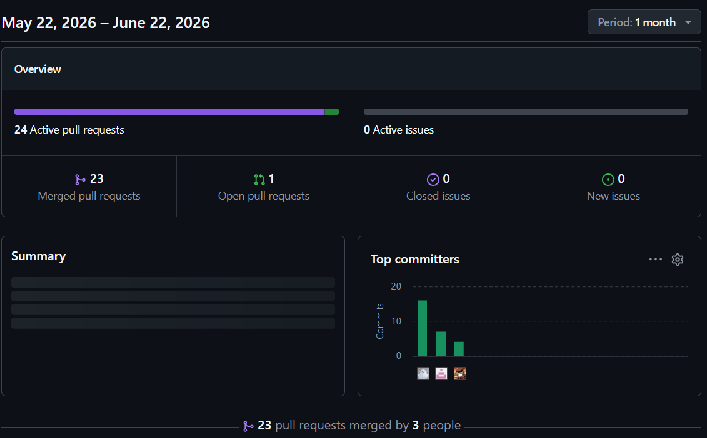

#### Webapp
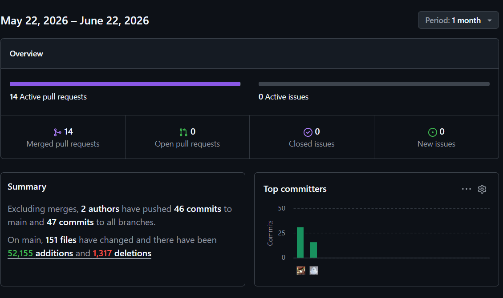

#### Website
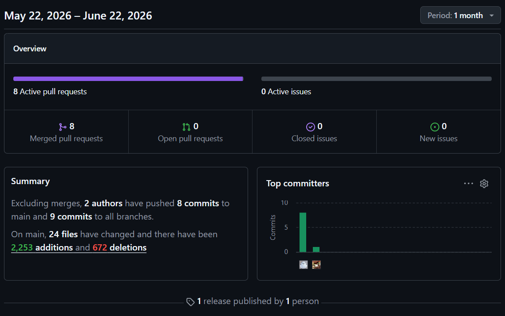

---

### Sprint 4

#### Sprint Planning 4

El presente apartado detalla los acuerdos y objetivos definidos durante el Sprint Planning Meeting de nuestra cuarta y última iteración, así como los resultados alcanzados al cierre del ciclo de vida del proyecto. Para este Sprint final, el equipo se concentró en tres frentes de trabajo: (1) completar los Bounded Contexts de Analytics, IoT/Monitoring y Membership del backend con Spring Boot; (2) incorporar un modelo de negocio de suscripción real, integrando Stripe como servicio de pago de terceros para la activación y facturación de cuentas de administrador; y (3) lograr la integración plena del frontend Angular con el backend real desplegado en producción, subsanando las correcciones identificadas en el Sprint 3 y consolidando la versión final de todos los productos digitales de la plataforma.

**Cambio en la composición del equipo:** al inicio de este Sprint, Atoche Gonzales, Nicolas Fernando y Cataño Zarate, Jesus Miguel se retiraron del curso. Se incorporó al equipo **Limache Coronel, Imanol Fabrizio** (GitHub: `ImaLi06`), quien asumió trabajo en los Bounded Contexts de Monitoring, Maintenance y Routines, además del módulo de Alertas en el frontend.

| Aspect | Details |
| :--- | :--- |
| **Sprint #** | Sprint 4 |
| **Date** | 2026-06-22 |
| **Time** | 09:00 AM |
| **Location** | Reunión Virtual (Discord) |
| **Prepared By** | Azama Fukuda, Juan Pablo |
| **Attendees (to planning meeting)** | Azama Fukuda, Juan Pablo / Espinoza Orrego, Valentino Andre / Fernández Linares, Alvaro Sebastian / Limache Coronel, Imanol Fabrizio |
| **Sprint 3 Review Summary** | Sprint 3 entregó el backend completo con Spring Boot para los Bounded Contexts IAM, Gym, Equipment, Maintenance, Reservation, Profiles y Routines, todos desplegados en Azure App Service conectado a Azure MySQL Flexible Database. Se realizaron seis entrevistas de validación con representantes de ambos segmentos objetivo y se documentó la evaluación heurística del producto, identificando seis áreas de mejora en usabilidad y diseño inclusivo. Sin embargo, quedaron pendientes los Bounded Contexts de Analytics e IoT/Telemetría, la conexión total del frontend Angular al backend real en producción, y la producción del Video About-the-Product. |
| **Sprint 3 Retrospective Summary** | El equipo reconoció que la amplitud del dominio del backend fue subestimada durante la planificación del Sprint 3, lo que impidió completar los Bounded Contexts de Analytics y Telemetría en el tiempo previsto. Como aciertos se destacaron la correcta arquitectura DDD con comunicación entre BCs mediante eventos de integración (TicketCreatedEvent / TicketResolvedEvent) y el despliegue exitoso de los tres productos en la nube. Para el Sprint 4 se establecerán check-ins diarios de progreso, criterios de aceptación explícitos por endpoint antes de comenzar su implementación, y un responsable de integración que valide el contrato de API entre frontend y backend antes del cierre de cada tarea. El despliegue de la versión final de todos los productos se tratará como tarea crítica de primer orden. |
| **Sprint Goal** | Nuestro enfoque es que los administradores de gimnasios puedan suscribirse, pagar y operar la plataforma de punta a punta —desde el registro de su negocio hasta la gestión financiera y predictiva de sus activos— mientras los clientes cuentan con una red de sensores IoT ampliada y un centro de alertas que los mantiene informados en tiempo real. Creemos que esto entrega un modelo de negocio SaaS completo y autosostenible a los administradores, y mayor confianza y capacidad de respuesta a los clientes ante eventos del sistema. Esto se confirmará cuando un administrador nuevo pueda registrar su gimnasio, pagar su membresía mediante Stripe, y operar sin bloqueos críticos desde la plataforma final de SpotTrack, disponible en producción. |
| **Sprint 4 Velocity** | 117 Story Points |
| **Sum of Story Points** | 117 |

##### Sprint 3 Retrospective — Individual Feedback

Durante la reunión de retrospectiva del Sprint 3, el equipo coincidió en que el sprint dejó como resultado la primera versión funcional de los tres productos (v1 del backend, v2 del frontend y v3 de la landing page), y resumió sus principales aprendizajes en tres puntos: (1) el equipo trabajó de forma más ordenada, (2) se definieron con más detalle las tareas, y (3) se logró una mejor distribución de la carga de trabajo respecto a sprints anteriores. A continuación se detalla la opinión individual de los miembros que participaron en esta retrospectiva.

| Miembro | Aciertos | Oportunidades de mejora |
| :--- | :--- | :--- |
| Azama Fukuda, Juan Pablo | Estuvimos organizados, nos esforzamos, mayor proactividad. | Se pudieron definir mejor los objetivos, se pudo distribuir mejor la carga. |
| Fernández Linares, Alvaro Sebastian | Hubo un objetivo macro que funcionó como motor de avance. | Podríamos haber tenido más cuidado con el backend, mejor definición de objetivos. |
| Espinoza Orrego, Valentino Andre | Sintió mejor definición de qué tenía que hacer. | Revisar bien la delegación que cada uno tiene, mejora en QA. |

##### Sprint 4 Retrospective Summary

Al cierre del Sprint 4, el equipo identificó que el alcance real superó ampliamente la estimación inicial de 40 Story Points: la incorporación de un modelo de suscripción de pago (Membership & Billing con Stripe) resultó ser una precondición no anticipada para que un administrador pudiera operar la plataforma, lo que arrastró consigo el onboarding de gimnasios, la gestión de sedes y la lista blanca de clientes. De forma similar, la ampliación de la red de sensores IoT (movimiento, cámara y seguimiento de sesión) generó la necesidad de un centro de alertas unificado que no había sido considerado en el Sprint 3. Como acierto principal, la salida de dos integrantes del equipo no detuvo el ritmo de entrega gracias a la incorporación oportuna de Limache Coronel, Imanol Fabrizio y a la arquitectura por Bounded Contexts, que permitió que el nuevo integrante tomara ownership de módulos delimitados (Monitoring, Alerts, parte de Maintenance y Routines) sin fricción con el resto del código. Como oportunidad de mejora, el equipo reconoce que no se implementó cobertura de pruebas automatizadas (unitarias o de integración) para los nuevos Bounded Contexts, ni un pipeline de CI/CD para el repositorio del backend, quedando ambos como recomendaciones para una eventual continuidad del producto.

#### Aspect Leaders and Collaborators

Para este Sprint 4 final, el equipo organizó su trabajo en cuatro frentes simultáneos: Membership & Billing (incluyendo la integración de pagos con Stripe), IoT Monitoring/Anomalías y el nuevo Centro de Alertas, Mantenimiento (gestión de técnicos) y Analítica/ROI, y la integración final del frontend junto con el cierre de la Landing Page. Esta estructura garantiza avance paralelo con ownership claro sobre cada frente, asegurando la entrega definitiva del proyecto.

| Team Member (Last Name, First Name) | GitHub Username | Aspect 1: Membership & Billing (Stripe) Leader (L) / Collaborator (C) | Aspect 2: IoT Monitoring, Anomalies & Alerts Center Leader (L) / Collaborator (C) | Aspect 3: Maintenance Technicians & Analytics/ROI Leader (L) / Collaborator (C) | Aspect 4: Frontend Integration & Landing Page Finalization Leader (L) / Collaborator (C) |
| :--- | :--- | :--- | :--- | :--- | :--- |
| Azama Fukuda, Juan Pablo | llummo | (C) | Monitoring & Session Tracking (L) | Maintenance Technicians & Analytics/ROI (L) | Stripe checkout & QR check-in (C) |
| Fernández Linares, Alvaro Sebastian | ORION-tech-c | Membership BC & Gym Onboarding (L) | (C) | Notification Preferences & Auth hardening (C) | (C) |
| Espinoza Orrego, Valentino Andre | valentinoespinoza13 | (C) | (C) | Analytics frontend refactor (C) | Landing Page finalization (L) |
| Limache Coronel, Imanol Fabrizio | ImaLi06 | (C) | Alerts Center & Anomaly reporting (L) | Technician assignment UI & Routine sessions (C) | (C) |

Nota: los commits de Limache Coronel Imanol Fabrizio aparecen en el historial de los repositorios `spottrack-platform` y `spottrack-webapp` bajo los identificadores de Git `ImaLi06` e `Imanol`.

#### Sprint Backlog 4

El Sprint 4 incorporó al backlog los User Stories y Technical Stories US30–US49 y TS60–TS100 (ver Capítulo III, sección 3.1). Este conjunto combina las historias documentadas de forma independiente por Valentino Espinoza (PR #164, cubriendo el ciclo completo de Membership & Billing con Stripe, onboarding multi-gimnasio, lista blanca, personal técnico, recuperación de contraseña y seguimiento de rutinas en vivo) con las historias de IoT Monitoring, Alertas, Analítica y gestión de técnicos de mantenimiento incorporadas en paralelo, tras reconciliar duplicados y renumerar IDs en conflicto. A continuación se detalla la descomposición en tasks de dichos artefactos, junto con tasks adicionales de cierre de sprint (prefijo `SF4-`).

| Id | Title | Task Id | Task Title | Description | Estimation (Hours) | Assigned To | Status |
| :--- | :--- | :--- | :--- | :--- | :--- | :--- | :--- |
| TS60 | Registrar alta de negocio y pago inicial API | T01 | Membership BC domain layer (Membership aggregate, MembershipTier enum, BranchAccess) | Definir el agregado Membership, el enum MembershipTier (Basic/Mid/Platinum) y el value object BranchAccess con el límite de sedes por plan. | 5 hrs | Fernández | Done |
| TS60 | Registrar alta de negocio y pago inicial API | T02 | Implement POST /api/v1/register-business | Registrar los datos personales y de empresa de un nuevo administrador en un registro pendiente previo al pago. | 4 hrs | Fernández | Done |
| TS61 | Iniciar pago de membresía API | T03 | Integrate Stripe Java SDK and configure API keys/webhook secret | Añadir la dependencia stripe-java, configurar las variables de entorno STRIPE_SECRET_API_KEY y STRIPE_WEBHOOK_SECRET en application-prod.properties. | 4 hrs | Azama | Done |
| TS61 | Iniciar pago de membresía API | T04 | Implement POST /api/v1/payments | Crear la sesión de pago en Stripe Checkout para el plan seleccionado y retornar el checkoutUrl al cliente. | 5 hrs | Azama | Done |
| TS62 | Confirmar pago mediante webhook de Stripe API | T05 | Implement POST /api/v1/webhooks/stripe with signature verification | Verificar la firma del header Stripe-Signature mediante Webhook.constructEvent antes de procesar cualquier evento recibido. | 5 hrs | Azama | Done |
| TS62 | Confirmar pago mediante webhook de Stripe API | T06 | Handle checkout.session.completed / expired events | Disparar ConfirmPaymentCommand al completarse el pago y FailPaymentCommand ante una sesión expirada. | 4 hrs | Azama | Done |
| US30 | Selección de plan y pago inicial en el alta de negocio | T07 | Build plan selection screen (Basic $69 / Mid $109 / Platinum $189) | Construir la pantalla de selección de planes con comparativa de características sustentada en un dato compartido plan-features.data.ts. | 5 hrs | Fernández | Done |
| US30 | Selección de plan y pago inicial en el alta de negocio | T08 | Implement Stripe Checkout handoff and success/cancel pages | Conectar el flujo de registro con Stripe Checkout mediante un borrador en sessionStorage, y construir las pantallas /payment/success y /payment/cancel. | 5 hrs | Azama | Done |
| US30 | Selección de plan y pago inicial en el alta de negocio | T09 | Build business registration form | Reescribir el formulario de registro para capturar datos personales (nombre, DNI, teléfono) y datos de empresa, con selección de rol administrador/cliente. | 5 hrs | Fernández | Done |
| TS64 | Obtener membresía del cliente autenticado API | T10 | Implement GET /api/v1/memberships/me | Retornar el estado y tier de la membresía del administrador autenticado. | 4 hrs | Fernández | Done |
| US32 | Gestión del ciclo de vida de la membresía | T11 | Build "My Membership" section | Construir la sección de perfil con estado de membresía, badge de plan y acciones de cancelar, deshacer cancelación, pagar deuda y cambiar de plan. | 5 hrs | Fernández | Done |
| TS65, TS66 | Cancelar / Deshacer cancelación de membresía API | T12 | Implement PATCH /memberships/{id}/cancel and /undo-cancel | Marcar la membresía como Pendiente de Cancelación y permitir revertir el estado antes de la fecha de corte. | 4 hrs | Fernández | Done |
| TS68, TS69 | Degradar / Mejorar plan de membresía API | T13 | Implement POST /memberships/{id}/upgrade-plan and /downgrade-plan | Actualizar el tier de membresía validando el límite de sedes activas contra el nuevo plan solicitado. | 5 hrs | Fernández | Done |
| TS67 | Pagar deuda de membresía suspendida API | T14 | Implement POST /memberships/{id}/pay-debt | Generar una nueva sesión de pago Stripe para regularizar una membresía morosa. | 4 hrs | Fernández | Done |
| US34 | Alta del primer gimnasio por el administrador | T15 | Build GymCreateComponent and hasGymGuard | Construir la pantalla de creación del primer gimnasio y el guard que redirige a administradores sin gimnasio asociado. | 5 hrs | Fernández | Done |
| US43 | Gestión de sedes adicionales según límite del plan | T16 | Build branch management screen (/gym/branches) | Construir la pantalla de gestión de sedes con validación del límite de sedes según el plan de membresía activo. | 5 hrs | Fernández | Done |
| US37 | Control de acceso mediante lista blanca de DNI | T17 | Build gym whitelist management screen | Construir la pantalla de administración de la lista blanca de DNIs autorizados para asociación de clientes. | 5 hrs | Fernández | Done |
| US35 | Asociación de un cliente a un gimnasio | T18 | Build /gym/associate screen and GymSwitcherComponent | Construir la pantalla de asociación de clientes a un gimnasio autorizado y el selector de sede en el perfil. | 5 hrs | Fernández | Done |
| US36 | Cambio entre gimnasios asociados | T19 | Implement hasClientGymGuard and ActiveGymStore | Implementar el guard de asociación de cliente y el store de gimnasio activo para cargar el mapa de calor de la sede correcta. | 4 hrs | Azama | Done |
| TS90 | Registrar y listar sensores de movimiento API | T20 | Monitoring BC domain layer (MotionSensor aggregate) | Definir el agregado MotionSensor, sus eventos de conexión/desconexión y el value object de estado. | 5 hrs | Azama | Done |
| TS90 | Registrar y listar sensores de movimiento API | T21 | Implement POST/GET /monitoring/motion-sensors and /me | Registrar sensores de movimiento y exponer el listado propio del administrador autenticado. | 4 hrs | Azama | Done |
| TS91 | Registrar y listar sensores de cámara API | T22 | Implement POST/GET /monitoring/camera-sensors and capture-motion | Registrar cámaras Edge y exponer el endpoint de captura de estado de movimiento detectado. | 5 hrs | Azama | Done |
| US44 | Monitoreo de sensores de movimiento y cámara | T23 | Build IoT Monitoring page | Construir la vista unificada de monitoreo IoT que reemplaza el mock de dispositivos, mostrando estado de conexión en vivo de cámaras y sensores de movimiento. | 5 hrs | Azama | Done |
| US44 | Monitoreo de sensores de movimiento y cámara | T24 | Implement MotionSensorConnectivityScheduler | Implementar el scheduler de conectividad que marca sensores como Desconectado tras vencer el período de tolerancia y dispara la alerta correspondiente. | 5 hrs | Azama | Done |
| TS92 | Gestionar session trackers API | T25 | SessionTracker aggregate and SessionTrackerScheduler | Definir el agregado SessionTracker y el scheduler que cierra automáticamente sesiones inactivas. | 5 hrs | Azama | Done |
| TS92 | Gestionar session trackers API | T26 | Implement create/verify/{id}/end/{id}/time endpoints | Exponer el ciclo de vida completo del session tracker bajo /monitoring/session-trackers. | 4 hrs | Azama | Done |
| US45 | Registro automático de sesión de uso vía sensor IoT | T27 | Implement live session tracking in the client app | Construir el polling de sesiones activas con badges en tiempo real, reemplazando la creación manual de sesiones. | 5 hrs | Limache Coronel | Done |
| TS89 | Registrar reporte de anomalía API | T28 | Anomaly aggregate and POST /api/v1/anomalies | Definir el agregado Anomaly, validar la pertenencia de la reserva al cliente que reporta, y publicar el evento de alerta. | 5 hrs | Azama | Done |
| US41 | Reporte estructurado de anomalías de equipo | T29 | Rework anomaly report flow with reservation dropdown | Reemplazar los campos manuales de reserva/equipo por un desplegable de reservas activas del cliente. | 4 hrs | Limache Coronel | Done |
| TS100 | Listar y resolver alertas API | T30 | Shared Alert aggregate with AlertSeverity | Definir el agregado Alert transversal con niveles de severidad, consumido por eventos de Monitoring y Gym. | 5 hrs | Limache Coronel | Done |
| TS100 | Listar y resolver alertas API | T31 | Implement GET /api/v1/alerts and PATCH /{id}/resolve | Exponer el listado de alertas por rol y la acción de resolución. | 4 hrs | Limache Coronel | Done |
| US46 | Centro de alertas unificado | T32 | Build unified alerts inbox with resolve and clear-all actions | Construir la bandeja de notificaciones con severidad, resolución individual y limpieza masiva de alertas resueltas. | 5 hrs | Limache Coronel | Done |
| US46 | Centro de alertas unificado | T33 | Fix AuthStore/AlertsStore circular dependency (NG0200) | Resolver la dependencia circular que rompía la carga de alertas al iniciar sesión, y reiniciar el estado de alertas al cerrar sesión. | 4 hrs | Limache Coronel | Done |
| TS99 | Configurar preferencias de notificación API | T34 | Implement PATCH /api/v1/users/me/notification-preferences | Persistir las preferencias de notificación del usuario autenticado en la tabla de usuarios de IAM. | 4 hrs | Fernández | Done |
| US47 | Preferencias de notificación | T35 | Build notification preferences settings card | Construir la tarjeta de configuración de preferencias de notificación dentro del módulo de Ajustes. | 4 hrs | Limache Coronel | Done |
| TS96 | Registrar y listar técnicos API | T36 | Technician aggregate, value object and persistence stack | Definir el agregado Technician, su value object de identidad y la capa de persistencia correspondiente. | 4 hrs | Azama | Done |
| TS96 | Registrar y listar técnicos API | T37 | Implement POST/GET /api/v1/maintenance/technicians | Registrar técnicos de mantenimiento y exponer su listado para asignación. | 4 hrs | Azama | Done |
| TS97 | Asignar técnico y aceptar trabajo de mantenimiento API | T38 | Implement PATCH tickets/{id}/assign/{technicianId} and jobs/{id}/accept/{technicianId} | Vincular un técnico a un ticket técnico y permitir que acepte y active el trabajo de mantenimiento asignado. | 5 hrs | Azama | Done |
| US48 | Gestión de técnicos de mantenimiento | T39 | Build technician management screen and assignment dropdown | Construir la pantalla de gestión de técnicos en Ajustes y el desplegable de asignación de técnico en los tickets, reemplazando el campo de texto libre. | 5 hrs | Limache Coronel | Done |
| TS98 | Registrar bitácora de finalización de ticket API | T40 | Implement POST /maintenance/tickets/{id}/completion-log | Registrar el costo y las notas de la intervención técnica al completar un ticket. | 4 hrs | Azama | Done |
| US49 | Registro de bitácora y costo de finalización de ticket | T41 | Add completion cost field to the ticket completion modal | Añadir el campo de costo de finalización al modal de cierre de ticket, tipado como número y conectado al store y API. | 4 hrs | Limache Coronel | Done |
| US40 | Check-in por código QR para activar reserva exprés | T42 | Integrate html5-qrcode scanner for reservation check-in | Integrar el escáner de código QR para validar la presencia del cliente frente a la máquina reservada y confirmar la ocupación. | 5 hrs | Azama | Done |
| TS93 | Registrar reporte de actividad API | T43 | Analytics BC domain layer (ActivityReport aggregate) | Definir el agregado ActivityReport con las métricas de horas de uso total y costo por inactividad. | 5 hrs | Azama | Done |
| TS93 | Registrar reporte de actividad API | T44 | Implement POST/GET /api/v1/activity-reports and /me | Generar y consultar reportes de actividad filtrados por el administrador autenticado. | 4 hrs | Azama | Done |
| TS94 | Generar cotización de mantenimiento API | T45 | MaintenanceQuote aggregate and cost endpoints | Definir el agregado MaintenanceQuote y los endpoints PATCH de repuestos, costo preventivo y costo total. | 5 hrs | Azama | Done |
| TS95 | Calcular proyección de ROI y detectar demanda API | T46 | ROIProjection aggregate and roi-projections endpoint | Definir el agregado ROIProjection y el endpoint POST /api/v1/roi-projections. | 5 hrs | Azama | Done |
| TS95 | Calcular proyección de ROI y detectar demanda API | T47 | Implement detect-low-demand/detect-high-demand/recommend-transfer actions | Detectar demanda baja/alta a partir del signo de la proyección de ROI y generar la recomendación de traslado de equipo. | 5 hrs | Azama | Done |
| US42 | Seguimiento de ejecución de rutina en vivo | T48 | Implement exercise-block completion tracking | Implementar el marcado de bloques de ejercicio completados dentro de una sesión de rutina activa, con historial de sesión. | 5 hrs | Limache Coronel | Done |
| TS80, TS81 | Solicitar / Verificar restablecimiento de contraseña API | T49 | Implement POST /authentication/forgot-password and /verify | Generar y validar un código de verificación de dos pasos para el restablecimiento de contraseña. | 4 hrs | Fernández | Done |
| TS80, TS81 | Solicitar / Verificar restablecimiento de contraseña API | T50 | Build two-step forgot-password flow in the UI | Construir el flujo de recuperación de contraseña en dos pasos y el cambio de contraseña en línea desde el perfil. | 4 hrs | Fernández | Done |
| - | Sprint 4 Closure | SF4-01 | Rebuild dashboard analytics from real data | Reconstruir el gráfico de picos de afluencia, la tabla de uso de máquinas y equipos subutilizados a partir de los endpoints reales de Analytics, retirando datos hardcodeados. | 5 hrs | Espinoza | Done |
| - | Sprint 4 Closure | SF4-02 | Fix financial-impact/inactivity-loss analytics filter | Corregir el filtro de pérdida por inactividad que descartaba datos reales del equipo actual. | 4 hrs | Espinoza | Done |
| - | Sprint 4 Closure | SF4-03 | Add global HTTP 401/403 interceptor | Implementar el interceptor HTTP que fuerza el cierre de sesión ante credenciales expiradas o inválidas. | 4 hrs | Fernández | Done |
| - | Sprint 4 Closure | SF4-04 | Finalize Landing Page v3.0.1 release | Consolidar la versión final de la Landing Page: video en el Hero Section, animaciones de Features y Pricing, formulario de contacto vía EmailJS, y corrección del build-size budget que bloqueaba el pipeline de despliegue. | 5 hrs | Azama | Done |
| - | Sprint 4 Closure | SF4-05 | Add mobile hamburger navigation and full responsive pass | Implementar el menú de navegación móvil tipo hamburguesa y ajustar los media queries de todas las secciones de la Landing Page. | 4 hrs | Azama | Done |
| - | Sprint 4 Closure | SF4-06 | Embed "About the Product" demo video section | Integrar la sección de video demostrativo (YouTube) debajo de Features en la Landing Page. | 4 hrs | Espinoza | Done |
| - | Sprint 4 Closure | SF4-07 | Final production deployment verification | Validar que los tres productos (Landing Page, Web Application y Backend API) son accesibles y funcionales en sus URLs de producción para la versión final del proyecto. | 4 hrs | Azama | Done |
| - | Sprint 4 Closure | SF4-08 | Document Sprint 4 in project report | Redactar las secciones de Sprint Planning 4, Aspect Leaders, Sprint Backlog y evidencias en el Capítulo V del informe del proyecto, junto con los nuevos User Stories y Technical Stories del Capítulo III. | 5 hrs | Espinoza | Done |

Como evidencia de la gestión de tareas del Sprint 4, se importó el desglose completo de tasks del Sprint Backlog 4 (T01–T50 y SF4-01 a SF4-08, 58 tareas en total) al tablero de Jira del equipo, anidándolas como subtareas del ticket **TAS-403 (Missing Web Services)**, que a su vez forma parte de la estructura jerárquica de la Épica **TAS-207 (Final Sprint)**. La primera captura muestra el estado del tablero antes de la incorporación de este desglose, con la estructura de historias de Final Sprint (Deployment, About the Product, Landing Page, QA, About the Team, Frontend Connection) aún sin la rama de Missing Web Services. La segunda captura refleja el estado posterior a la importación y a la asignación masiva de responsable, prioridad y estado (Finalizada) sobre las 58 subtareas, evidenciando la trazabilidad completa entre el backlog documentado en este capítulo y el tablero operativo real del equipo.

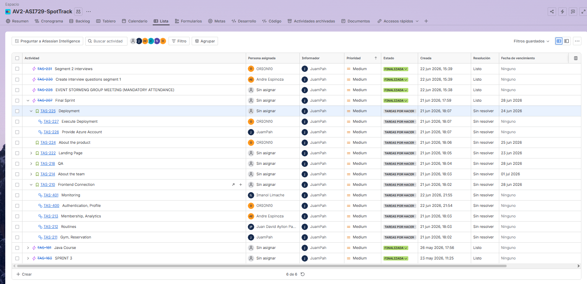
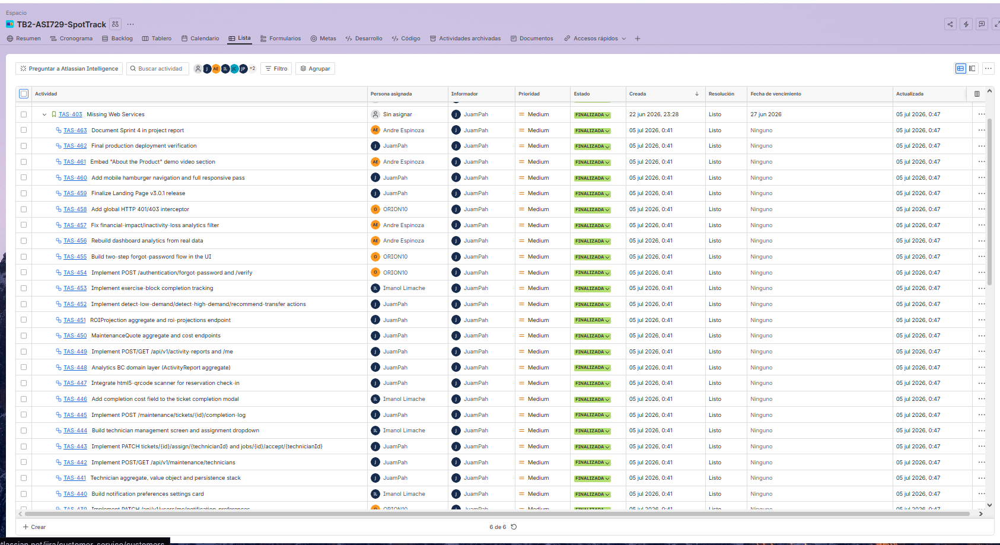

Adicionalmente, y únicamente para cumplir con el requisito de la rúbrica de contar con un tablero en Trello, se replicó el mismo desglose de 58 tareas en un tablero de Trello (`spottrack-tb2`), dado que el equipo utilizó Jira como su herramienta principal de gestión de tareas durante todo el proyecto. La primera captura muestra las 58 tarjetas recién cargadas en la columna **To-do**, y la segunda captura las mismas 58 tarjetas movidas a la columna **Done** al cierre del sprint.

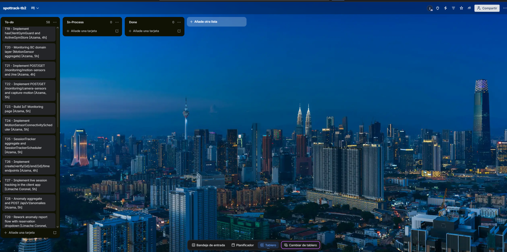
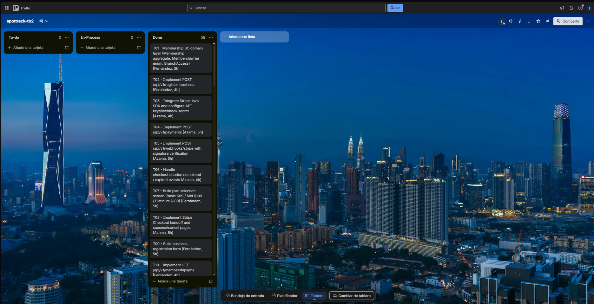

#### Development Evidence for Sprint Review

El Sprint 4 concentró el mayor volumen de trabajo del proyecto: **825 commits (132 Pull Requests fusionados)** en `spottrack-platform`, **466 commits (72 Pull Requests fusionados)** en `spottrack-webapp` y **37 commits (11 Pull Requests fusionados)** en `spottrack-website`, entre el 2026-06-19 y el 2026-07-04. A continuación se presenta una muestra representativa de los commits más relevantes por repositorio.

Backend (`spottrack-platform`):

| Repository | Branch | Commit Id | Commit Message | Commit Message Body | Committed on (Date) |
| :--- | :--- | :--- | :--- | :--- | :--- |
| upc-pre-202610-1asi0729-11881-spottrack/spottrack-platform | feature/membership-stripe | 9be57b8 | feat(membership): implemented stripe | - | 2026-06-27 |
| upc-pre-202610-1asi0729-11881-spottrack/spottrack-platform | feature/branch-limit-by-plan | 6550d2a | feat(gym): return 409 Conflict when branch limit is reached | - | 2026-07-03 |
| upc-pre-202610-1asi0729-11881-spottrack/spottrack-platform | feature/membership-undo-cancellation | 72b7150 | feat(membership): add PATCH undo-cancel endpoint | - | 2026-07-03 |
| upc-pre-202610-1asi0729-11881-spottrack/spottrack-platform | feat/technician-management | f5a990f | feat(maintenance): add Technician aggregate, value object, and domain events | - | 2026-07-03 |
| upc-pre-202610-1asi0729-11881-spottrack/spottrack-platform | feat/reservation-request-fulfillment | 231aa31 | feat(reservation): auto-create a Reservation when a request is submitted | - | 2026-07-03 |
| upc-pre-202610-1asi0729-11881-spottrack/spottrack-platform | feat/analytics-demand-transfer-policies | c4f32b9 | feat(analytics): recommend equipment transfer on low demand and notify for relocation | - | 2026-07-03 |
| upc-pre-202610-1asi0729-11881-spottrack/spottrack-platform | feature/routine-session-completion | 7f05507 | feat(routine): add setExerciseBlockCompletion endpoint to RoutineSessionsController | - | 2026-07-03 |
| upc-pre-202610-1asi0729-11881-spottrack/spottrack-platform | feature/notification-preferences | 160fd5a | feat(iam): add GET/PATCH endpoints for notification preferences | - | 2026-07-04 |
| upc-pre-202610-1asi0729-11881-spottrack/spottrack-platform | fix/silent-alert-notification-failures | edf0001 | fix(monitoring): log every silent-drop path in anomaly alert creation | - | 2026-07-04 |
| upc-pre-202610-1asi0729-11881-spottrack/spottrack-platform | feat/gym-scoped-equipment-endpoint | 939b7d6 | feat(gym): expose client-accessible gym-scoped equipment endpoint | - | 2026-07-04 |

Frontend (`spottrack-webapp`):

| Repository | Branch | Commit Id | Commit Message | Commit Message Body | Committed on (Date) |
| :--- | :--- | :--- | :--- | :--- | :--- |
| upc-pre-202610-1asi0729-11881-spottrack/spottrack-webapp | feat/technician-management | e95a9b0 | Merge pull request #134 feat/technician-assignment-dropdown | - | 2026-07-04 |
| upc-pre-202610-1asi0729-11881-spottrack/spottrack-webapp | feat/settings-technicians | 431f9f8 | Merge pull request #132 feat/settings-technicians | - | 2026-07-04 |
| upc-pre-202610-1asi0729-11881-spottrack/spottrack-webapp | feat/settings-notification-preferences | 22dbd56 | Merge pull request #133 feat/settings-notification-preferences | - | 2026-07-04 |
| upc-pre-202610-1asi0729-11881-spottrack/spottrack-webapp | feat/anomaly-report-reservation-dropdown | 951af78 | Merge pull request #138 feat/anomaly-report-reservation-dropdown | - | 2026-07-04 |
| upc-pre-202610-1asi0729-11881-spottrack/spottrack-webapp | feat/clear-all-notifications | 45b94c8 | Merge pull request #140 feat/clear-all-notifications | - | 2026-07-04 |
| upc-pre-202610-1asi0729-11881-spottrack/spottrack-webapp | feat/dashboard-peak-hours-chart-v2 | 3ad091e | Merge pull request #139 feat/dashboard-peak-hours-chart-v2 | - | 2026-07-04 |
| upc-pre-202610-1asi0729-11881-spottrack/spottrack-webapp | fix/authstore-circular-dependency | 900a8ca | Merge pull request #127 fix/authstore-circular-dependency | - | 2026-07-04 |
| upc-pre-202610-1asi0729-11881-spottrack/spottrack-webapp | fix/financial-impact-inactivity-filter | d9cdc0f | Merge pull request #124 fix/financial-impact-inactivity-filter | - | 2026-07-04 |

Landing Page (`spottrack-website`):

| Repository | Branch | Commit Id | Commit Message | Commit Message Body | Committed on (Date) |
| :--- | :--- | :--- | :--- | :--- | :--- |
| upc-pre-202610-1asi0729-11881-spottrack/spottrack-website | feat/stripe-checkout | 9be57b8 | implemented stripe | - | (posterior al release v3.0.1, fecha exacta a confirmar por el equipo) |
| upc-pre-202610-1asi0729-11881-spottrack/spottrack-website | feature/hero | c5469c6 | feat: add stock video to hero-section | - | 2026-06-21 |
| upc-pre-202610-1asi0729-11881-spottrack/spottrack-website | feat/pricing | a6f0236 | feat(pricing): add graph animations to pricing section and card overhaul | - | 2026-06-21 |
| upc-pre-202610-1asi0729-11881-spottrack/spottrack-website | feat/contact | 89c5454 | feat: reworked contact form | - | 2026-06-21 |
| upc-pre-202610-1asi0729-11881-spottrack/spottrack-website | fix/build-size-budget | d8c366e | fix: istok web-font size budget glitched the github actions | - | 2026-06-21 |
| upc-pre-202610-1asi0729-11881-spottrack/spottrack-website | feature/mobile-nav | 1a27d9c | feat: add hamburger mobile navigation menu | - | 2026-07-01 |
| upc-pre-202610-1asi0729-11881-spottrack/spottrack-website | feature/add-about-the-product | fddaeec | feat(video): add YouTube demo section below Features | - | 2026-07-04 |

#### Execution Evidence for Sprint Review

Al cierre del Sprint 4, SpotTrack alcanzó su versión final como plataforma SaaS B2B2C completa: un administrador puede registrar su negocio, seleccionar un plan de membresía (Basic/Mid/Platinum), pagar mediante Stripe Checkout, crear su gimnasio y sedes respetando el límite de su plan, gestionar una lista blanca de clientes autorizados, monitorear en tiempo real sensores de movimiento y cámara, recibir y resolver alertas centralizadas (mantenimiento, sensores, anomalías, reservas), asignar técnicos a tickets con bitácora de costos, y proyectar el ROI de nuevas inversiones o reubicaciones de equipos. Los clientes, por su parte, pueden asociarse a un gimnasio autorizado, hacer check-in de sus reservas exprés mediante código QR, reportar anomalías desde una reserva activa, y llevar seguimiento del progreso de sus rutinas por bloque de ejercicio. La Landing Page cerró su versión final (v3.0.1) con una sección de video demostrativo, navegación móvil y un formulario de contacto funcional vía EmailJS.

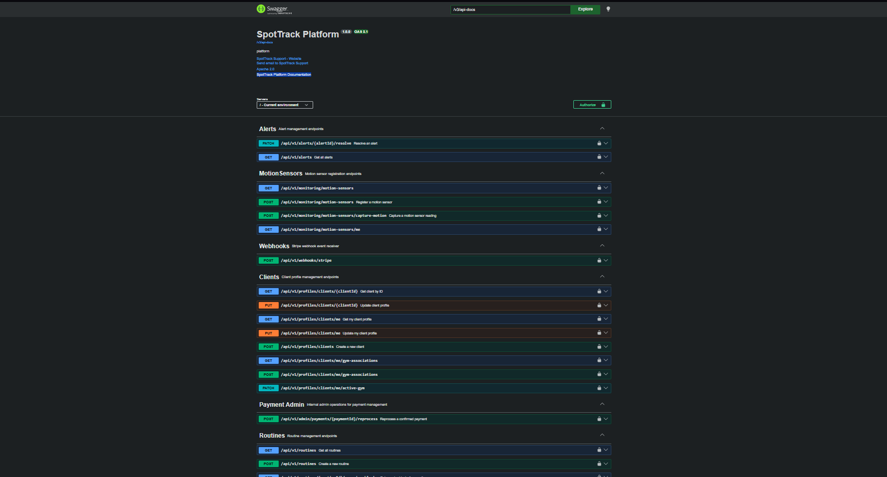

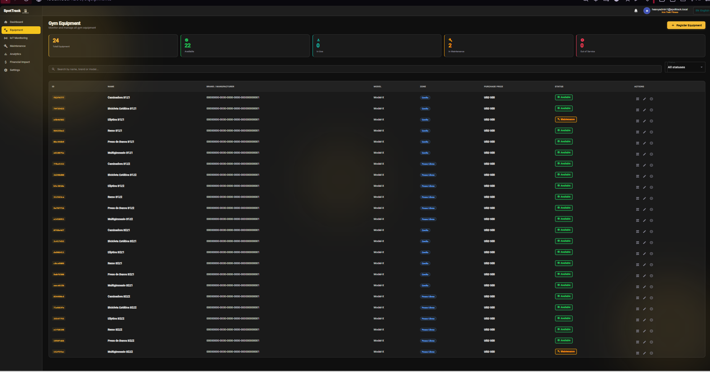

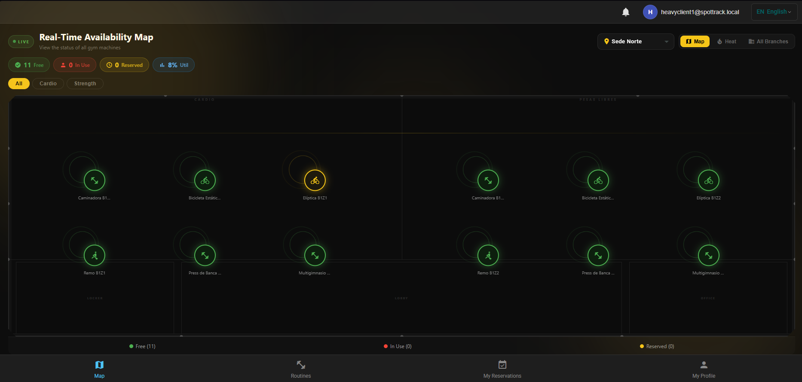

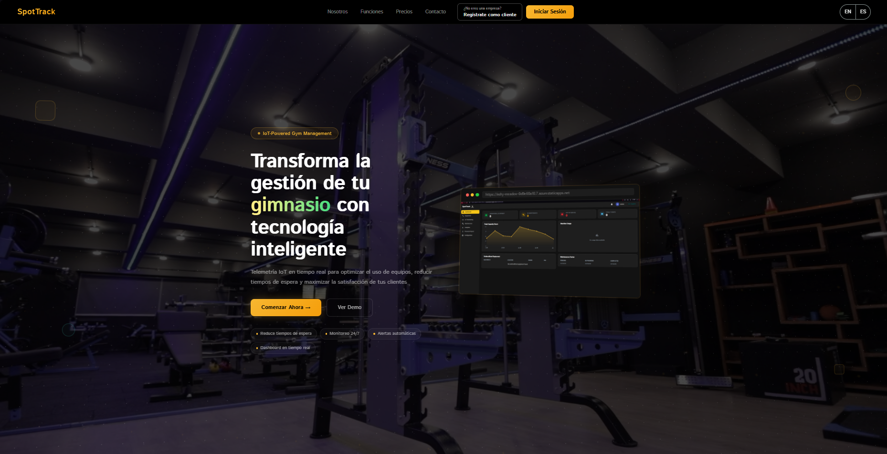

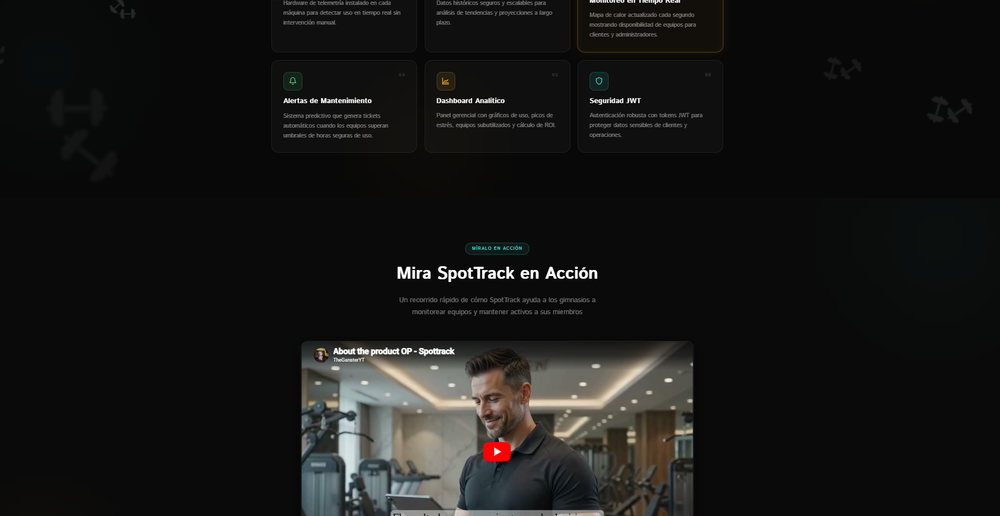

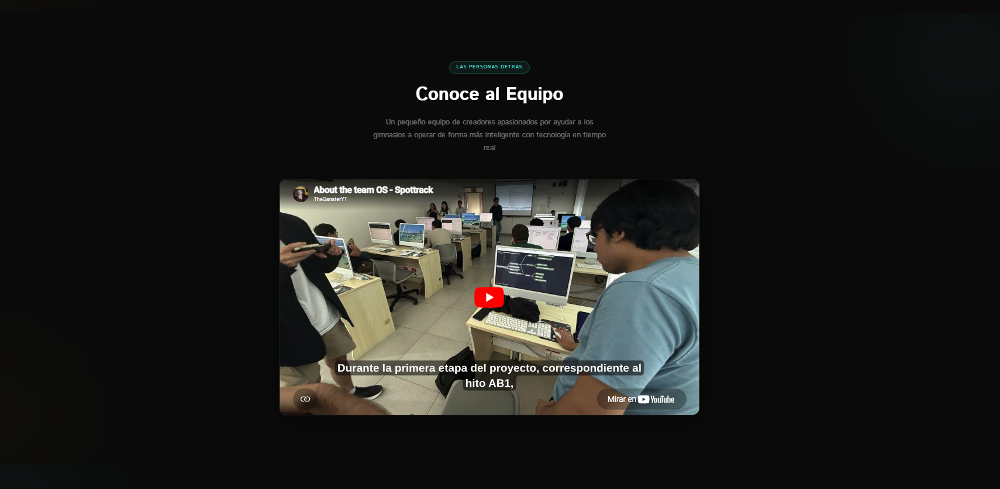

*Video de evidencia de ejecución:* [Enlace al video de ejecución del Sprint 4 - SpotTrack](https://upcedupe-my.sharepoint.com/:v:/g/personal/u202411310_upc_edu_pe/IQBSBXxJ7QCGRYPQp4-K74l6AZuoE_AJcGf8MW04nLF-HpE?e=qEWGQk&nav=eyJyZWZlcnJhbEluZm8iOnsicmVmZXJyYWxBcHAiOiJTdHJlYW1XZWJBcHAiLCJyZWZlcnJhbFZpZXciOiJTaGFyZURpYWxvZy1MaW5rIiwicmVmZXJyYWxBcHBQbGF0Zm9ybSI6IldlYiIsInJlZmVycmFsTW9kZSI6InZpZXcifX0%3D)

#### Services Documentation Evidence for Sprint Review

A continuación se detallan los principales endpoints implementados durante el Sprint 4, agrupados por Bounded Context.

##### Bounded Context: Membership (Suscripción y Facturación)

| Endpoint | Acción | Verbo HTTP | Sintaxis de Llamada | Ejemplo de Response | Explicación |
| :--- | :--- | :--- | :--- | :--- | :--- |
| `/api/v1/register-business` | Registrar negocio | `POST` | `/api/v1/register-business` | `{ "registrationId": "uuid", "status": "PENDING" }` | Registra los datos personales y de empresa de un administrador antes del pago. |
| `/api/v1/payments` | Crear sesión de pago | `POST` | `/api/v1/payments` | `{ "checkoutUrl": "https://checkout.stripe.com/..." }` | Genera una sesión de pago en Stripe Checkout para el plan elegido. |
| `/api/v1/webhooks/stripe` | Confirmar pago | `POST` | `/api/v1/webhooks/stripe` | `{ "received": true }` | Verifica la firma del evento Stripe y activa la membresía tras el pago. |
| `/api/v1/memberships/me` | Consultar membresía propia | `GET` | `/api/v1/memberships/me` | `{ "tier": "MID", "status": "ACTIVE", "maxBranches": 3 }` | Retorna el estado y tier de la membresía del administrador autenticado. |
| `/api/v1/memberships/{id}/cancel` | Cancelar membresía | `PATCH` | `/api/v1/memberships/{id}/cancel` | `{ "status": "PENDING_CANCELLATION" }` | Marca la membresía para cancelación al finalizar el período pagado. |
| `/api/v1/memberships/{id}/undo-cancel` | Deshacer cancelación | `PATCH` | `/api/v1/memberships/{id}/undo-cancel` | `{ "status": "ACTIVE" }` | Revierte una cancelación pendiente antes de la fecha de corte. |
| `/api/v1/memberships/{id}/upgrade-plan` | Aumentar plan | `POST` | `/api/v1/memberships/{id}/upgrade-plan` | `{ "tier": "PLATINUM" }` | Cambia la membresía a un tier superior. |
| `/api/v1/memberships/{id}/downgrade-plan` | Reducir plan | `POST` | `/api/v1/memberships/{id}/downgrade-plan` | `{ "tier": "BASIC" }` | Cambia la membresía a un tier inferior, validando el límite de sedes activas. |
| `/api/v1/memberships/{id}/pay-debt` | Pagar deuda | `POST` | `/api/v1/memberships/{id}/pay-debt` | `{ "checkoutUrl": "https://checkout.stripe.com/..." }` | Genera una nueva sesión de pago para regularizar una membresía morosa. |

##### Bounded Context: Monitoring (Sensores IoT y Anomalías)

| Endpoint | Acción | Verbo HTTP | Sintaxis de Llamada | Ejemplo de Response | Explicación |
| :--- | :--- | :--- | :--- | :--- | :--- |
| `/api/v1/monitoring/motion-sensors` | Registrar / Listar | `POST`, `GET` | `/api/v1/monitoring/motion-sensors` | `{ "id": "uuid", "equipmentId": "uuid", "online": true }` | Registra y consulta sensores de movimiento instalados. |
| `/api/v1/monitoring/motion-sensors/me` | Listar propios | `GET` | `/api/v1/monitoring/motion-sensors/me` | `[{ "id": "uuid", "online": false }]` | Retorna los sensores de movimiento del administrador autenticado. |
| `/api/v1/monitoring/camera-sensors` | Registrar / Listar | `POST`, `GET` | `/api/v1/monitoring/camera-sensors` | `{ "id": "uuid", "equipmentId": "uuid", "online": true }` | Registra y consulta cámaras Edge instaladas. |
| `/api/v1/monitoring/camera-sensors/capture-motion` | Capturar estado | `POST` | `/api/v1/monitoring/camera-sensors/capture-motion` | `{ "occupancyDetected": true }` | Recibe la señal de detección de ocupación desde una cámara Edge. |
| `/api/v1/monitoring/session-trackers` | Crear sesión | `POST` | `/api/v1/monitoring/session-trackers/create` | `{ "id": "uuid", "status": "ACTIVE" }` | Crea un session tracker al detectar uso continuo de un equipo. |
| `/api/v1/monitoring/session-trackers/{id}/end` | Finalizar sesión | `PATCH` | `/api/v1/monitoring/session-trackers/{id}/end` | `{ "status": "ENDED", "durationMinutes": 32 }` | Cierra la sesión de uso y calcula su duración. |
| `/api/v1/anomalies` | Reportar anomalía | `POST` | `/api/v1/anomalies` | `{ "id": "uuid", "status": "OPEN" }` | Registra una anomalía asociada a una reserva y dispara una alerta. |

##### Bounded Context: Analytics & Maintenance (Técnicos, Cotizaciones y ROI)

| Endpoint | Acción | Verbo HTTP | Sintaxis de Llamada | Ejemplo de Response | Explicación |
| :--- | :--- | :--- | :--- | :--- | :--- |
| `/api/v1/activity-reports` | Registrar / Listar | `POST`, `GET` | `/api/v1/activity-reports` | `{ "id": "uuid", "totalUsageTime": 128.5 }` | Genera reportes de actividad con horas de uso y costo por inactividad. |
| `/api/v1/maintenance-quotes` | Registrar / Listar | `POST`, `GET` | `/api/v1/maintenance-quotes` | `{ "id": "uuid", "totalCost": 350.0 }` | Calcula el costo de repuestos, mano de obra preventiva y total de una intervención. |
| `/api/v1/roi-projections` | Crear proyección | `POST` | `/api/v1/roi-projections` | `{ "id": "uuid", "roiMonths": 7.2 }` | Simula el retorno de inversión de un equipo nuevo o reubicado. |
| `/api/v1/roi-projections/{id}/recommend-transfer` | Recomendar traslado | `PATCH` | `/api/v1/roi-projections/{id}/recommend-transfer` | `{ "recommended": true, "targetBranchId": "uuid" }` | Genera una recomendación de reubicación basada en demanda detectada. |
| `/api/v1/maintenance/technicians` | Registrar / Listar | `POST`, `GET` | `/api/v1/maintenance/technicians` | `{ "id": "uuid", "name": "Carlos Ruiz" }` | Registra técnicos y expone el listado disponible para asignación. |
| `/api/v1/maintenance/tickets/{id}/assign/{technicianId}` | Asignar técnico | `PATCH` | `/api/v1/maintenance/tickets/{id}/assign/{technicianId}` | `{ "status": "ASSIGNED" }` | Vincula un técnico a un ticket técnico. |
| `/api/v1/maintenance/tickets/{id}/completion-log` | Registrar bitácora | `POST` | `/api/v1/maintenance/tickets/{id}/completion-log` | `{ "cost": 150.0, "notes": "Reemplazo de faja" }` | Registra el costo y las notas de finalización de una intervención. |

##### Bounded Context: IAM y Alertas

| Endpoint | Acción | Verbo HTTP | Sintaxis de Llamada | Ejemplo de Response | Explicación |
| :--- | :--- | :--- | :--- | :--- | :--- |
| `/api/v1/users/me/notification-preferences` | Configurar preferencias | `GET`, `PATCH` | `/api/v1/users/me/notification-preferences` | `{ "maintenance": true, "sensors": false }` | Consulta y actualiza los tipos de notificación que el usuario desea recibir. |
| `/api/v1/authentication/forgot-password` | Solicitar código | `POST` | `/api/v1/authentication/forgot-password` | `{ "message": "Verification code sent" }` | Envía un código de verificación al correo del usuario. |
| `/api/v1/authentication/forgot-password/verify` | Verificar y restablecer | `POST` | `/api/v1/authentication/forgot-password/verify` | `{ "message": "Password reset successfully" }` | Valida el código y actualiza la contraseña. |
| `/api/v1/alerts` | Listar alertas | `GET` | `/api/v1/alerts` | `[{ "id": "uuid", "severity": "CRITICAL", "resolved": false }]` | Retorna las alertas activas asociadas al rol del usuario autenticado. |
| `/api/v1/alerts/{id}/resolve` | Resolver alerta | `PATCH` | `/api/v1/alerts/{id}/resolve` | `{ "resolved": true }` | Marca una alerta como resuelta. |

Repositorio de Web Services: https://github.com/upc-pre-202610-1asi0729-11881-spottrack/spottrack-platform — documentación interactiva disponible en Swagger UI (`/swagger-ui/index.html`), configurada mediante `springdoc-openapi-starter-webmvc-ui` con esquema de seguridad JWT Bearer.

#### Software Deployment Evidence for Sprint Review

El backend (`spottrack-platform`) se mantiene contenedorizado mediante un `Dockerfile` multi-stage (build con Maven 3.9/Eclipse Temurin 26, ejecución sobre `eclipse-temurin:26-jre`) y un `docker-compose.yml` que expone las variables de entorno de base de datos, `JWT_SECRET` y las credenciales de Stripe (`STRIPE_SECRET_API_KEY`, `STRIPE_WEBHOOK_SECRET`), desplegado en Azure App Service conectado a Azure MySQL Flexible Database con `useSSL=true`. **Se identifica como pendiente la ausencia de un pipeline de CI/CD** (no existe carpeta `.github/workflows` en este repositorio); el despliegue del backend se realiza de forma manual a partir de la imagen Docker.

La Web Application (`spottrack-webapp`) se despliega en Azure Static Web Apps mediante GitHub Actions (`azure-static-web-apps-kind-desert-06c07fc10.yml`), activado en cada push a `develop`. El archivo `staticwebapp.config.json` reescribe las peticiones `/api/*` hacia `https://spottrack-platform-os.azurewebsites.net/api/*`, evitando problemas de CORS mediante proxy inverso. El archivo `environment.ts` de producción confirma que la aplicación consume exclusivamente el backend real; no queda ninguna referencia a Fake API/JSON Server en la configuración de entornos.

La Landing Page (`spottrack-website`) continúa desplegada en GitHub Pages mediante el workflow `jekyll-gh-pages.yml` (que en realidad ejecuta un build de Angular), mismo que se activa en cada push a `develop`. El último despliegue exitoso corresponde a la fusión del PR #33 (2026-07-01); el despliegue más reciente, correspondiente a la sección de video "About the Product" (PR #34, 2026-07-04), presentó un error transitorio de infraestructura de GitHub Pages ("Deployment failed, try again later") tras un build exitoso, pendiente de reintento por el equipo antes del cierre del proyecto.

| Producto | Entorno | Tecnología | Enlace |
| :--- | :--- | :--- | :-- |
| SpotTrack Backend API | Docker + Azure App Service + Azure MySQL Flexible Database | Spring Boot + Java | https://spottrack-platform-os.azurewebsites.net/swagger-ui/index.html |
| SpotTrack Web Application | Azure Static Web Apps (producción) | Angular | https://ashy-meadow-0d9e60a10.7.azurestaticapps.net |
| SpotTrack Landing Page | GitHub Pages (producción) | Angular | https://upc-pre-202610-1asi0729-11881-spottrack.github.io/spottrack-website/ |

#### Team Collaboration Insights during Sprint

Durante el Sprint 4, la colaboración del equipo se concentró en tres repositorios activos. La siguiente tabla resume los commits por integrante en la ventana del sprint (2026-06-19 a 2026-07-04):

| Integrante | GitHub Username(s) | Commits `spottrack-platform` | Commits `spottrack-webapp` | Commits `spottrack-website` | Foco principal |
| :--- | :--- | :--- | :--- | :--- | :--- |
| Fernández Linares, Alvaro Sebastian | ORION-tech-c | 395 | 186 | 0 | Membership BC, onboarding de gimnasios, sedes, lista blanca, IAM |
| Azama Fukuda, Juan Pablo | llummo | 348 | 210 | 35 | Monitoring/IoT, Maintenance (técnicos), Analytics/ROI, pagos Stripe, Landing Page |
| Limache Coronel, Imanol Fabrizio | ImaLi06 / Imanol | 73 | 59 | 0 | Alerts, Monitoring, Routines, Maintenance (asignación de técnicos) |
| Espinoza Orrego, Valentino Andre | valentinoespinoza13 / Valentino Espinoza | 9 | 11 | 2 | Refactor de Analytics (frontend), video "About the Product", correcciones de análisis financiero |

En conjunto, el Sprint 4 acumuló 132 Pull Requests fusionados en `spottrack-platform`, 72 en `spottrack-webapp` y 11 en `spottrack-website`. La distribución evidencia que Fernández y Azama concentraron la mayor parte de la implementación de los nuevos Bounded Contexts (Membership y Monitoring, respectivamente), mientras que Limache Coronel se integró productivamente al proyecto a mitad de ciclo tomando ownership del módulo de Alertas, y Espinoza sostuvo su rol de cierre de documentación y corrección de los módulos de Analítica heredados de Sprints anteriores.

#### Platform
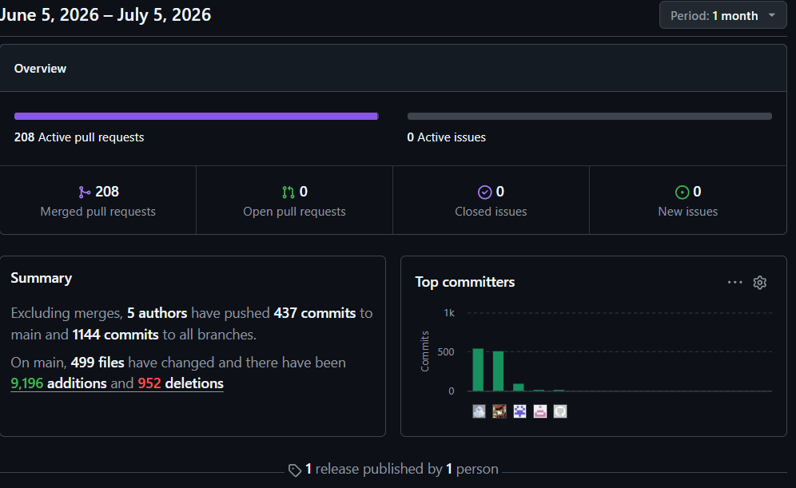

#### Report
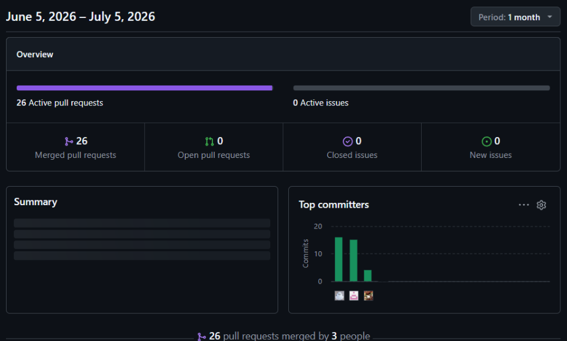

#### Webapp
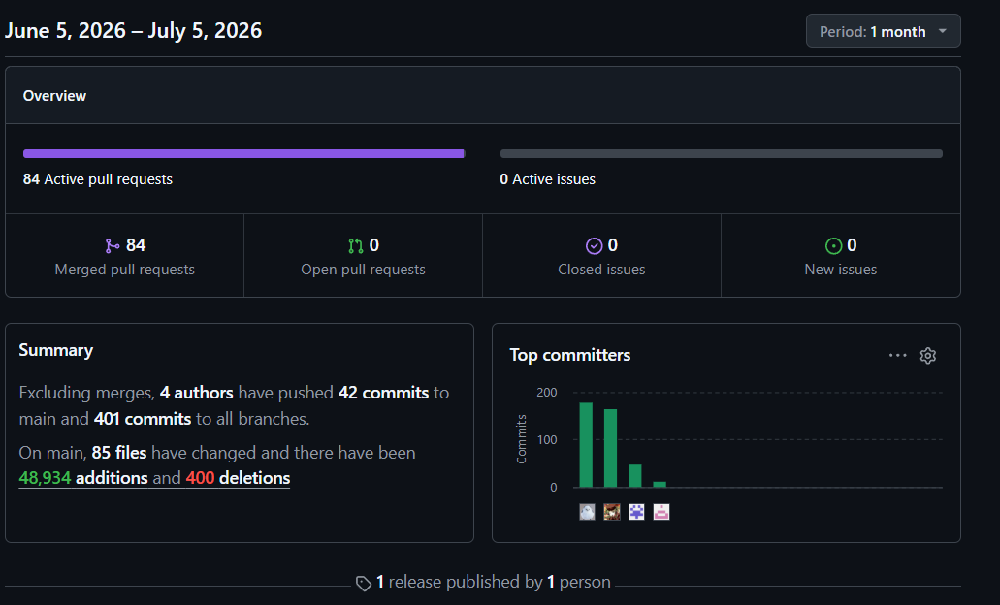

#### Website
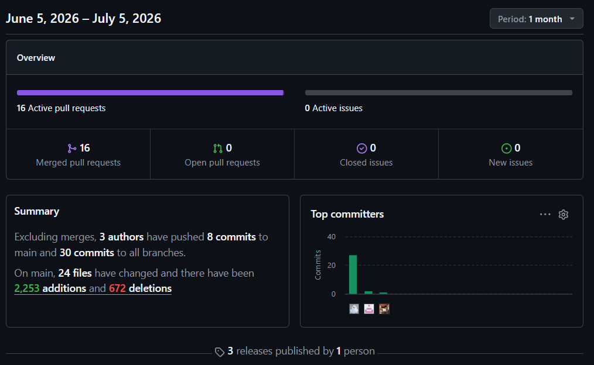

---

## Validation Interviews
### Diseño de Entrevistas

Segmento 1 (Administradores de gimnasio y gerentes de Operaciones) 

1. ¿Qué tan fluido te resultó el proceso de autenticación en la pantalla de Iniciar Sesión y qué fue lo primero que llamó tu atención al entrar al Panel Principal?
2. Observando la gráfica de Uso de Máquinas en el Panel Principal, ¿te resulta evidente identificar su tiempo de uso de las máquinas del gimnasio?
3. En la parte inferior del Panel Principal tienes la tabla de Equipos Infrautilizados. ¿Consideras que esta ubicación es la ideal para detectar rápidamente qué máquinas no están generando valor, o preferirías ver esto en otra sección?
4. En la sección de Equipos, si tuvieras que añadir una nueva cinta de correr al sistema, ¿qué tan intuitivo te parece el flujo empezando por el botón + Registrar Equipo?
5. En la sección de Analítica, enfocándonos en las tarjetas superiores, ¿cómo interpretas la métrica de Horas Totales de Uso frente al Tiempo Inactivo? ¿Te da una idea clara de la eficiencia de tu local?
6. Bajando en esa misma sección de Analítica, encontrarás el panel de Recomendaciones de Reubicación (ej. mover de Sede Miraflores a Sede San Isidro). ¿La interfaz visual con las barras de progreso y el cálculo de "$/mes" extra te resulta convincente para tomar la decisión de trasladar una máquina?
7. En la sección de Mantenimiento en el apartado de Centro de Mantenimiento, ¿el diseño de tarjetas separadas por columnas (Pendiente, En Progreso, Completado) te facilita visualizar el cuello de botella en las reparaciones técnicas?
8. Si navegas en la sección de Configuración, encontrarás el apartado de Umbrales de Mantenimiento. ¿Te resulta claro cómo configure el límite de "Horas de Uso Críticas (500h)" para que el sistema genere un ticket de forma automática antes de que la máquina falle?
9. En la misma sección de Configuración, existe un Buffer de Horas Pico. Como administrador, ¿comprendes cómo esta función bloquea automáticamente la programación de mantenimientos preventivos durante las horas de mayor afluencia?
10. En la sección de Monitoreo IoT, ¿la información sobre el estado de la batería, nivel de señal y desconexiones te da la seguridad de que los sensores están midiendo correctamente sin necesidad de ir a revisarlos físicamente?
11. Al ingresar a la pestaña de Impacto Financiero, la primera tabla muestra la Pérdida por Inactividad de Equipos. ¿Ver el desglose exacto de horas perdidas y su equivalente en dólares te genera un sentido de urgencia para agilizar las reparaciones?
12. En esa misma pantalla, tienes la herramienta Simulador de Retorno de Inversión (ROI). Si ingresas el costo de una máquina nueva y la demanda insatisfecha, ¿el gráfico de barras de "Proyección de ROI" te resulta lo suficientemente claro para justificar una nueva compra a tus socios?
13. Si necesitaras enviar un reporte de estos costos a contabilidad, ¿qué tan fácil te resultó ubicar y utilizar los botones de Generar PDF o Exportar CSV en la parte superior derecha?
14. Como administrador de un gimnasio, ¿la paleta de colores oscuros (Dark Mode), la limpieza de las tablas y la fluidez de la plataforma te transmiten el nivel de profesionalismo esperado para gestionar tus finanzas y activos?
15. Sabiendo que los módulos de monitoreo en las máquinas son sensores pasivos (telemetría y vibración/uso) que no graban video ni comprometen la privacidad de los usuarios, ¿te sentirías tranquilo instalándolos en todo tu local?
16. De todo lo que probaste hoy (Alertas predictivas, Simulador de ROI, Reubicación multisede), ¿cuál herramienta consideras que tendría el impacto más rápido para reducir tus costos operativos (OPEX)?
17. Si finalizaras tu mes de prueba gratuito, ¿estarías dispuesto a pagar una suscripción mensual por SpotTrack basándote en el dinero que la plataforma te demostró que podrías ahorrar en mantenimiento correctivo? ¿Qué mejorarías para que Spottrack te ayude más a gestionar tu gimnasio?
    

Segmento 2 (Clientes frecuentes de gimnasio)

1. ¿Podrías indicarme tu edad, el distrito en el que resides y con qué frecuencia asistes al gimnasio semanalmente?
2. Cuando estás entrenando y encuentras que la máquina que necesitas usar está malograda o en mantenimiento, ¿qué sueles hacer actualmente?
3. Dando un vistazo rápido a esta página principal, ¿qué beneficio principal sientes que SpotTrack te ofrece como asistente regular al gimnasio?
4. ¿Sientes que está claro a dónde debes hacer clic si quieres empezar a usar la plataforma?
5. ¿La información que ves aquí te genera el interés y la confianza suficiente para registrarte en este momento?
6. Al intentar completar estas tareas, ¿te resultó intuitivo encontrar las opciones para reportar y buscar equipos, o tuviste que buscar demasiado en el menú?
7. Si en algún momento presionaste una opción equivocada, ¿sentiste que el sistema te ayudó a regresar o corregir el error fácilmente?
8. Al momento de enviar tu reporte del equipo malogrado, ¿la aplicación te dejó totalmente claro y visible que tu aviso fue enviado con éxito?
9. Imagina que estás a mitad de tu rutina, sudando y quizás con la vista cansada. ¿Sientes que el tamaño de las letras, los colores y el contraste de los botones son fáciles de distinguir desde la pantalla de tu celular?
10. ¿Sientes que esta aplicación web mantiene el mismo estilo y colores que la página de presentación que vimos al inicio?
11. ¿Hay alguna función que te gustaría que SpotTrack tuviera para hacer tus rutinas de entrenamiento mucho más fluidas?

### Registro de Entrevistas
Segmento 1: Administradores de gimnasios y gerentes de operaciones 
 Entrevista #1 
 | Campo | Detalle |
| :--- | :--- |
| **Entrevistado** | Julio Cardenas |
| **Imagen** | {width=80%} |
| **Edad** | 45 |
| **Ocupación** | Administrador de Gimnasio |
| **Link** | [https://upcedupe-my.sharepoint.com/:v:/g/personal/u202410344_upc_edu_pe/IQCZBlRAQy6vTKt2sy_uq2wxAdvr5oWA557SQsOtwPZU9xo?nav=eyJyZWZlcnJhbEluZm8iOnsicmVmZXJyYWxBcHAiOiJTdHJlYW1XZWJBcHAiLCJyZWZlcnJhbFZpZXciOiJTaGFyZURpYWxvZy1MaW5rIiwicmVmZXJyYWxBcHBQbGF0Zm9ybSI6IldlYiIsInJlZmVycmFsTW9kZSI6InZpZXcifX0%3D&e=3Aga7d](https://upcedupe-my.sharepoint.com/:v:/g/personal/u202410344_upc_edu_pe/IQCZBlRAQy6vTKt2sy_uq2wxAdvr5oWA557SQsOtwPZU9xo?nav=eyJyZWZlcnJhbEluZm8iOnsicmVmZXJyYWxBcHAiOiJTdHJlYW1XZWJBcHAiLCJyZWZlcnJhbFZpZXciOiJTaGFyZURpYWxvZy1MaW5rIiwicmVmZXJyYWxBcHBQbGF0Zm9ybSI6IldlYiIsInJlZmVycmFsTW9kZSI6InZpZXcifX0%3D&e=3Aga7d) |
| **Resumen** | La entrevista presenta a Julio Cárdenas, administrador de gimnasios de 45 años, quien valoró positivamente SpotTrack por su facilidad de uso, claridad visual y utilidad para la toma de decisiones. Destacó el dashboard, las métricas de uso de equipos, el tablero de mantenimiento y, especialmente, la herramienta de reubicación de máquinas entre sedes, considerada la funcionalidad con mayor impacto para reducir costos y maximizar ingresos. También resaltó el simulador de ROI y la visualización de pérdidas por inactividad como herramientas clave para justificar inversiones. Como mejoras, sugirió una aplicación móvil para técnicos y una mayor precisión en las lecturas de batería de los sensores IoT. Finalmente, indicó que estaría dispuesto a pagar una suscripción al considerar que la plataforma genera ahorros y optimiza la gestión del gimnasio.

Entrevista #2

| Campo | Detalle |
| :--- | :--- |
| **Entrevistado** | Luis Romero |
| **Imagen** | {width=80%} |
| **Edad** | 51 |
| **Ocupación** | Administrador de Gimnasio |
| **Link** | [https://upcedupe-my.sharepoint.com/:v:/g/personal/u202410344_upc_edu_pe/IQD_5gyaNnsmRrRNHsDQAmRVAWRrRspTMiVz2J91TZ_5MEU?nav=eyJyZWZlcnJhbEluZm8iOnsicmVmZXJyYWxBcHAiOiJTdHJlYW1XZWJBcHAiLCJyZWZlcnJhbFZpZXciOiJTaGFyZURpYWxvZy1MaW5rIiwicmVmZXJyYWxBcHBQbGF0Zm9ybSI6IldlYiIsInJlZmVycmFsTW9kZSI6InZpZXcifX0%3D&e=g4BSMA](https://upcedupe-my.sharepoint.com/:v:/g/personal/u202410344_upc_edu_pe/IQD_5gyaNnsmRrRNHsDQAmRVAWRrRspTMiVz2J91TZ_5MEU?nav=eyJyZWZlcnJhbEluZm8iOnsicmVmZXJyYWxBcHAiOiJTdHJlYW1XZWJBcHAiLCJyZWZlcnJhbFZpZXciOiJTaGFyZURpYWxvZy1MaW5rIiwicmVmZXJyYWxBcHBQbGF0Zm9ybSI6IldlYiIsInJlZmVycmFsTW9kZSI6InZpZXcifX0%3D&e=g4BSMA) |
| **Resumen** | La entrevista presenta a Luis Romero, entrenador y encargado del gimnasio de Monterrico (UPC), quien destacó la facilidad de uso y el diseño intuitivo de SpotTrack. Valoró especialmente la visualización de métricas sobre uso de máquinas, ocupación y mantenimiento, ya que le permiten tomar decisiones basadas en datos en lugar de percepciones. Consideró útiles las herramientas de reubicación de equipos, monitoreo IoT, mantenimiento preventivo y análisis de pérdidas económicas por inactividad. Entre todas las funcionalidades, señaló que el simulador de ROI tendría el mayor impacto para reducir costos y justificar inversiones. Asimismo, indicó que estaría dispuesto a pagar una suscripción por la plataforma y sugirió incorporar métricas relacionadas con la asistencia de usuarios a clases grupales, como zumba, baile o cycling, para evaluar mejor el desempeño de las actividades y los instructores.
 |

 Entrevista #3

 
| Campo | Detalle |
| :--- | :--- |
| **Entrevistado** | Percy Baraybar |
| **Imagen** | {width=80%} |
| **Edad** | 30 |
| **Ocupación** | Administrador de Gimnasio |
| **Link** | [https://upcedupe-my.sharepoint.com/:v:/g/personal/u202410344_upc_edu_pe/IQAwVXFjAV-_QoogXMMWflDOARN7DWk8a4ZW3xSLubHEQ18?nav=eyJyZWZlcnJhbEluZm8iOnsicmVmZXJyYWxBcHAiOiJTdHJlYW1XZWJBcHAiLCJyZWZlcnJhbFZpZXciOiJTaGFyZURpYWxvZy1MaW5rIiwicmVmZXJyYWxBcHBQbGF0Zm9ybSI6IldlYiIsInJlZmVycmFsTW9kZSI6InZpZXcifX0%3D&e=rJdCDm](https://upcedupe-my.sharepoint.com/:v:/g/personal/u202410344_upc_edu_pe/IQAwVXFjAV-_QoogXMMWflDOARN7DWk8a4ZW3xSLubHEQ18?nav=eyJyZWZlcnJhbEluZm8iOnsicmVmZXJyYWxBcHAiOiJTdHJlYW1XZWJBcHAiLCJyZWZlcnJhbFZpZXciOiJTaGFyZURpYWxvZy1MaW5rIiwicmVmZXJyYWxBcHBQbGF0Zm9ybSI6IldlYiIsInJlZmVycmFsTW9kZSI6InZpZXcifX0%3D&e=rJdCDm) |
| **Resumen** |La entrevista presenta a Percy Baraybar, administrador de gimnasio de 30 años, quien destacó la rapidez de uso y el diseño profesional de SpotTrack. Valoró especialmente las métricas visuales sobre uso de equipos, tiempo inactivo, pérdidas económicas y mantenimiento, ya que le permiten tomar decisiones rápidas y sustentadas en datos. Consideró que las recomendaciones de reubicación de máquinas entre sedes y el simulador de ROI son las funcionalidades más valiosas para incrementar ingresos y justificar inversiones. También resaltó la utilidad de las alertas preventivas, el monitoreo IoT y la visualización del impacto financiero de las fallas. Indicó que estaría dispuesto a pagar una suscripción porque la plataforma se justifica por los ahorros generados y sugirió mejorar la precisión de las lecturas de batería de los sensores, ya que observó que todos aparecían con 0% a pesar de estar funcionando correctamente. |

Entrevista # 4

{width=80%}

| Campo | Detalle |
| :--- | :--- |
| **Nombre** | Joan Steffano Quispe Gamez |
| **Edad** | 19 |
| **Distrito** | Los Olivos |
| **Ocupación** | Estudiante universitario (UPC) |
| **Frecuencia** | 3 a 4 veces por semana |
| **Horario** | Nocturno (Post-clases) |
| **Contexto** | Entrena de noche debido a su alta carga académica. |
|**Resumen**| Participante de 20 años, residente de Los Olivos, asiste al gimnasio 3 a 4 veces por semana. Consideró que SpotTrack es útil para optimizar tiempos y conocer la disponibilidad de equipos. Encontró la interfaz clara, intuitiva y confiable, pudiendo completar sin dificultades las tareas de reportar una máquina averiada y buscar otra disponible. Valoró la consistencia visual de la plataforma y señaló que los colores son adecuados, aunque el tamaño de algunas letras podría mejorar. No sugirió nuevas funcionalidades.
| **Link** | https://upcedupe-my.sharepoint.com/:v:/g/personal/u202410344_upc_edu_pe/IQDP5A1bSATXR44bALEni2evARKfusmPU00SQ8ZbIOLQKHk?nav=eyJyZWZlcnJhbEluZm8iOnsicmVmZXJyYWxBcHAiOiJTdHJlYW1XZWJBcHAiLCJyZWZlcnJhbFZpZXciOiJTaGFyZURpYWxvZy1MaW5rIiwicmVmZXJyYWxBcHBQbGF0Zm9ybSI6IldlYiIsInJlZmVycmFsTW9kZSI6InZpZXcifX0%3D&e=t4vk4n |

Entrevista #5

{width=80%}

| Campo | Detalle |
| :--- | :--- |
| **Nombre** | Diego Quispe |
| **Edad** | 19 |
| **Distrito** | Los Olivos |
| **Ocupación** | Estudiante universitario (U. de Lima) y trabajador a medio tiempo |
| **Frecuencia** | 4 días a la semana (rutina de dos días seguidos y un día de descanso) |
| **Duración** | Variable (afectada por la alta afluencia) |
| **Contexto** | Entrena por las noches por falta de tiempo diurno; el cansancio le ayuda a conciliar el sueño. |
|**Resumen**| Participante de 20 años, residente de Pueblo Libre, asiste al gimnasio 2 a 3 veces por semana. Consideró que SpotTrack es útil e intuitivo para reportar equipos y encontrar alternativas disponibles. Destacó que la información presentada genera interés y confianza para registrarse. Como observaciones, sugirió mejorar la diferenciación visual de la landing page mediante más contraste y colores, y señaló que algunos elementos podrían resaltarse mejor. Valoró positivamente la facilidad para corregir errores y la claridad de las notificaciones. Como mejora, propuso añadir una sección de notas personales en las rutinas para centralizar toda la información de entrenamiento en una sola plataforma.|
| **Link** | https://upcedupe-my.sharepoint.com/:v:/g/personal/u202410344_upc_edu_pe/IQCRj16pkvNhS6YfHtRv0_xrAVmVLdmCIl9yln-s6R5mwmw?nav=eyJyZWZlcnJhbEluZm8iOnsicmVmZXJyYWxBcHAiOiJTdHJlYW1XZWJBcHAiLCJyZWZlcnJhbFZpZXciOiJTaGFyZURpYWxvZy1MaW5rIiwicmVmZXJyYWxBcHBQbGF0Zm9ybSI6IldlYiIsInJlZmVycmFsTW9kZSI6InZpZXcifX0%3D&e=3aHRhT |

Entrevista #6

| Campo | Detalle |
| :--- | :--- |
| **Nombre** | Fabián Suárez |
| **Edad** | 19 |
| **Distrito** | Pueblo Libre |
| **Ocupación** | Estudiante y trabajador |
| **Frecuencia** | 3 a 4 días a la semana (interdiario) |
| **Duración** | Entre 1 a 2 horas |
| **Contexto** | Adapta sus entrenamientos según su carga laboral y académica. |
|**Resumen**| Participante de 20 años, residente de Los Olivos, asiste al gimnasio 3 a 4 veces por semana. Encontró la plataforma intuitiva para reportar equipos y buscar alternativas disponibles. Consideró que la landing page podría reforzar más su identidad relacionada con el gimnasio mediante imágenes o elementos visuales del rubro. Señaló que los colores permiten identificar fácilmente las acciones, aunque algunas letras podrían ser más grandes para mejorar la legibilidad. Como mejoras, sugirió incorporar la opción de cancelar reservas, recibir notificaciones sobre equipos malogrados y añadir videos, recomendaciones y rutinas más completas y personalizadas dentro de la aplicación.
| **Link** | [https://upcedupe-my.sharepoint.com/:v:/g/personal/u202410344_upc_edu_pe/IQBFQYoChOMaSpPJ6Wp5AXuMAS2UsOruQATKpZ7eJkDyqdU?nav=eyJyZWZlcnJhbEluZm8iOnsicmVmZXJyYWxBcHAiOiJTdHJlYW1XZWJBcHAiLCJyZWZlcnJhbFZpZXciOiJTaGFyZURpYWxvZy1MaW5rIiwicmVmZXJyYWxBcHBQbGF0Zm9ybSI6IldlYiIsInJlZmVycmFsTW9kZSI6InZpZXcifX0%3D&e=4BlzqE ](https://upcedupe-my.sharepoint.com/:v:/g/personal/u202410344_upc_edu_pe/IQBFQYoChOMaSpPJ6Wp5AXuMAS2UsOruQATKpZ7eJkDyqdU?nav=eyJyZWZlcnJhbEluZm8iOnsicmVmZXJyYWxBcHAiOiJTdHJlYW1XZWJBcHAiLCJyZWZlcnJhbFZpZXciOiJTaGFyZURpYWxvZy1MaW5rIiwicmVmZXJyYWxBcHBQbGF0Zm9ybSI6IldlYiIsInJlZmVycmFsTW9kZSI6InZpZXcifX0%3D&e=4BlzqE)|

#### Video unificado
| Entrevista | Marca de tiempo | Entrevistado |
| :--- | :--- | :--- |
| 1 | 00:00:00 | Julio Cardenas |
| 2 | 09:26:26 | Luis Romero |
| 3 | 25:20:96 | Percy Baraybar | 
| 4 | 36:07:12 | Joan Steffano Quispe Gamez |
| 5 | 42:16:27 | Fabián Suárez |
| 6 | 51:04:27 | Diego Quispe |

| **Link** | [Enlace al video unificado de entrevistas - SpotTrack] (https://upcedupe-my.sharepoint.com/:v:/g/personal/u202410344_upc_edu_pe/IQC4THjNSb7oRaOHLJ-MgEa4ATxqbIKiZ5H2DUDdsVrw1ms?nav=eyJyZWZlcnJhbEluZm8iOnsicmVmZXJyYWxBcHAiOiJTdHJlYW1XZWJBcHAiLCJyZWZlcnJhbFZpZXciOiJTaGFyZURpYWxvZy1MaW5rIiwicmVmZXJyYWxBcHBQbGF0Zm9ybSI6IldlYiIsInJlZmVycmFsTW9kZSI6InZpZXcifX0%3D&e=vD9jjd)|

### Evaluaciones Según Heurísticas

**UX Heuristics & Principles Evaluation**
**Usability – Inclusive Design – Information Architecture**

**CARRERA:** Ingeniería de Software
**CURSO:** Desarrollo de Aplicaciones Open Source
**SECCIÓN:** 1ASI0729
**PROFESORES:** Todos
**AUDITOR:** Producto: Bloomie, Grupo: Dermacare (u202416272 - Asmat Alminco, Martin Alejandro; u202414802 - Contreras Torres, Arturo Valentino; u20241b843 - Mechan Montenegro, Luciana Carolina)
**CLIENTE(S):** SpotTrack Team

**SITE o APP A EVALUAR:**
SpotTrack

**TAREAS A EVALUAR:**
El alcance de esta evaluación incluye la revisión de la usabilidad de las siguientes tareas:

1. Visualización del mapa de calor y aplicación de filtros (Userflow: US09 y US10).
2. Reserva exprés de equipos (Userflow: S16).

**ESCALA DE SEVERIDAD:**
Los errores serán puntuados tomando en cuenta la siguiente escala de severidad

| Nivel | Descripción |
| --- | --- |
| 1 | Problema superficial: puede ser fácilmente superador por el usuario o ocurre con muy poco frecuencia. No necesita ser arreglado a no ser que exista disponibilidad de tiempo. |
| 2 | Problema menor: puede ocurrir un poco más frecuentemente o es un poco más difícil de superar para el usuario. Se le debería asignar una prioridad baja resolverlo de cara al siguiente release. |
| 3 | Problema mayor: ocurre frecuentemente o los usuarios no son capaces de resolverlos. Es importante que sean corregidos y se les debe asignar una prioridad alta. |
| 4 | Problema muy grave: un error de gran impacto que impide al usuario continuar con el uso de la herramienta. Es imperativo que sea corregido antes del lanzamiento. |

**TABLA RESUMEN:**

| # | Problema | Escala de severidad | Heurística/Principio violada(o) |
| :--- | :--- | :--- | :--- |
| 1 | Los colores indicadores en el mapa de calor (rojo/verde) carecen de un texto o ícono alternativo, dificultando la lectura para personas con daltonismo. | 3 | Inclusive Design: Provide comparable experience |
| 2 | Al aplicar múltiples filtros en la búsqueda de máquinas, no existe una opción de "Limpiar filtros" visible en el primer nivel de navegación. | 2 | Usability: Control y libertad del usuario / Information Architecture: Is it usable? |
| 3 | No se muestra retroalimentación visual inmediata mientras el mapa de calor está cargando los datos filtrados, lo cual puede generar incertidumbre en la conexión. | 2 | Usability: Visibilidad del estado del sistema |
| 4 | El tiempo restante para la reserva exprés no es visible si el usuario navega a otra pantalla durante el período activo de reserva. | 3 | Usability: Visibilidad del estado del sistema |
| 5 | Falta de instrucciones claras sobre las consecuencias de que la reserva exprés expire antes de ser confirmada presencialmente. | 2 | Usability: Prevención de errores / Ayuda y documentación |
| 6 | El botón para cancelar la reserva exprés utiliza un color neutral en lugar de un color semántico destructivo (rojo). | 2 | Usability: Consistencia y estándares |

**DESCRIPCIÓN DE PROBLEMAS:**

**PROBLEMA #1: Falta de alternativas visuales en el indicador de disponibilidad (rojo/verde)**

Severidad: 3
Heurística violada: Inclusive Design - Provide comparable experience

**Problema:**
Al visualizar la disponibilidad de las máquinas en el mapa de calor, el único indicador de estado es el color (verde para disponible, rojo para ocupado). Esto genera problemas de accesibilidad para personas con daltonismo (protanopia o deuteranopia), ya que no pueden distinguir fácilmente qué equipo está libre.

**Recomendación:**
Acompañar los colores con un indicador iconográfico (ej. un "check" para libre y una "x" u "ojo tachado" para ocupado), o una etiqueta de texto breve que aclare el estado del activo, garantizando así una experiencia comparable.

---

**PROBLEMA #2: Ausencia de opción rápida para "Limpiar Filtros"**

Severidad: 2
Heurística violada: Usability - Control y libertad del usuario

**Problema:**
Una vez que el cliente elige múltiples filtros de tipo de máquina (ej. Cardio, Fuerza, etc.), tiene que desmarcar cada uno manualmente para regresar a la vista general. No existe una "salida de emergencia" o botón rápido para restablecer la vista.

**Recomendación:**
Añadir un botón claro de "Limpiar todos los filtros" junto al panel de filtrado, que se muestre activo únicamente cuando exista al menos un filtro aplicado.

---

**PROBLEMA #3: Falta de retroalimentación durante el filtrado**

Severidad: 2
Heurística violada: Usability - Visibilidad del estado del sistema

**Problema:**
Cuando la red está lenta y el usuario aplica un filtro, el sistema no muestra un *spinner* ni un estado de carga claro (esqueleto) en la cuadrícula de máquinas, por lo que el usuario podría pensar que la app se congeló.

**Recomendación:**
Implementar un estado de carga (skeleton loaders o spinners interactivos) sobre el área del mapa de calor, que comunique al usuario de manera transparente que el sistema está procesando su petición.

---

**PROBLEMA #4: Falta de visibilidad global del temporizador de reserva exprés**

Severidad: 3
Heurística violada: Usability - Visibilidad del estado del sistema

**Problema:**
Durante el período de reserva exprés (que tiene un tiempo limitado de pocos minutos), si el usuario abandona la pantalla de confirmación para ver su perfil u otras secciones, el temporizador deja de ser visible. El usuario puede olvidar cuánto tiempo le queda para llegar a la máquina.

**Recomendación:**
Implementar un *banner* fijo superior (sticky) o un ícono flotante que permanezca visible a lo largo de toda la aplicación mientras haya una reserva activa, mostrando el contador regresivo de forma persistente.

---

**PROBLEMA #5: Instrucciones poco claras sobre la expiración de la reserva**

Severidad: 2
Heurística violada: Usability - Prevención de errores / Ayuda y documentación

**Problema:**
Al momento de confirmar la reserva exprés, la interfaz no indica explícitamente qué sucede cuando el tiempo expira ni advierte si existe alguna penalización por no cumplir con la reserva, generando ansiedad en el usuario.

**Recomendación:**
Añadir una pequeña nota aclaratoria debajo del botón de reserva (ej. "Si no te acercas a la máquina en 5 minutos, la reserva se anulará sin penalización").

---

**PROBLEMA #6: Colores confusos para acciones destructivas**

Severidad: 2
Heurística violada: Usability - Consistencia y estándares

**Problema:**
El botón de "Cancelar Reserva" emplea un color neutral o idéntico al de botones de acciones secundarias no destructivas, lo que podría provocar que el usuario lo confunda o no identifique rápidamente cómo anular la acción.

**Recomendación:**
Usar un color que indique peligro o acción destructiva, como un rojo suave, para el botón de cancelar reserva o aplicar un texto en color rojo, siguiendo los patrones de diseño UI estándar.

## Video About the Product

https://upcedupe-my.sharepoint.com/:v:/g/personal/u202410344_upc_edu_pe/IQBqCwjhy-X9RpjfwzjwhXqVARIbfCSm8cjN-vPPROqJqLk?nav=eyJyZWZlcnJhbEluZm8iOnsicmVmZXJyYWxBcHAiOiJTdHJlYW1XZWJBcHAiLCJyZWZlcnJhbFZpZXciOiJTaGFyZURpYWxvZy1MaW5rIiwicmVmZXJyYWxBcHBQbGF0Zm9ybSI6IldlYiIsInJlZmVycmFsTW9kZSI6InZpZXcifX0%3D&e=BDcZEP

## Conclusiones y Recomendaciones

### Conclusiones

#### Sprint 1

La propuesta central de SpotTrack no es un sistema de reportes, sino la visibilidad en tiempo real del estado de cada máquina a través de sensores Edge. Esta telemetría pasiva —que no requiere ninguna acción del usuario— transforma directamente la experiencia del cliente en el gimnasio: este puede consultar qué máquinas están libres antes de desplazarse al local, organizar su rutina evitando tiempos de espera y obtener sugerencias de ejercicios alternativos cuando una máquina está ocupada. El mapa de calor interactivo (con indicadores verde/rojo por máquina) es la interfaz que convierte los datos del sensor en valor tangible para el usuario final, y es la razón por la que SpotTrack resuelve un problema que ningún competidor como Fitco, GYMMaster o Virtuagym puede atender sin IoT.

La telemetría acumulada por los dispositivos Edge es la materia prima de todas las capas superiores del sistema: los patrones de uso histórico alimentan las alertas de mantenimiento predictivo, las estadísticas de ocupación por hora informan las recomendaciones de horario, y los datos de desgaste acumulado sustentan las decisiones de reubicación o reemplazo de activos. Las funcionalidades analíticas y de gestión son extensiones que amplifican el valor del sensor, pero no pueden existir sin él. Esta dependencia refuerza la importancia de priorizar la estabilidad y cobertura del flujo de telemetría como fundamento de todo el sistema.

La definición de Bounded Contexts (Telemetría, Mantenimiento, Activos, Reservas, Rutinas y Analíticas) permitió que los cinco integrantes del equipo trabajaran en áreas delimitadas sin interferencias. El modelado previo mediante EventStorming fue determinante para identificar flujos críticos —como la sincronización del estado de una máquina entre el sensor, el mapa de calor y el módulo de reservas— antes de iniciar el desarrollo, lo que redujo la necesidad de refactorizaciones costosas.

La automatización del despliegue de la Landing Page en GitHub Pages garantizó que cada integración a main quedara reflejada en producción de forma inmediata y sin intervención manual. Esta práctica, implementada desde el Sprint 1, demostró que configurar el pipeline de despliegue en las etapas tempranas del proyecto elimina la fricción acumulada de los despliegues manuales y sienta las bases para extender esta automatización al backend en sprints posteriores.

#### Sprint 2

El Sprint 2 operó en dos frentes simultáneos: sanear los artefactos pendientes del Sprint 1 (15 tareas CORR + 4 tareas SETUP) e iniciar el desarrollo del frontend Angular con Fake API. Esta dualidad permitió avanzar en ambas dimensiones sin bloquear ninguna, pero evidenció que la carga de coordinación entre subequipos es significativamente mayor que en un sprint de un solo frente. La asignación de responsables claros por área (correcciones vs. desarrollo) fue determinante para mantener el flujo.

El hecho de contar con la Fake API accesible en una URL pública —y no solo en localhost— permitió que todos los integrantes del equipo consumieran el mismo backend simulado independientemente de su entorno local. Esto eliminó la clase de errores de integración más frecuente en proyectos de equipo ("funciona en mi máquina") y validó el flujo de despliegue que se reutilizará para el backend Spring Boot en el Sprint 3.

Inicializar el proyecto Angular con carpetas separadas por contexto (`auth/`, `heatmap/`, `admin/`, `maintenance/`, `equipment/`, `routines/`) demostró que los límites de dominio definidos en el DDD son aplicables también en la capa de presentación. Esta organización facilitó que cada integrante trabajara en su módulo asignado con mínima interferencia sobre el código de los demás, confirmando que la inversión en el diseño de arquitectura del Sprint 1 tiene retorno directo en la productividad del equipo de desarrollo.

#### Sprint 3

La transición de JSON Server a Spring Boot validó la decisión arquitectónica tomada en el Sprint 2 de establecer un contrato de API explícito. Al preservar los mismos paths, estructuras de respuesta y códigos de estado en el backend real, la integración se redujo a actualizar la URL base en el `environment.ts` de Angular sin modificar ningún servicio ni componente existente. Este resultado confirma que documentar los contratos de API desde la fase de Fake API no es documentación accesoria, sino una decisión técnica que elimina retrabajo en la etapa de integración.

Las entrevistas de validación realizadas con representantes de ambos segmentos objetivo —administradores de gimnasio y clientes frecuentes— confirmaron que las funcionalidades implementadas (mapa de calor en tiempo real, gestión de activos, reservas exprés y alertas de mantenimiento predictivo) responden directamente a los dolores identificados durante la investigación inicial del Sprint 1. Los participantes lograron completar sus tareas principales sin bloqueos críticos, lo que valida tanto el flujo de navegación del producto como la solidez de la integración frontend-backend alcanzada en este sprint.

La arquitectura de Bounded Contexts definida mediante EventStorming en el Sprint 1 y actualizada en el sprint 3, demostró su valor end-to-end al guiar también la organización del backend en Spring Boot: cada contexto delimitado (Gym, Monitoring, Maintenance, Reservation, Analytics, and the rest) se tradujo en un módulo de backend independiente con sus propios controladores, commandos, queries, servicios y repositorios. Esta coherencia entre el modelo de dominio, la estructura del frontend Angular y la arquitectura del backend redujo la fricción de comunicación entre subequipos y facilitó la integración de los tres sprints en una plataforma funcional y coherente.

#### Sprint 4

El desbordamiento del alcance estimado (40 Story Points planificados frente a 117 Story Points de velocidad real) reveló que ciertas funcionalidades no son incrementales sino precondiciones estructurales: el modelo de Membership & Billing con Stripe no era una mejora aislada, sino el requisito que habilita que un administrador pueda operar la plataforma, arrastrando consigo el onboarding de gimnasios, la gestión de sedes y la lista blanca de clientes. De forma análoga, ampliar la red de sensores IoT (movimiento, cámara y seguimiento de sesión) hizo evidente la necesidad de un Centro de Alertas unificado que no había sido dimensionado en el Sprint 3. Este patrón confirma que la arquitectura por Bounded Contexts, si bien facilita el desarrollo paralelo, no exime al equipo de mapear las dependencias funcionales entre contextos durante la planificación.

La arquitectura por Bounded Contexts volvió a demostrar su valor durante la incorporación de Limache Coronel, Imanol Fabrizio a mitad de ciclo, tras la salida de dos integrantes del equipo: los límites de dominio ya establecidos (Monitoring, Alerts, Maintenance y Routines) permitieron que el nuevo integrante tomara ownership de módulos delimitados sin fricción con el código existente ni ralentización del ritmo de entrega, validando que el diseño de dominio robusto es también una estrategia de mitigación de riesgo ante cambios de composición del equipo.

Las entrevistas de validación del Sprint 4 confirmaron que las funcionalidades de mayor valor percibido por los administradores son las recomendaciones de reubicación de equipos entre sedes y el simulador de ROI, ya que traducen datos de telemetría en decisiones financieras concretas. La misma validación expuso un defecto de datos no detectado en sprints anteriores: las lecturas de batería de los sensores IoT se muestran en 0% de forma consistente pese a que los dispositivos operan correctamente, evidenciando una brecha entre la cobertura funcional (features implementadas) y la calidad de los datos que esas features exponen.

El cierre del proyecto con 132 Pull Requests fusionados en `spottrack-platform`, 72 en `spottrack-webapp` y 11 en `spottrack-website` durante un único sprint, sin cobertura de pruebas automatizadas ni pipeline de CI/CD en el backend, deja constancia de que el equipo priorizó consistentemente la entrega de funcionalidad completa sobre la inversión en infraestructura de calidad, una decisión sostenible para un proyecto académico de alcance fijo pero que representa el principal riesgo técnico heredado para una eventual continuidad del producto.

---

### Recomendaciones

#### Sprint 1

Las 15 tareas de corrección abarcan deficiencias documentales y de despliegue identificadas en la revisión del Sprint 1. En particular, CORR-06 (Diagrama ERD y Diagrama de Clases), CORR-07 (evidencias de ejecución y colaboración) y CORR-08 (Big Picture EventStorming) tienen impacto directo en la calificación de entregables anteriores. Se recomienda asignar fechas límite internas por responsable y verificar su cierre antes de iniciar la documentación del Sprint Review.

Al diseñar el flujo de navegación de la Angular SPA, el mapa de calor debe ser la pantalla principal que el cliente ve inmediatamente después del login. Dado que la disponibilidad de máquinas en tiempo real es el motivo por el que un usuario abre la aplicación durante su visita al gimnasio, colocarlo como punto de entrada refuerza la propuesta de valor central del producto desde el primer uso y reduce la fricción de navegación.

#### Sprint 2

La configuración del `db.json` con datos semilla completos  es un requisito técnico que desbloquea la mayor parte del backlog de vistas del Sprint 2. Las vistas de autenticación, reservas, mapa de calor y gestión de activos dependen de que esta tarea esté resuelta para funcionar correctamente contra la Fake API. Continuarla en paralelo al desarrollo de vistas genera inconsistencias que producen retrabajo.

Las tareas T13 (Build interactive heatmap component) y T14 (Implement real-time status update via polling) son el núcleo funcional del producto desde la perspectiva del cliente final. El resto de funcionalidades del flujo de cliente —filtrado por tipo de máquina (T15-T16), cambio de sucursal (T17-T18) y motor de rutinas alternativas (T19-T20)— dependen del mapa de calor como superficie de interacción base. Dejarlas para el final del sprint compromete la viabilidad de toda la demo del Sprint Review.

Para que el paso de JSON Server a Spring Boot no implique cambios en los componentes Angular, los endpoints del backend real deben respetar los mismos paths, estructuras de response y códigos de estado ya documentados en la tabla de servicios del Sprint 2. Con ese contrato preservado, la transición se reduce a actualizar la URL base en el `environment.ts` de Angular sin tocar ningún servicio ni componente existente.

#### Sprint 3

Los hallazgos de las entrevistas de validación deben traducirse en un backlog priorizado para el siguiente ciclo. Las observaciones sobre fricción de navegación, flujos de reserva y visualización del mapa de calor deben evaluarse según su impacto en ambos segmentos antes de planificar nuevas funcionalidades. Incorporar métricas de tasa de éxito de tareas por segmento como criterio de aceptación en los próximos sprint backlogs consolidará la práctica de validación continua con usuarios reales que se estableció en este sprint.

Con el backend en producción y ambos segmentos accediendo a la plataforma real, el siguiente paso crítico es reforzar la seguridad del sistema: implementar autenticación basada en tokens JWT con expiración controlada, aplicar validaciones de entrada en todos los endpoints del backend y configurar CORS estrictamente para aceptar únicamente los orígenes de producción autorizados. La transición de un Fake API a un backend real expone datos de gimnasios y clientes que requieren protección activa.

Se recomienda extender el pipeline CI/CD al repositorio del backend Spring Boot, siguiendo el mismo modelo automatizado implementado para la Landing Page y la Web Application. Un workflow de GitHub Actions que ejecute las pruebas unitarias e integración antes de cada despliegue en el entorno de producción reduciría el riesgo de regresiones a medida que el equipo incorpore correcciones y nuevas funcionalidades en iteraciones posteriores.

Se recomienda finalizar los bounded contexts faltantes para el sprint final.

#### Sprint 4

Se recomienda implementar cobertura de pruebas automatizadas (unitarias e integración) para los Bounded Contexts incorporados en este sprint (Membership, Monitoring, Alerts y Analytics/ROI), priorizando los flujos con impacto financiero directo como el checkout de Stripe y el cálculo de proyecciones de ROI, dado que actualmente no cuentan con ninguna red de seguridad automatizada ante regresiones.

Se recomienda extender al repositorio `spottrack-platform` el mismo modelo de pipeline de CI/CD ya implementado en `spottrack-webapp` y `spottrack-website` mediante GitHub Actions, de modo que cada Pull Request fusionado a `develop` ejecute build y pruebas antes de habilitar el despliegue manual a Azure App Service, cerrando la brecha de automatización identificada en la evidencia de despliegue de este sprint.

Se recomienda corregir la lectura de nivel de batería de los sensores IoT, reportada en 0% de forma constante durante la entrevista de validación con Percy Baraybar pese al funcionamiento correcto del hardware, ya que un dato de monitoreo incorrecto compromete la confianza del administrador en el resto del panel de Monitoreo IoT.

Para una eventual continuidad del producto más allá del ciclo académico, se recomienda mapear explícitamente las dependencias funcionales entre Bounded Contexts durante la planificación de cada sprint (por ejemplo, Membership como precondición de Gym Onboarding), en lugar de descubrirlas durante la implementación, con el fin de acotar la brecha entre Story Points estimados y velocidad real observada en este sprint.

## Bibliography

DINGG Team. (2025, 26 de noviembre). *Your 5-step operational plan to handle equipment failures*. DINGG. https://dingg.app/blogs/your-5-step-operational-plan-to-handle-equipment-failures

Maintainnow. (2025, 19 de octubre). *MRO: Maintenance, repair, & operations - A practical guide*. https://www.maintainnow.app/learn/guides/mro-maintenance-repair-operations-a-practical-guide

Energym. (2023). *Why do gym members cancel their memberships?* https://energym.io/blogs/braingains/why-do-gym-members-cancel-their-memberships

Oxmaint. (2023). *Corrective vs. preventive work orders*. https://www.oxmaint.com/blog/post/corrective-vs-preventive-work-orders

Fitness Store. (2024). *Commercial & professional treadmills*. https://www.topfitness.com/collections/commercial-treadmills

## Annexes

### Annex A : Videos de Exposiciones

| Entrega | Título de la Exposición | Hipervínculo al Video (Microsoft Stream) |
| :--- | :--- | :--- |
| **AV1** | Sprint Review - Semana 4 | [Enlace al video AV1 - SpotTrack](URL_AQUI) |
| **TB1** | Stage Review - Semana 7 | (Pendiente) |
| **AV2** | Sprint Review - Semana 12 | (Pendiente) |
| **TB2** | Release Review - Semana 15 | [Enlace al video TB2 - SpotTrack](https://upcedupe-my.sharepoint.com/:v:/g/personal/u202411310_upc_edu_pe/IQBSBXxJ7QCGRYPQp4-K74l6AZuoE_AJcGf8MW04nLF-HpE?e=qEWGQk&nav=eyJyZWZlcnJhbEluZm8iOnsicmVmZXJyYWxBcHAiOiJTdHJlYW1XZWJBcHAiLCJyZWZlcnJhbFZpZXciOiJTaGFyZURpYWxvZy1MaW5rIiwicmVmZXJyYWxBcHBQbGF0Zm9ybSI6IldlYiIsInJlZmVycmFsTW9kZSI6InZpZXcifX0%3D) |

### Annex B : Video unificado entrevistas
[Enlace al video unificado de entrevistas - SpotTrack](https://upcedupe-my.sharepoint.com/:v:/g/personal/u202413214_upc_edu_pe/IQDpYTdDwbM1QZOtdJPZIbsQASLFAmK8moRkLLD7ZudoVtM?e=unt1Xd&nav=eyJyZWZlcnJhbEluZm8iOnsicmVmZXJyYWxBcHAiOiJTdHJlYW1XZWJBcHAiLCJyZWZlcnJhbFZpZXciOiJTaGFyZURpYWxvZy1MaW5rIiwicmVmZXJyYWxBcHBQbGF0Zm9ybSI6IldlYiIsInJlZmVycmFsTW9kZSI6InZpZXcifX0%3D)

### Annex C : Link importantes

Link del Landing: https://upc-pre-202610-1asi0729-11881-spottrack.github.io/spottrack-website/

Link del WebApp: https://ashy-meadow-0d9e60a10.7.azurestaticapps.net

Link de la organización: https://github.com/upc-pre-202610-1asi0729-11881-spottrack

Link del repositorio de webapp: https://github.com/upc-pre-202610-1asi0729-11881-spottrack/spottrack-webapp

Link del repositorio de platform: https://github.com/upc-pre-202610-1asi0729-11881-spottrack/spottrack-platform.git

Link del repositorio de Landing page: https://github.com/upc-pre-202610-1asi0729-11881-spottrack/spottrack-website

Link del repositorio del report: https://github.com/upc-pre-202610-1asi0729-11881-spottrack/spottrack-report

Link del about the product: https://upcedupe-my.sharepoint.com/:v:/g/personal/u202410344_upc_edu_pe/IQBqCwjhy-X9RpjfwzjwhXqVARIbfCSm8cjN-vPPROqJqLk?nav=eyJyZWZlcnJhbEluZm8iOnsicmVmZXJyYWxBcHAiOiJTdHJlYW1XZWJBcHAiLCJyZWZlcnJhbFZpZXciOiJTaGFyZURpYWxvZy1MaW5rIiwicmVmZXJyYWxBcHBQbGF0Zm9ybSI6IldlYiIsInJlZmVycmFsTW9kZSI6InZpZXcifX0%3D&e=BDcZEP

Link del about the team: https://upcedupe-my.sharepoint.com/:v:/g/personal/u202410344_upc_edu_pe/IQCeBAJRJruqRpHrYHKWh9dIAZ-pnIuAtFKfjQC6ITyNkzQ?nav=eyJyZWZlcnJhbEluZm8iOnsicmVmZXJyYWxBcHAiOiJTdHJlYW1XZWJBcHAiLCJyZWZlcnJhbFZpZXciOiJTaGFyZURpYWxvZy1MaW5rIiwicmVmZXJyYWxBcHBQbGF0Zm9ybSI6IldlYiIsInJlZmVycmFsTW9kZSI6InZpZXcifX0%3D&e=ZWNmmV

